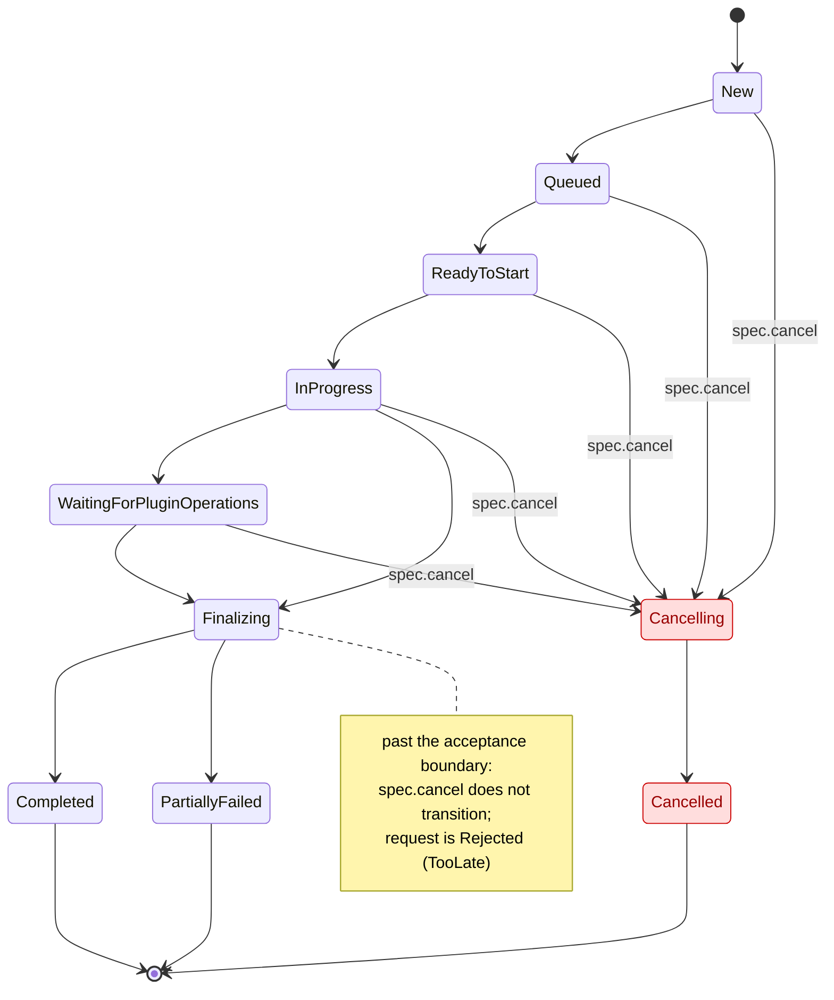
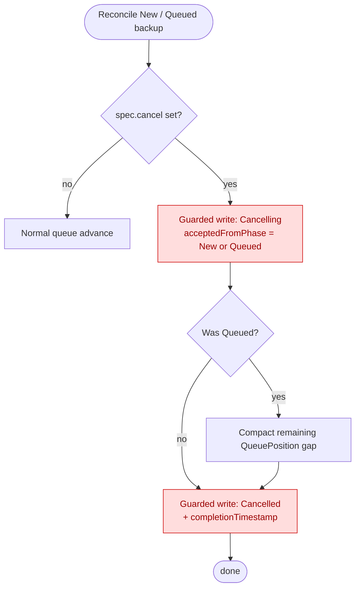
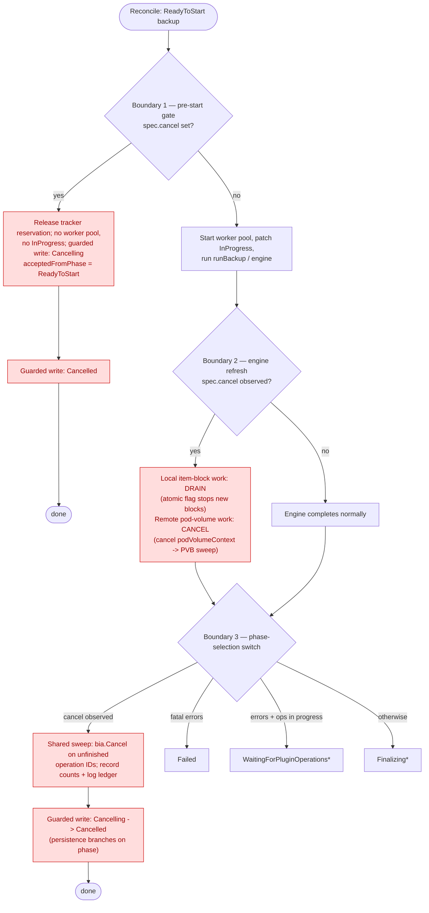
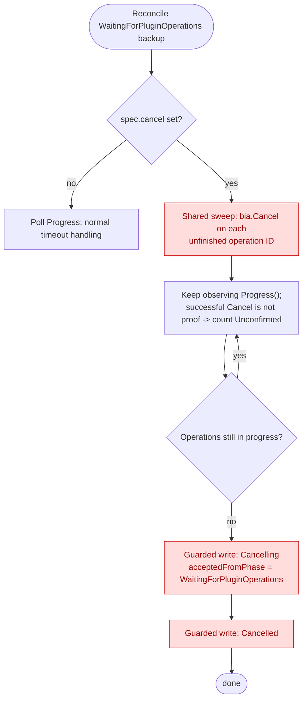
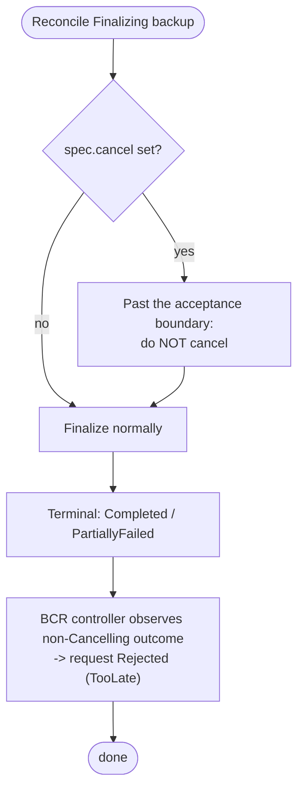
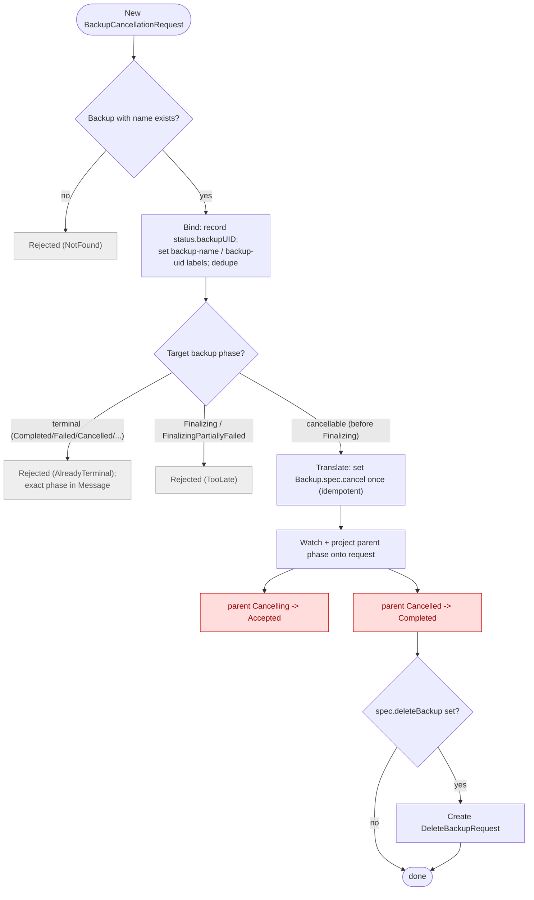

# Backup Cancellation

## Abstract

Add a supported way to cancel an in-progress Velero backup: stop further work where possible, and keep the Backup object and any artifacts for diagnosis.
Today there is no cooperative cancellation path, so the only recourse is to delete or kill the workload — which strands child operations, leaves applications quiesced by pre-hooks, and produces unaccounted partial artifacts.

## Background

A backup moves through phases owned by different controllers: the queue controller advances `New -> Queued -> ReadyToStart`; the backup controller runs `InProgress` via one blocking `runBackup()` call, then hands off to plugin-operations, finalization, and a terminal phase.
Cancellation is hard because a backup is not one unit of work — `runBackup()` does synchronous item collection/archiving, waits on asynchronous node-side children (pod-volume backups and CSI data uploads), and starts durable asynchronous plugin operations polled by a separate controller.
A busy reconcile cannot be interrupted by another event for the same object, so stopping a backup needs cooperative checkpoints inside the running work plus durable intent that survives restarts — not just a controller watching a request.

A prototype exists on the `backup-cancellation` branch (design PR [#9284](https://github.com/velero-io/velero/pull/9284)): it added `spec.cancel`, cancellation phases, engine checkpoints, and a reconciler, but predates main's queueing, per-request worker pools, and PVB timeout fixes.
This design takes its lessons rather than adopting it directly.

## Goals

- A supported way to cancel an in-progress backup that stops further work where possible and retains the Backup and artifacts for diagnosis.
- Safety: cancellation never leaves the Backup inconsistent, and a stale engine, finalizer, or operations write cannot overwrite an accepted cancellation outcome.

## Non Goals

- Restore cancellation.
- Undoing applied work; a completed action or an in-flight plugin call cannot be reversed.
- A hard, real-time interruption guarantee; cancellation is cooperative and best-effort.
- Provider-enforced write fencing; this does not prove a plugin's external work truly stopped.
- Deleting stored artifacts; that stays with `velero backup delete` (cancellation can *trigger* it as a follow-up — see Cleanup).

## High-Level Design

- **Intent is a CR.** Users create a `BackupCancellationRequest` rather than patching the Backup. It names a target Backup, binds to that Backup's UID (so a name reuse cannot satisfy it), and carries configuration plus request/accepted/rejected outcomes.
- **The signal is `spec.cancel`.** The request controller translates an accepted request into `Backup.spec.cancel`, the internal signal phase owners observe. Users do not set it directly.
- **Acceptance is authoritative.** A backup is not cancelled until a phase owner records acceptance (`Cancelling`) on the Backup; once accepted, it cannot be resumed.
- **Teardown is observer-owned.** Phases are owned by different controllers; whichever owns the current phase observes `spec.cancel`, tears down its in-flight work, records `Cancelling` plus status, and drives the Backup to terminal `Cancelled`. There is no central coordinator.
- **Timeout is tentative.** Cancellation may carry a configurable timeout (server default plus per-request override) recorded as a deadline. Whether and how to enforce it is unresolved (see Open Issues); the design only leaves room for it.

Cancellation is accepted through `WaitingForPluginOperations`; at `Finalizing` and beyond it is rejected.
The `PartiallyFailed` variants (`WaitingForPluginOperationsPartiallyFailed`, `FinalizingPartiallyFailed`) behave like their siblings and are omitted below for readability.



## Detailed Design

### API: BackupCancellationRequest CRD

A namespaced CR in `velero.io/v1`, shaped like `DeleteBackupRequest`/`DownloadRequest`.
Its spec names the target; its status carries the request phase, the bound UID, a rejection reason, and a message.
Authoritative cancellation detail (acceptance time, accepted-from phase, outcome reason, bounded counts) lives on the parent's `status.cancellation` (next section) — the request controller reflects it, not duplicates it.

```go
// BackupCancellationRequestSpec is the specification for a request to cancel a backup.
type BackupCancellationRequestSpec struct {
	// BackupName is the name of the backup to cancel.
	BackupName string `json:"backupName"`

	// TimeoutSeconds optionally overrides the server-level cancellation timeout. Tentative:
	// may be ignored until the deadline mechanism is designed (still open).
	// +optional
	TimeoutSeconds *int64 `json:"timeoutSeconds,omitempty"`

	// DeleteBackup, when true, requests deletion after cancellation completes successfully: the
	// request controller creates a DeleteBackupRequest once the backup reaches Cancelled. Not
	// applied when the request is Rejected. See Cleanup.
	// +optional
	DeleteBackup bool `json:"deleteBackup,omitempty"`
}

// BackupCancellationRequestPhase represents the lifecycle phase of a BackupCancellationRequest.
// +kubebuilder:validation:Enum=New;Accepted;Completed;Rejected
type BackupCancellationRequestPhase string

const (
	// New: observed, but no phase owner has recorded acceptance on the target Backup yet.
	BackupCancellationRequestPhaseNew BackupCancellationRequestPhase = "New"

	// Accepted: a phase owner recorded Cancelling on the target Backup; the outcome is authoritative.
	BackupCancellationRequestPhaseAccepted BackupCancellationRequestPhase = "Accepted"

	// Completed: the target Backup reached the terminal Cancelled phase.
	BackupCancellationRequestPhaseCompleted BackupCancellationRequestPhase = "Completed"

	// Rejected: the request could not be honored; Status.Reason distinguishes why.
	BackupCancellationRequestPhaseRejected BackupCancellationRequestPhase = "Rejected"
)

// BackupCancellationRequestRejectedReason explains why a request was Rejected.
// +kubebuilder:validation:Enum=TooLate;AlreadyTerminal;NotFound
type BackupCancellationRequestRejectedReason string

const (
	// TooLate: the Backup was still running but past the acceptance boundary (Finalizing*).
	RejectedReasonTooLate BackupCancellationRequestRejectedReason = "TooLate"

	// AlreadyTerminal: the Backup had already reached a terminal phase (Completed, PartiallyFailed,
	// Failed, FailedValidation, or Cancelled). Message records the exact phase.
	RejectedReasonAlreadyTerminal BackupCancellationRequestRejectedReason = "AlreadyTerminal"

	// NotFound: no Backup with the requested name existed when the request was bound.
	RejectedReasonNotFound BackupCancellationRequestRejectedReason = "NotFound"
)

// BackupCancellationRequestStatus is the current status of a BackupCancellationRequest.
type BackupCancellationRequestStatus struct {
	// Phase is the current state of the request.
	// +optional
	Phase BackupCancellationRequestPhase `json:"phase,omitempty"`

	// BackupUID binds the request: it is only acted on for the Backup with this UID, so a later
	// Backup reusing the same name cannot satisfy or be affected by it.
	// +optional
	BackupUID string `json:"backupUID,omitempty"`

	// Reason categorizes a Rejected request.
	// +optional
	Reason BackupCancellationRequestRejectedReason `json:"reason,omitempty"`

	// Message is a human-readable explanation of the current phase (e.g. the exact terminal phase
	// behind an AlreadyTerminal rejection).
	// +optional
	Message string `json:"message,omitempty"`
}
```

The object wrapper carries the standard markers and print columns, mirroring the existing request CRDs (proposed short name `bcr`):

```go
// +genclient
// +k8s:deepcopy-gen:interfaces=k8s.io/apimachinery/pkg/runtime.Object
// +kubebuilder:object:root=true
// +kubebuilder:object:generate=true
// +kubebuilder:storageversion
// +kubebuilder:resource:shortName=bcr
// +kubebuilder:printcolumn:name="BackupName",type="string",JSONPath=".spec.backupName"
// +kubebuilder:printcolumn:name="Status",type="string",JSONPath=".status.phase"
// +kubebuilder:printcolumn:name="Reason",type="string",JSONPath=".status.reason"
// +kubebuilder:printcolumn:name="Age",type="date",JSONPath=".metadata.creationTimestamp"

// BackupCancellationRequest is a request to cancel an in-progress backup.
type BackupCancellationRequest struct {
	metav1.TypeMeta `json:",inline"`
	// +optional
	metav1.ObjectMeta `json:"metadata,omitempty"`
	// +optional
	Spec BackupCancellationRequestSpec `json:"spec,omitempty"`
	// +optional
	Status BackupCancellationRequestStatus `json:"status,omitempty"`
}
```

Binding: on first observation, resolve the named Backup and record its UID in `status.backupUID`; associate for listing/cleanup via the `velero.io/backup-name` label (matching `DeleteBackupRequest`).

### Parent Backup status and phases

Two authoritative phases are added to `BackupPhase`:

```go
// BackupPhaseCancelling means cancellation has been accepted for an in-progress backup and the
// owning controller is tearing down its work. The backup is not usable.
BackupPhaseCancelling BackupPhase = "Cancelling"

// BackupPhaseCancelled means the backup was cancelled. Terminal and non-resumable. Available
// artifacts are retained for diagnosis but the backup is not restorable.
BackupPhaseCancelled BackupPhase = "Cancelled"
```

- `Cancelling` is recorded by whichever controller owns the accepting phase; recording it is what makes cancellation authoritative. `Cancelled` is terminal.
- Parent spellings `Cancelling`/`Cancelled` differ from the child spellings `Canceling`/`Canceled` (DataUpload, PodVolumeBackup), reconciled via adapters rather than renamed (see Compatibility).

A `cancellation` struct is added to `BackupStatus`, set only after acceptance.
It holds **only fixed-size fields** (bounded counts): a backup can start thousands of child operations, so an open-ended per-operation list risks the Kubernetes object size limit — the same reason Velero already keeps per-operation detail off the Backup (counts on status, detail in an object-storage artifact). `completionTimestamp` is reused for the final time.

```go
// Cancellation records the outcome of a cancellation. Set only once accepted (phase Cancelling
// or Cancelled).
// +optional
// +nullable
Cancellation *BackupCancellationStatus `json:"cancellation,omitempty"`
```

```go
// BackupCancellationStatus records the outcome of cancelling a backup.
type BackupCancellationStatus struct {
	// AcceptedAt is when the owning controller accepted cancellation (recorded Cancelling).
	// +optional
	// +nullable
	AcceptedAt *metav1.Time `json:"acceptedAt,omitempty"`

	// Deadline is when cancellation orchestration is intended to finish. Tentative: the deadline
	// mechanism is not yet designed, so this may be unset (still open).
	// +optional
	// +nullable
	Deadline *metav1.Time `json:"deadline,omitempty"`

	// Reason is a short, human-readable summary of the outcome (e.g. noting unconfirmed teardown).
	// +optional
	Reason string `json:"reason,omitempty"`

	// AcceptedFromPhase records the phase the backup was in when cancellation was accepted.
	// +optional
	AcceptedFromPhase BackupPhase `json:"acceptedFromPhase,omitempty"`

	// ActionsAttempted is how many teardown actions cancellation tried.
	// +optional
	ActionsAttempted int `json:"actionsAttempted,omitempty"`

	// ActionsConfirmed is how many of those Velero confirmed completed.
	// +optional
	ActionsConfirmed int `json:"actionsConfirmed,omitempty"`

	// ActionsUnconfirmed is how many Velero could not verify actually stopped the work.
	// +optional
	ActionsUnconfirmed int `json:"actionsUnconfirmed,omitempty"`
}
```

Per-action detail (each step's name and whether it was confirmed/skipped/failed/unconfirmed) goes to the backup log, not the object (see Diagnostics).
`ActionsUnconfirmed` keeps the safety goal honest: a successful `Cancel` call is counted as *attempted*, not as proof that remote work stopped.

### Cancellation across controllers

`spec.cancel` is the signal; each phase owner observes it and runs **observer-owned teardown** (no coordinator): record `Cancelling` -> tear down in-flight work -> record `Cancelled`.
Teardown grows with lifecycle progress — nothing before work starts, up to child and operation teardown once work is in flight.

| Phase | Owner | Teardown |
|---|---|---|
| New / Queued | queue | none (bookkeeping only) |
| ReadyToStart | backup | release tracker reservation |
| InProgress | backup + engine | drain local item-blocks / cancel PVBs / sweep ops |
| WaitingForPluginOperations | operations | sweep ops |
| Finalizing+ | finalizer | none — request Rejected (past boundary) |

Rules that apply to every owner:

- **Guarded transitions.** Every phase write is a fresh read plus an optimistic-lock (resourceVersion) update, recomputing on conflict, so exactly one transition wins and a stale write cannot overwrite acceptance. The replay-prone helpers (`kube.PatchResource`, `PatchResourceWithRetriesOnErrors`) must **not** be used here. This is the safety mechanism.
- **Shared vs. local teardown.** Only plugin-operation cancellation (`bia.Cancel()` on recorded operation IDs) is shared — the backup and operations controllers call one helper. PVB teardown is engine-only (PVBs exist and are tracked only inside the engine, and are terminal by later phases). Observer-owned means each owner *triggers and transitions*, not that each reimplements teardown.
- **Acceptance boundary.** Accepted through `WaitingForPluginOperations`; `Finalizing`/terminal -> `Rejected` (`TooLate` for `Finalizing`*, `AlreadyTerminal` otherwise).
- **Fast, request-based `Cancelled`.** `Cancelled` means teardown was *requested*, not proven stopped. PVBs are confirmed (the engine waits for `Canceled`); plugin ops are `Unconfirmed`. So `Cancelling` is usually brief (dominated by the PVB wait) and may go unseen — but it is a real persisted phase: the atomicity point that wins the guarded race, and the crash-recovery anchor that tells a restart to finish teardown rather than resume.

Rationale for observer-owned vs. central coordinator, and request-based vs. confirmation-based, is in Alternatives. Per-controller detail follows.

#### Queue controller (New, Queued)

*Owns `New -> Queued -> ReadyToStart`. Nothing is in flight: no pool, children, or operations; the tracker only reserves at `AddReadyToStart`.*



- **Observe.** Add a watch-predicate case for `spec.cancel` on `New`/`Queued` so it is seen promptly, not at the ~1-minute requeue (`defaultQueuedBackupRecheckFrequency`).
- **Teardown.** Bookkeeping only: guarded `Cancelling` (`acceptedFromPhase` New/Queued); if `Queued`, compact `QueuePosition` like the dequeue path; add no tracker entry (`AddReadyToStart` has not run).
- **Transition.** No work to settle -> guarded `Cancelled` + `completionTimestamp` immediately. Uses the optimistic-locked update, not `kube.PatchResource`.

#### Backup controller (ReadyToStart, InProgress)

*Owns the `ReadyToStart` gate, `ReadyToStart -> InProgress`, and the blocking `runBackup()`. Once `InProgress`, no watch event re-enters for that key until the call returns. Owns the worker pool (deferred `StopWorkerPool()`) and the tracker entry.*

Cancellation is checked at **three boundaries** only (plus the engine's cooperative wind-down), not scattered through the controller.



**1. Pre-start gate (event-driven).**
Before `prepareBackupRequest` builds the request or starts a pool, check `spec.cancel`.
Nothing is in flight: release the `AddReadyToStart` reservation, create no pool, do not patch `InProgress`, record guarded `Cancelling` (`acceptedFromPhase: ReadyToStart`), and proceed straight to `Cancelled`.

**2. Engine-owned refresh (in-flight).**
The engine (`pkg/backup/backup.go`) re-reads `spec.cancel` itself (rate-limited; it takes no context from the reconciler) and winds down with a **hybrid**, because local and remote work want opposite things:

- *Local (item-block producer + pool): drain.* An atomic flag at the producer loop top stops submitting new blocks; in-flight blocks finish; the deferred `StopWorkerPool()` tears the pool down. A flag, not a context, because drain-then-stop wants the in-flight waits and the worker-return send to *complete* — a context would interrupt them and deadlock the result consumer. An item whose action already started runs to its next boundary so its operation ID is recorded for the op sweep.
- *Remote (pod-volume backups): cancel.* These are the expensive node-agent copy, so stop them. `WaitAllPodVolumesProcessed` already selects on `podVolumeContext.Done()` and, when it fires, sets `Spec.Cancel = true` on non-terminal PVBs and waits for `Canceled` — today driven only by the PVB timeout. Cancellation reuses it unchanged by also cancelling `podVolumeContext` on `spec.cancel`. A context *is* right here (interrupting is the goal), and no new PVB helper is needed.

**3. Phase-selection transition.**
After the engine returns, `runBackup()` picks the handoff phase in a `switch`. Cancellation must be a first-class case evaluated *ahead* of the error and operation cases — otherwise in-flight plugin operations route to `WaitingForPluginOperations`, which would *wait for* the cancelled work.
The controller already holds the plugin manager and operation list (`getBackupItemOperationProgress`), so it runs the shared op sweep (`bia.Cancel()` per unfinished operation ID) in place, records counts plus log detail, and transitions toward `Cancelled`.
Persistence must branch on the phase (so no usable terminal metadata is published), the write must be guarded (not `PatchResourceWithRetriesOnErrors`), and the deferred tracker handling must gain `Cancelling`/`Cancelled` cases so the entry is not leaked.

*(Two refinements were deprioritized: a check before `BackupWithResolvers` — redundant given the pre-start gate and engine checks — and a separate pre-upload check — folded into phase-selection persistence.)*

#### Operations controller (WaitingForPluginOperations)

*Already reconciles waiting backups periodically and already cancels in-flight operations on timeout via `bia.Cancel(operationID, backup)`.*



Cancellation reuses that exact sweep, triggered by `spec.cancel` instead of the timeout — a new trigger, not new logic.
It `Cancel()`s each unfinished operation and keeps polling `Progress()` rather than trusting a successful `Cancel()` return (the interface permits unsupported cancellation to succeed); such cases are `ActionsUnconfirmed` and logged.
Modes with no real cancel path (e.g. native snapshots) stop new calls and record the work unconfirmed.
When no operations remain in progress: guarded `Cancelling` (`acceptedFromPhase: WaitingForPluginOperations`) -> `Cancelled`.

#### Finalizer controller (Finalizing)

*Owns `Finalizing`: data is already captured and async operations are already complete; only results and the final artifact upload remain.*

**Does not accept cancellation** — it is past the acceptance boundary, and abandoning a near-done backup yields a half-finalized artifact for no benefit.
No finalizer code is needed: boundary 3 already makes `Cancelling` win ahead of the `Finalizing` case, so a backup only reaches `Finalizing` with `spec.cancel` set if the signal arrived *after* it entered `Finalizing`.
Then no `Cancelling` write happens, the backup finalizes normally to its terminal phase, and the request controller sees the non-`Cancelling` outcome -> `Rejected`/`TooLate`.



#### BackupCancellationRequest controller (new)

*Owns the request lifecycle. Never writes the parent's phase or `status.cancellation` — it raises the signal, then projects the parent's outcome back onto the request.*



- **Bind.** On a `New` request, resolve the Backup, record its UID, and set the `velero.io/backup-name` and `velero.io/backup-uid` labels (like `DeleteBackupRequest`). No such Backup -> `Rejected`/`NotFound`.
- **Dedupe.** Collapse redundant requests for the same bound Backup (DeleteBackupRequest convention).
- **Translate.** If still cancellable (before `Finalizing`), set `spec.cancel` once, idempotently. Setting it is not acceptance — acceptance is a phase owner recording `Cancelling`.
- **Reject past the boundary.** `Finalizing`* -> `TooLate`; terminal -> `AlreadyTerminal` (exact phase in `Message`).
- **Project.** Watch the parent: `Cancelling` -> request `Accepted`, `Cancelled` -> request `Completed`. Reading the outcome from the parent (not at signal-set time) resolves the set-time race: if the backup slips to `Finalizing` first, it finalizes and the request lands `Rejected`/`TooLate`.

Teardown remains observer-owned by the phase controllers.

### Diagnostics and artifacts

- **Ledger in the log.** Each teardown step is logged with its name, outcome (`Done`/`Skipped`/`Failed`/`Unconfirmed`), and a message. The Backup keeps only the bounded `ActionsAttempted`/`Confirmed`/`Unconfirmed` counts — summary on the object, detail in the log (already in object storage).
- **Artifacts retained, non-restorable.** Partial artifacts are kept for diagnosis, but `Cancelled` marks them diagnostic-only. A cancelled backup still uploads its log and metadata, but persistence branches on the phase (boundary 3) so it publishes no usable terminal or restorable metadata.

### Cleanup

- Cancellation does not delete artifacts itself (Non Goals). Deletion is opt-in via `spec.deleteBackup`: when set, the request controller creates a `DeleteBackupRequest` once the backup reaches `Cancelled` (request `Completed`), reusing the existing deletion machinery. It fires only on successful cancellation — a `Rejected` request triggers no deletion.
- Process-local resources (temp tarball, worker pool, plugin processes) need no special cleanup: the existing deferred teardown (`StopWorkerPool`, plugin-manager cleanup, temp-file removal) runs regardless of how `runBackup` returns.

### Hooks

No special handling. Hooks run inside `backupItemBlock`, which a worker runs to completion once it picks up the block; the drain boundary is *between* blocks, never inside one.
So a started block always runs its pre-hooks, items, and paired post-hooks together — cancellation cannot split a pre/post-hook pair or leave an application quiesced without its matching post-hook.

### CLI, metrics, and sync

- `velero backup cancel BACKUP_NAME` creates a `BackupCancellationRequest`; `--wait` blocks to a terminal request phase (`Completed`/`Rejected`), `--delete` sets `spec.deleteBackup` (`--timeout` if the tentative timeout lands).
- `velero backup describe` shows the `Cancelling`/`Cancelled` phase and `status.cancellation` counts; `velero backup logs` includes the ledger.
- Metrics: at least a cancelled-backups counter, labeled by `acceptedFromPhase` to show where cancellations land.
- Backup sync treats `Cancelled` as terminal and non-restorable: synced for visibility/audit, not offered as a restore source (see Compatibility).

## Alternatives Considered

**User-facing `spec.cancel` instead of a request CR.**
Rejected as the user surface: no place for per-request config or a timeout, no durable record of who/when, and no clean "too late".
The CR gives an auditable, UID-bound object with request/accepted/rejected outcomes; `spec.cancel` stays the internal signal.

**Central coordinator instead of observer-owned teardown.**
Rejected: phases are already owned by distinct controllers, so a coordinator would reach into in-flight work it does not own (the engine pool, the operations poll), duplicating logic and racing the owner.
Observer-owned keeps teardown next to the code that understands it and makes transitions naturally single-writer.

**Hard abort instead of drain-then-stop.**
Rejected: the worker result send is blocking and unguarded, so interrupting mid-flight risks deadlocking shutdown — and aborting local work buys little, since the cost is the remote copy.
Drain-then-stop uses an atomic flag; a context is used only for the PVB wait, where interrupting is what triggers the existing cancel sweep.

**Inline `actions[]` on status instead of counts.**
Rejected: thousands of child operations could exceed the Kubernetes object size limit (the reason per-operation data is already off the Backup).
Status carries bounded counts; detail goes to the log.

**Confirmation-based `Cancelled` instead of fast/request-based.**
Rejected as default: holding `Cancelling` until every child/operation is confirmed terminal depends on work Velero cannot always confirm (a no-op `Cancel`, native snapshots) and would need a bounding timeout.
Instead `Cancelled` means *requested*: PVBs confirmed, plugin operations `Unconfirmed`.

## Security Considerations

- Cancellation privilege is the ability to create a `BackupCancellationRequest`, gated by normal RBAC (as `DeleteBackupRequest` gates deletion). `spec.cancel` is internal, not user-facing.
- Because phase owners honor `spec.cancel` from any source, Backup-write access effectively grants cancellation. This design accepts that rather than adding a validating webhook to forbid direct edits (a possible hardening — Open Issues).
- `spec.deleteBackup` escalates to deletion but does not bypass controls: it creates a `DeleteBackupRequest` through the normal deletion flow and its checks. Granting create access with this option effectively grants deletion of the target.

## Compatibility

- **`Cancelled` is not a restore source.** The restore controller already allowlists only `Completed`/`PartiallyFailed` (`restore_controller.go`), so `Cancelled` is already refused. The only change is an explicit `Cancelled`-specific message, plus backup sync and CLI surfacing `Cancelled` as terminal/non-restorable rather than an error or omission.
- **Child phase spellings.** Parent `Cancelling`/`Cancelled` vs. child `Canceling`/`Canceled` (DataUpload, PodVolumeBackup) are reconciled via adapters, not renamed, to avoid a breaking change to the child CRDs and node-agent.

## Implementation

Builds on the `backup-cancellation` prototype but reworked for main's queueing, per-request worker pools, and PVB timeout handling.

**Ordering principle (why it is safe to land in pieces):** `spec.cancel` defaults to false and no request exists until a user creates one, so every observer added before the request path is **inert** — it changes behavior only once something sets `spec.cancel`.
So teardown lands first (tested by setting `spec.cancel` directly), and the request path — which turns the feature *on* — lands last, after every phase has an observer, so no user can file a request that a phase silently ignores.

**Phase 1 — Foundations (inert plumbing)**
1. API types: `spec.cancel` on `BackupSpec`, the `Cancelling`/`Cancelled` phases, `BackupCancellationStatus` (counts-only), and the `BackupCancellationRequest` CRD with generated clients and manifests.
2. Guarded phase-transition helper (fresh read + optimistic lock), replacing the replay-prone patch helpers for these transitions.

**Phase 2 — Teardown observers (inert until `spec.cancel` is set)**
3. Engine wind-down: the atomic drain flag plus routing `podVolumeContext` off `spec.cancel` (reusing the PVB sweep). The riskiest change, isolated.
4. Backup controller: the three boundaries plus the shared op-cancel helper (introduced here).
5. Operations controller: trigger the shared sweep from `spec.cancel`. Small; depends on #4's helper.
6. Queue controller: pre-start handling for `New`/`Queued`. Small and self-contained.

**Phase 3 — Activation (user-facing)**
7. BackupCancellationRequest controller: bind/UID, translate, dedupe, project, rejection reasons, and the `deleteBackup` follow-up. Lands only after Phase 2.
8. CLI, metrics, backup sync, and the restore-gate message.

One PR per step (5 and 6 can combine). Contributors and timeline TBD.

## Open Issues

- **Timeout/deadline:** whether to implement it, and how to enforce it at the deadline. The fast transition reduces its need (no blocking on unconfirmable work), so it may stay an optional bound. `spec.timeoutSeconds` and `status.cancellation.deadline` are tentative pending this.
- **Direct `spec.cancel` edits:** add a validating webhook to force cancellation through the CR, or accept Backup-write as cancellation access.
- **Metrics:** exact shape and cardinality.
- **`deleteBackup` failure:** behavior when the follow-up `DeleteBackupRequest` fails or is rejected (retry, surface on the request, or leave to the deletion-request lifecycle).
