# OwnerReference & Dependency Relinking (Core Dynamic Relinking Engine)

## Glossary & Abbreviation

**Dynamic Ownership Relinking**: The restore-side process introduced in this design where Velero records an in-memory `OldUID -> NewUID` map during synchronous object creation and subsequently relinks `metadata.ownerReferences` and allowlisted spec pointers with live cluster UIDs.
**Spec Pointer (`specRefPaths`)**: User-configured dotted field paths within custom resource `spec` stanzas targeting typed `corev1.ObjectReference` maps containing UIDs that require dynamic rewriting to point to live cluster objects. Paths are not JSONPath: they are `.`-separated unstructured keys starting with `spec.`, with optional `[*]` slice wildcards (for example `spec.infrastructureRef`, `spec.tasks[*].componentRef`).
**Controller Quiescing (`quiesceOnRestore`)**: An automated restore engine capability that temporarily injects a pause **annotation** onto a parent object during **create** in Phase 1A to silence declarative controllers while dependent children are restored, then removes that annotation after Phase 1B relinking. Quiescing is strictly and permanently annotation-based; it never injects `spec.paused` or mutates `.spec` (`specFieldPath` is a permanent non-goal).
**$Q$ (Quiesced Object)**: Symbolic notation representing an individual resource ($Q$ in `QuiescedObjects`) temporarily paused by Velero during create in Phase 1A.
**$P$ (Pending Patch Request)**: Symbolic notation representing an individual outstanding patch request ($P$ in `pendingPatches`) awaiting ownerReference or spec-pointer relinking in Phase 1B.
**Graph-Free Independent Unquiescing**: An evaluation predicate that determines when a quiesced parent $Q$ can be safely unpaused: no remaining pending patch $P$ targets $Q$ itself or names $Q$ (by Group+Kind+Name+Namespace) as an owner or target in `Targets` (including transitive quiesced root targets propagated from multi-hop descendants). No DAG is built or traversed during unquiesce matching.
**Two-Pass Restore Workflow**: The two-stage patching pipeline where Phase 1B Pass 1 executes immediately in `RestoreController` after `RestoreWithResolvers` to relink `ownerReferences` and spec pointers and persist paused state to `Restore.Status` (bounded by `resourceTimeout`, default 10m; Pass 1 never unpauses objects), and Phase 1B Pass 2 runs in `RestoreFinalizerController` as a conflict retry safety net and automated unquiesce evaluator across `Finalizing` and `FinalizingPartiallyFailed` phases after asynchronous volume snapshot operations complete (or immediately if no volume operations are running).
**Dual-Layer State Persistence**: Survives Velero pod restarts **after** Pass 1 has persisted `Restore.Status` (phases `WaitingForPluginOperations`, `WaitingForPluginOperationsPartiallyFailed`, `Finalizing`, and `FinalizingPartiallyFailed`). Layer 2 (`QuiescedObjects`, `PendingOwnerRefPatches`) is the source of truth for pending work. Layer 1 live labels (`velero.io/quiesced-by-restore`, formatted via `label.GetValidName(restore.Name)`) provide administrator visibility, manual out-of-band remediation, and leftover-unpause catch-up; they cannot rebuild `uidMap`. Catch-up preconditions, `InProgress` leftovers, and the crash matrix: [Catch-Up Invariants and Crash Matrix](#catch-up-invariants-and-crash-matrix).
**Live Precedence**: An ownership resolution rule enforcing Kubernetes single-controlling-owner validation by preserving existing live controller references when patching an object that already has a controlling owner (specifically when an active in-cluster controller claims a newly created child between Phase 1A create and Phase 1B patch), demoting incoming restored parent references to non-controlling (`controller: nil`).
**RBAC Fallback**: An automated fallback mechanism that strips `blockOwnerDeletion: true` when a patch encounters HTTP 403 Forbidden, allowing relinking to proceed when Velero lacks `delete` permissions on custom third-party owner CRDs.

## Background

### The Kubernetes OwnerReference & Garbage Collection Problem

Kubernetes uses `metadata.ownerReferences` to establish parent-child relationships between API objects.
Typical examples in core workloads include `Deployment -> ReplicaSet -> Pod`, while declarative operators such as Cluster API (CAPI) use `Cluster -> MachineDeployment -> MachineSet -> Machine -> VSphereMachine`.
Each `ownerReference` entry contains:
- `apiVersion` and `kind` of the parent resource.
- `name` of the parent resource.
- `uid` of the parent resource (the unique UUID assigned by the API server).
- Optional `controller` (boolean indicating if this parent is the managing controller).
- Optional `blockOwnerDeletion` (boolean indicating whether the parent deletion should wait for the child deletion).

When a parent object is deleted, the Kubernetes Garbage Collector (GC) uses `ownerReferences` to cascade-delete or orphan child resources.
When Velero restores resources into a cluster, the Kubernetes API server assigns **new UIDs** to all newly created parent objects.
The backed-up child resources, however, contain `ownerReferences` pointing to the **old parent UIDs** from the source cluster.
If a child resource is restored with an outdated parent `UID`, the target cluster's GC immediately determines that the parent object does not exist and **deletes the restored child resource instantly**.

### Velero's Current Default Behavior

To prevent immediate GC deletion, Velero currently strips `ownerReferences` during metadata sanitization in `pkg/restore/restore.go`.
Specifically, `resetMetadataAndStatus()` unconditionally deletes the `ownerReferences` field from every restored object:

```go
func resetMetadata(obj *unstructured.Unstructured) (*unstructured.Unstructured, error) {
    // ...
    for k := range metadata {
        switch k {
        case "generateName", "selfLink", "uid", "resourceVersion", "generation", 
             "creationTimestamp", "deletionTimestamp", "deletionGracePeriodSeconds", 
             "ownerReferences": // <--- Velero forcibly strips ownerReferences!
            delete(metadata, k)
        }
    }
    return obj, nil
}
```

While stripping `ownerReferences` prevents immediate GC deletion, it leaves restored resources **permanently orphaned** from their parents.
For core workloads (`Deployment -> ReplicaSet -> Pod`), `kube-controller-manager` uses label selectors to adopt orphaned ReplicaSets and Pods via `claimPods()` and `claimReplicaSets()`.
However, custom resources and declarative operators (e.g. Cluster API, Crossplane, Knative, Strimzi Kafka, CloudNativePG) do not rely on label selector adoption.
Instead, they rely strictly on `metadata.ownerReferences` and typed spec references containing parent UIDs.
Without ownerReferences, restored operators fail to adopt child resources, break cascading lifecycle management, and leave infrastructure detached.

### Controller Race Conditions in Disaster Recovery (DR)

In disaster recovery migrations or restores to clean target clusters, the destination cluster is empty prior to restore.
The parent objects (such as a Cluster API `Cluster` or a Kafka cluster CR) do not exist before Velero creates them.
Backups are taken from healthy, actively running production clusters where pause annotations are absent.
The moment Velero creates parent objects during restore, active controllers running in the destination cluster receive Kubernetes Watch notifications.
Observing zero attached children, active controllers immediately reconcile:
- They assume child infrastructure was lost and trigger duplicate provisioning in cloud and infrastructure providers (e.g. spawning duplicate VMs).
- They fight Velero as it attempts to restore backed-up child resources.
- They race against child restoration, leading to split-brain states and quota exhaustion.

### Case Study: Cluster API (CAPI)

Cluster API (CAPI) exemplifies complex declarative CRD ownership trees and cross-object references:

```
OWNERSHIP (metadata.ownerReferences): child ──ownerRef──> parent
================================================================================

  [ Cluster ]  <──ownerRef──  [ VSphereCluster ]     (infra owns toward Cluster)
  [ Cluster ]  <──ownerRef──  [ MachineDeployment ]
  [ Cluster ]  <──ownerRef──  [ KubeadmControlPlane (KCP) ]

  [ KubeadmControlPlane ]  <──ownerRef──  [ Machine (control plane) ]
  [ MachineDeployment ]    <──ownerRef──  [ MachineSet ]
  [ MachineSet ]           <──ownerRef──  [ Machine (worker) ]

  [ Machine ]  <──ownerRef──  [ VSphereMachine ]
  [ Machine ]  <──ownerRef──  [ KubeadmConfig ]


SPEC POINTERS (name/kind refs; may also carry uid): object ──spec.*Ref──> peer
================================================================================

  [ Cluster ]  ──spec.infrastructureRef──>  [ VSphereCluster ]
  [ Cluster ]  ──spec.controlPlaneRef────>  [ KubeadmControlPlane ]

  [ Machine ]  ──spec.infrastructureRef──>  [ VSphereMachine ]
  [ Machine ]  ──spec.bootstrap.configRef─> [ KubeadmConfig ]
```

Without ownerReference and spec pointer relinking, restoring CAPI manifests three catastrophic failure modes:
1. **Orphaned Machines:** Stripping `ownerReferences` leaves `Machine` and `VSphereMachine` objects detached from `MachineSet` and `KubeadmControlPlane`.
2. **Controller Race Conditions:** If `KubeadmControlPlane` or `MachineSet` is restored without child `Machine` objects attached, CAPI controllers assume zero nodes exist and trigger duplicate VM provisioning in vSphere or public clouds.
3. **Broken Cascading Deletion:** Deleting a `MachineDeployment` fails to delete worker `Machine` or `VSphereMachine` instances, leaking cloud infrastructure.

### CAPI Out-of-Order Creation Tolerance & Priority Ordering Analysis

A critical architectural consideration during Phase 1A synchronous restoration is the creation order between parent and child resources.
In Velero's default restore resource priorities (`pkg/cmd/server/config/config.go`), `clusters.cluster.x-k8s.io` is positioned in `LowPriorities`.
Specifically, it follows Tanzu `clusterbootstraps.run.tanzu.vmware.com` to prevent the Tanzu controller from auto-generating an unwanted default bootstrap resource upon detecting an unbootstrapped `Cluster`.
Consequently, non-prioritized CAPI resources—such as `bootstrap.cluster.x-k8s.io` (`KubeadmConfig`), `controlplane.cluster.x-k8s.io` (`KubeadmControlPlane`), `infrastructure.cluster.x-k8s.io` (`VSphereMachine`, `DockerMachine`, `AWSMachine`), and `cluster.x-k8s.io` (`Machine`, `MachineSet`)—are restored alphabetically **before** `Cluster`.

CAPI controllers and infrastructure providers inherently tolerate out-of-order restoration without racing:
1. **Infrastructure Providers (`DockerMachine`, `VSphereMachine`, `AWSMachine`):** Compliant infrastructure controllers call `util.GetOwnerMachine(ctx, r.Client, infraMachine)`. During Phase 1A, objects are created with `ownerReferences` stripped. When `GetOwnerMachine` returns `nil`, the infrastructure controller logs `"Waiting for Machine controller to set OwnerRef on <InfraMachine>"` and immediately returns `reconcile.Result{}, nil`. It issues zero cloud provider API calls and provisions no VMs.
2. **Control Plane (`KubeadmControlPlane` / KCP):** The KCP reconciler looks up its parent cluster via `util.GetOwnerCluster(ctx, r.Client, kcp.ObjectMeta)`. With `ownerReferences` stripped in Phase 1A, `GetOwnerCluster` returns `nil`. KCP logs `"Cluster Controller has not yet set OwnerRef"` and returns `ctrl.Result{}, nil` without generating certificates or configuring bootstrap.
3. **Core Workload Controllers (`MachineSet`, `Machine`):** `MachineSet` and `Machine` reconcilers look up their cluster via `util.GetClusterByName(ctx, r.Client, m.Namespace, m.Spec.ClusterName)`. While `Cluster` is waiting in `LowPriorities`, `GetClusterByName` returns `apierrors.IsNotFound(err)`. The reconciler requeues with backoff without performing mutations.
4. **Transition upon Cluster Creation (Auto-Quiesce Activation):** The moment Velero reaches `LowPriorities` and creates `Cluster`, Velero's `quiesceOnRestore` engine intercepts the call and injects the annotation `cluster.x-k8s.io/paused: ""` (key presence; CAPI `HasPausedAnnotation` / `annotations.IsPaused`) alongside the `velero.io/quiesced-by-restore` tracking label. Velero never sets `spec.paused` (controller quiescing is strictly annotation-based). The cluster creation event wakes up child watches, but CAPI's `annotations.IsPaused(cluster, obj)` evaluates to `true`, logging `"Reconciliation is paused for this object"` and returning `ctrl.Result{}, nil`.
5. **No Restore Priority Change or Leaf Quiescing Required:** Moving `clusters.cluster.x-k8s.io` to `HighPriorities` would break Tanzu `ClusterBootstrap` ordering, while adding leaf-level pause rules to every intermediate kind adds unnecessary overhead. Because CAPI controllers safely no-op or requeue before `Cluster` exists, and immediately freeze once `Cluster` is created paused, the current restore priority ordering is safe and requires no modification or leaf-level quiescing.

## Goals

- Provide a pure restore-side dynamic relinking engine that restores Kubernetes `metadata.ownerReferences` without requiring any changes to backup archives, backup plugins, or backup tarball formats.
- Support dynamic rewriting of allowlisted spec-level object pointers (`specRefPaths`) for typed `corev1.ObjectReference` fields containing UIDs, including nested slice wildcard (`[*]`) support and `ObjectReference.namespace` rewrite under restore namespace mapping.
- Provide generic automated controller quiescing (`quiesceOnRestore`) that injects pause **annotations** on **create** in Phase 1A and unpauses after Phase 1B patching without manual operator intervention.
- Close the controller race window by executing Phase 1B Pass 1 immediately in `RestoreController` upon completion of synchronous object creation (bounded by `resourceTimeout`, default 10m).
- Implement graph-free independent unquiescing so that each quiesced parent $Q$ is evaluated independently: $Q$ is unpaused as soon as no pending patch targets $Q$ or names $Q$ by Group+Kind+Name, preventing unrelated workloads from blocking each other.
- Guarantee crash resilience across multi-hour asynchronous CSI snapshot operations **after** Pass 1 has persisted `Restore.Status` (dual-layer: live tracking labels plus Status).
- Preserve 100% backward compatibility with existing Velero releases via mandatory server feature flag gating (`--features=OwnerRefRelink`) and per-restore opt-in/customization (`Restore.Spec.OwnerRefConfigMap`).
- Enforce strict safety boundaries using a built-in deny list for core leaf workloads (`Pod`, `ReplicaSet`, `ReplicationController`, `Job`), preserving `kube-controller-manager` selector adoption semantics.

## Non-Goals

- Modifying the Velero backup pipeline, creating backup-side dependency graphs, or modifying the backup archive tarball format (e.g. no `velero-owner-dag.json`).
- Implementing a global topological sort or altering Velero's core workload restore priority order (e.g. restoring Pods before Deployments remains strictly preserved).
- Heuristically or blindly scanning arbitrary untyped string fields in resource `spec` stanzas to guess where UIDs might reside.
- Rewriting `ownerReferences` on unlisted or denied resources (such as `Pod` or `ReplicaSet`).
- Re-linking ownerReferences across namespace boundaries where Kubernetes strictly forbids cross-namespace ownership.
- Modifying Velero backup or restore CLI flags to require inline owner-ref rules; configuration is expressed via ConfigMap or built-in defaults.
- Injecting or clearing spec-field pauses (`spec.paused`, `specFieldPath`). Controller quiescing is strictly and permanently annotation-based; `specFieldPath` is a permanent architectural non-goal. Mutating `.spec` introduces GitOps auto-sync/self-heal reversion duels, OpenAPI v3 schema validation errors (HTTP 422) on unpause/null deletion, webhook/CEL failures due to generation bumps, and corruption of user-declared desired state. Projects lacking pause annotations (such as Argo CD) are advocated to adopt native pause annotations upstream.
- Rewriting object references or UIDs inside resource `.status` stanzas (e.g. `Machine.status.nodeRef.uid`, `Cluster.status.infrastructureRef`). `specRefPaths` is strictly designed for `.spec` fields (`spec.*`). When `Restore.Spec.RestoreStatus` is enabled, status subresources are restored with their backed-up values and are not dynamically relinked by this engine; stale UIDs in status are left for live reconcilers to overwrite during normal controller reconciliation.
- In-place ownerReference or spec-reference relinking on pre-existing live objects (`existingResourcePolicy: update`, skip, or ServiceAccount merge paths). In-place restore and live-cluster relinking of an already-running CAPI cluster is not race-closed (live controllers remain unquiesced) and is explicitly unsupported in this design. This design focuses on Disaster Recovery (DR) into a newly provisioned management cluster/namespace where resources are created fresh.
- Resuming a restore that crashed while `Restore.Status.Phase` is `InProgress`. Velero continues to only reconcile `New` restores. Dual-layer persistence does not rebuild `uidMap` from labels.
- Heuristically relinking PVC `ownerReferences` whose parent GVK is on the deny list (for example a Pod-owned ephemeral PVC).
- Building a reverse index of parent-side child inventories that are not mirrored by `metadata.ownerReferences` on those children (for example Crossplane `spec.resourceRefs[*]` when composed objects do not ownerRef the XR, KubeVela `ResourceTracker.spec.managedResources[]`, Flux `Kustomization` status inventory). Transitive quiesce pinning walks the ownerRef `parentMap` only. `specRefPaths` rewrites allowlisted spec pointers on the object being patched; it does not record reverse edges from “who lists me.” Topologies whose children are tracked solely by a parent-side list without bottom-up `metadata.ownerReferences` to the quiesced parent are not supported.

## Architecture of OwnerReference & Dependency Relinking

### Configuration Model

The dynamic relinking and automated quiescing engine is configured via a dedicated ConfigMap referenced by `Restore.Spec.OwnerRefConfigMap` (`velero restore create --owner-ref-restore-configmap`) or the server baseline `--owner-ref-configmap`.
The ConfigMap contains three distinct top-level configuration sections:

```yaml
apiVersion: v1
kind: ConfigMap
metadata:
  name: velero-ownerref-config
  namespace: velero
data:
  # Additive GVKs for ownerReference relinking:
  inScope: |
    - group: cluster.x-k8s.io
    - group: controlplane.cluster.x-k8s.io
    - group: bootstrap.cluster.x-k8s.io
    - group: infrastructure.cluster.x-k8s.io
    - group: ipam.cluster.x-k8s.io
    - group: addons.cluster.x-k8s.io

  # Curated typed ObjectReference dotted paths containing UIDs (supports [*] slice wildcards):
  specRefPaths: |
    - group: cluster.x-k8s.io
      kind: Cluster
      paths:
        - spec.infrastructureRef
        - spec.controlPlaneRef
    - group: cluster.x-k8s.io
      kind: Machine
      paths:
        - spec.infrastructureRef
        - spec.bootstrap.configRef

  # Automated controller quiescing rules (injected on create in 1A, unpaused after 1B):
  quiesceOnRestore: |
    - group: cluster.x-k8s.io
      kind: Cluster
      annotationKey: cluster.x-k8s.io/paused
      annotationValue: ""   # inject payload only; CAPI treats key presence as paused
```

`annotationValue` is written on create only. Unpause always merge-patches the annotation key to `null` (key deletion). Value-based pauses (`paused=true` vs `paused=false` with the key left in place) are not supported.

All three sections coexist in the same ConfigMap:
- `inScope` defines which resource types should have their `metadata.ownerReferences` dynamically relinked. Restore-level entries are **always unioned** additively with the baseline ConfigMap.
- `specRefPaths` specifies which custom resource spec fields hold typed `ObjectReference` maps whose `uid` (and, under namespace mapping, `namespace`) must be rewritten. Dotted field paths are configured under the `paths` key for each GVK. Restore paths are unioned and deduplicated with baseline paths. The syntax is strictly dot-separated path segments starting with `spec.`, optionally containing `[*]` slice wildcards. Full JSONPath syntax like `$`, filters, and `..` is rejected.
- `quiesceOnRestore` specifies pause **annotations** to inject on create and remove upon successful relinking. `annotationValue` is the inject payload only; unpause always deletes the key (`null`), it does not rewrite the value. If a restore-level rule targets the same `(Group, Kind)` as a baseline rule, the restore-level rule overrides the baseline rule; otherwise rules are unioned. Controller quiescing is strictly annotation-based; `specFieldPath` is permanently excluded.

### Scope and Safety Boundary Model

The engine strictly enforces safety boundaries by categorizing resources into five distinct classes:

| Resource Class | Restore Behavior | Reason |
| :--- | :--- | :--- |
| **Leaf / Intermediate Workloads** (`core/Pod`, `apps/ReplicaSet`, `core/ReplicationController`, `batch/Job`) | **Legacy behavior (Deny List)**: strip `ownerReferences`; preserve existing restore priorities | Preserves `kube-controller-manager` selector adoption semantics (`claimPods`, `claimReplicaSets`) and prevents workload attach churn |
| **Storage Volumes** (`core/PersistentVolumeClaim`) | **Legacy strip by default; Dynamic Relink if explicitly listed in a restore-level ConfigMap `inScope`, parent-filtered** | **Not in the baseline ConfigMap.** Enabling the feature flag must not relink StatefulSet `volumeClaimTemplate` PVCs, which would change GC so that deleting the STS deletes restored volumes. Operator-owned PVCs (CNPG, Kafka, KubeVirt, Tekton) opt in per restore. When opted in, PVC ownerRefs whose parent GVK is on the deny list are omitted so Pod-owned ephemeral PVCs are not relinked |
| **Top-Level Workloads** (`apps/Deployment`, `apps/StatefulSet`, `apps/DaemonSet`, `batch/CronJob`) | **Configurable**: Legacy strip-and-adopt by default; **Dynamic Relink** if explicitly listed in ConfigMap `inScope` | Standalone workloads have no ownerRefs; operator-managed workloads (Prometheus, Kafka, CNPG) can re-link to parent CRs |
| **In-Scope Application CRDs** (CAPI, user allowlist) | **Dynamic Relink**: Create stripped (1A) -> map UIDs -> Patch relinked ownerRefs (1B) | Restores hierarchical lifecycle without orphaning or GC deletion |
| **Unlisted CRDs / Other Resources** | **Legacy behavior**: strip `ownerReferences` | Safe default fallback; zero blast radius on unfamiliar resources |

### Configuration Precedence Model

The engine is gated by a mandatory server feature flag: **`--features=OwnerRefRelink` must be enabled on the Velero server**.
- **Server Flag Disabled (`--features=OwnerRefRelink` omitted):** The engine is completely dormant. Restores execute in 100% legacy mode (`resetMetadata` strips `ownerReferences`; they are never relinked; zero pause annotations are injected). If a user submits a `Restore` CR specifying `Restore.Spec.OwnerRefConfigMap` when the feature flag is disabled, the restore **fails validation immediately** (`FailedValidation`) and will not execute, preventing unauthorized or unvetted controller quiescing and live-cluster mutations.
- **Server Flag Enabled (`--features=OwnerRefRelink` present):** The engine is active. Restores use the server baseline ConfigMap (`velero-ownerref-config`) by default. Users can optionally supply a per-restore ConfigMap (`Restore.Spec.OwnerRefConfigMap`) to augment or customize rules via the 2-tier additive union model.

The Go binary `NewScope()` contains only the immutable safety deny list (`core/Pod`, `apps/ReplicaSet`, `core/ReplicationController`, `batch/Job`).

When the engine is enabled, scope is resolved via a **2-Tier Additive Union Model (`Baseline ConfigMap ∪ Restore ConfigMap`)**:

| Tier | Source | Lookup / Fallback Behavior |
| :--- | :--- | :--- |
| **Tier 1 (Server Baseline)** | Server flag `--owner-ref-configmap=<name>` | Load that ConfigMap from the Velero namespace. If missing/unreadable, log a warning and proceed with an empty baseline. |
| | Conventional name `velero-ownerref-config` | If server flag is unset, look for `velero-ownerref-config` in the Velero namespace. If present, load baseline rules (CAPI groups only; PVC is not included). If missing, proceed with empty baseline (not an error). |
| **Tier 2 (Restore Delta)** | `Restore.Spec.OwnerRefConfigMap` (`velero restore create --owner-ref-restore-configmap`) | If specified, load that ConfigMap from the Velero namespace and union additively onto Tier 1. If the server feature flag `--features=OwnerRefRelink` is disabled, or if the ConfigMap is missing or unreadable, **Fail restore validation.** The resolved scope is `nil` (engine does not activate); the restore is rejected before execution. |

**Conflict Resolution Semantics across Tiers:**
- `inScope`: Set union (`Baseline ∪ Restore`). Any entry matching the hardcoded deny list fails validation.
- `specRefPaths`: Deduplicated union by normalized path per GVK.
- `quiesceOnRestore`: Restore rule overrides Baseline rule for the same `(Group, Kind)`. Non-overlapping rules are unioned.

Curated Baseline ConfigMap content (`examples/velero-ownerref-config.yaml`):
- `inScope`: Cluster API groups (`cluster.x-k8s.io`, `controlplane.cluster.x-k8s.io`, `bootstrap.cluster.x-k8s.io`, `infrastructure.cluster.x-k8s.io`, `ipam.cluster.x-k8s.io`, `addons.cluster.x-k8s.io`). `core/PersistentVolumeClaim` is **not** in the baseline; list it in a restore-level ConfigMap to opt in.
- `quiesceOnRestore`: `cluster.x-k8s.io/Cluster` with annotation `cluster.x-k8s.io/paused: ""` (key presence).
- `specRefPaths`: CAPI `Cluster` (`spec.infrastructureRef`, `spec.controlPlaneRef`) and `Machine` (`spec.infrastructureRef`, `spec.bootstrap.configRef`).

### Data Flow in the Restore Pipeline

The ownerReference restoration process operates across a two-pass lifecycle integrated directly into Velero's restore controllers:

```mermaid
flowchart TD
    subgraph phase1A [Phase 1A: Synchronous Object Creation]
        Start([Start Restore]) --> ReadBackup[Read Item From Backup]
        ReadBackup --> StashOwnerRef[Stash Original OwnerReferences]
        StashOwnerRef --> ResetMeta[Strip OwnerReferences in resetMetadata]
        ResetMeta --> QuiesceCheck{Matches Quiesce Rule?}
        QuiesceCheck -- Yes --> InjectQuiesce[Inject Pause Metadata and Live Tracking Label]
        QuiesceCheck -- No --> CreateObj[Call Kubernetes API Create]
        InjectQuiesce --> CreateObj
        CreateObj --> RecordUID["Record in-memory uidMap: oldUID -> newUID"]
        RecordUID --> EnqueuePatch[Enqueue in-scope child to ownerPatchQueue or specPatchQueue]
    end

    subgraph phase1BPass1 [Phase 1B Pass 1: Immediate Relinking in RestoreController]
        EnqueuePatch --> Finish1A[RestoreWithResolvers Finishes]
        Finish1A --> Pass1Start[Execute Pass 1: ApplyOwnerRefRelinking]
        Pass1Start --> ProcessQueues[Process ownerPatchQueue and specPatchQueue]
        ProcessQueues --> ResolveUIDs[Resolve Parent UIDs from in-memory uidMap]
        ResolveUIDs --> PatchLive[Patch Live Objects with RetryOnConflict]
        PatchLive --> PatchCheck{Patch Outcome?}
        PatchCheck -- Succeeded --> NextPatch[Increment Relink Counter]
        PatchCheck -- Retriable Error --> EnqueuePending[Enqueue to pendingPatches with Roots in Targets]
        PatchCheck -- Non-Retriable Error --> BlockRoot[Log Warning and Mark Roots UnquiesceBlocked]
        NextPatch --> SaveQuiesced[Record All QuiescedObjects in Status]
        EnqueuePending --> SaveQuiesced
        BlockRoot --> SaveQuiesced
        SaveQuiesced --> PersistStatus[Persist State and Overflow CM to Restore.Status]
    end

    subgraph asyncPhase [Asynchronous Plugin Operations]
        PersistStatus -->|"Volume data movement"| PluginWait["WaitingForPluginOperations: Volume Data Movement"]
    end

    subgraph phase1BPass2 [Phase 1B Pass 2: Safety Net and Unquiescing in RestoreFinalizerController]
        PersistStatus -->|"No volume operations"| FinalizingPhase[Restore Enters Finalizing Phase]
        PluginWait --> FinalizingPhase
        FinalizingPhase --> CheckPending{Pending Patches in Status?}
        CheckPending -- Yes --> RetryPass2[Retry Pending Patches with RetryOnConflict]
        CheckPending -- No --> EvalUnquiesce[Batch Evaluate UnquiesceEligibleObjects]
        RetryPass2 --> EvalUnquiesce
        EvalUnquiesce --> RecheckUnquiesce{Eligible to Unquiesce?}
        RecheckUnquiesce -- Yes --> UnquiescePass2[Unquiesce Parent via Merge Patch]
        RecheckUnquiesce -- "No / None" --> CheckDrained{"Patches, ConfigMap, and QuiescedObjects Empty?"}
        UnquiescePass2 --> UnquiesceOk{Unquiesce Patch Succeeded?}
        UnquiesceOk -- Yes --> CheckDrained
        UnquiesceOk -- No --> KeepQuiesced[Keep Pause for Safety and Retain in QuiescedObjects]
        KeepQuiesced --> CheckDrained
        CheckDrained -- "No: Outstanding Patches or Pauses" --> SkipCatchUp["Skip Catch-Up: Never Unpause Leftovers With Outstanding Work"]
        SkipCatchUp --> EvalTerminal
        CheckDrained -- "Yes: All Queues Empty" --> CatchUp["Layer 1 Catch-Up: List and Unpause Leftovers"]
        CatchUp --> CatchUpOk{All Leftovers Unpaused?}
        CatchUpOk -- Yes --> EvalTerminal[Evaluate Strict Terminal Completion Invariant]
        CatchUpOk -- No --> RetainLeftover[Record Failed Leftovers in QuiescedObjects]
        RetainLeftover --> EvalTerminal
        TerminalCheck{"Patches, ConfigMap, and QuiescedObjects Empty?"}
        EvalTerminal --> TerminalCheck
        TerminalCheck -- Yes --> PhaseCompleted([RestorePhaseCompleted])
        TerminalCheck -- No --> PhasePartiallyFailed([RestorePhasePartiallyFailed])
    end
```



### Impact on Backup

The backup process (`pkg/backup/`) is **completely unmodified** by this design.
Every Kubernetes object stored in a Velero backup tarball is already an individual JSON file containing its full manifest:
- Original object UID is at `metadata.uid`.
- Original owner relationships are at `metadata.ownerReferences`.
- Spec-level object pointers are at `spec.*Ref`.

Because all required ownership information already exists inside standard backup archives, Velero requires no backup accumulators, no DAG metadata files, and no archive format changes.
Consequently, this restore engine provides 100% universal compatibility across all Velero backups, whether created years ago or in the future.

### Edge Cases and Behavior Documentation

**Missing or Excluded Parents:**
When a parent resource was excluded from the backup or restore (e.g. via `--exclude-resources`, label selectors, or namespace exclusion), its old UID will not be present in `uidMap`.
Velero recognizes this as a permanent omission rather than a transient error.
It logs a clear warning: `"Parent with old UID %s not found in restore for %s/%s; parent may have been excluded"`.
The unresolvable reference is omitted from the patch, and the item is not deferred to Pass 2.
Crucially, this omitted reference does not lock the child or parent in an indefinite retry loop.

**GitOps self-heal of pause annotations (operational, not Velero):**
Annotation quiesce (`cluster.x-k8s.io/paused`, plus Velero tracking keys) is still the right engine (schema, generation, `null` delete). It is **not** GitOps-safe by default. Argo CD and Flux self-heal compare live vs git, including custom annotations. If a CAPI `Cluster` is Application- or Kustomization-managed with self-heal, and git does not contain the pause key, GitOps reverts `cluster.x-k8s.io/paused` during Pass 1 the same way it would revert `spec.paused`.

Velero does not inject GitOps ignore rules. When CAPI (or any quiesced GVK) is GitOps-managed, operators must either suspend that Application/Kustomization for the restore window, or ignore the pause and tracking keys. Spec vs annotation is not a GitOps vs not-GitOps split; ignored-or-suspended vs self-healed is.

**Argo CD** — `ignoreDifferences` on the Application that syncs `Cluster`, with `RespectIgnoreDifferences=true` (without that sync option Argo still overwrites the fields on sync). JSON Pointer encodes `/` in the annotation name as `~1`:

```yaml
apiVersion: argoproj.io/v1alpha1
kind: Application
metadata:
  name: capi-mgmt
  namespace: argocd
spec:
  destination:
    namespace: capi-workload
    server: https://kubernetes.default.svc
  syncPolicy:
    automated:
      prune: true
      selfHeal: true
    syncOptions:
      - RespectIgnoreDifferences=true
  ignoreDifferences:
    - group: cluster.x-k8s.io
      kind: Cluster
      jsonPointers:
        - /metadata/annotations/cluster.x-k8s.io~1paused
        - /metadata/annotations/velero.io~1quiesced-key
        - /metadata/labels/velero.io~1quiesced-by-restore
```

Cluster-wide equivalent in `argocd-cm`:

```yaml
data:
  resource.customizations.ignoreDifferences.cluster.x-k8s.io_Cluster: |
    jsonPointers:
      - /metadata/annotations/cluster.x-k8s.io~1paused
      - /metadata/annotations/velero.io~1quiesced-key
      - /metadata/labels/velero.io~1quiesced-by-restore
```

**Flux** — `spec.driftDetection.ignore` on the Kustomization that applies `Cluster`:

```yaml
apiVersion: kustomize.toolkit.fluxcd.io/v1
kind: Kustomization
metadata:
  name: capi-clusters
  namespace: flux-system
spec:
  interval: 10m
  path: ./clusters/prod
  prune: true
  sourceRef:
    kind: GitRepository
    name: fleet
  driftDetection:
    mode: enabled
    ignore:
      - target:
          group: cluster.x-k8s.io
          kind: Cluster
        paths:
          - /metadata/annotations/cluster.x-k8s.io~1paused
          - /metadata/annotations/velero.io~1quiesced-key
          - /metadata/labels/velero.io~1quiesced-by-restore
```

Alternatively suspend GitOps for the restore (`argocd app set … --sync-policy none` or `flux suspend kustomization …`) and resume after `Completed`. If git does not manage `Cluster` at all, there is no annotation duel. Worked examples: [CAPI](./case-study/01-cluster-api.md), [Argo CD](./case-study/08-argo-cd.md), [Flux v2](./case-study/07-flux-v2.md).

**Multiple Parents & Diamond Dependencies:**
Kubernetes allows API objects to have multiple parents in `metadata.ownerReferences` (e.g. shared `Secrets`, `ConfigMaps`, or PVCs co-owned by multiple controllers).
The engine preserves the complete slice `[]metav1.OwnerReference` and iterates over each entry independently.
Each parent UID is resolved via an \(O(1)\) lookup against `uidMap`.
If Parent 1 is present and Parent 2 was excluded from restore, Parent 1 is relinked while Parent 2 is omitted with a logged warning.

**Existing Objects & In-Place Restores:**
When restoring into a cluster where objects already exist, Velero adheres to a clear lifecycle contract:

| Existing Object Path | Record `uidMap`? | Enqueue Owner/Spec Patch? | Quiesce Behavior? | Notes |
| :--- | :--- | :--- | :--- | :--- |
| **Object created fresh** | Yes (`oldUID -> newUID`) | Yes, if in-scope and has ownerRefs (when PVC is opted into `inScope`: only if parent GVK is not denied) | Injects pause annotation & tracking label if a quiesce rule matches **and** the backup object was not already paused. Already-paused objects are left as-is and **not** recorded in `QuiescedObjects`. | Standard race-closed create path. |
| **`existingResourcePolicy: update`** | Yes (`backupUID -> liveUID`) | **No (skipped in this design)** | **Never quiesced.** Live object is not paused. | `uidMap` registered for newly created children; live object refs left untouched. In-place live relinking unsupported in this design. |
| **ServiceAccount merge path** | Yes (`backupUID -> liveUID`) | **No (skipped in this design)** | Not applicable (ServiceAccounts are not controllers) | Live SA refs not relinked. |
| **Already exists and equal (skip)** | Yes (`backupUID -> liveUID`) | **No (skipped in this design)** | **Never quiesced**; live running cluster resource left untouched | Live resource left completely untouched. `uidMap` registered for newly created children. |
| **Already exists, different, no policy** | No (Velero warned and skipped) | No | **Never quiesced**; left running untouched | Untouched. |
| **In-place PVC / Volume Restore** | Yes (via existing PVC UID) | **No (skipped in this design)** | Not applicable (in-place restores volume data into existing PVC/PV) | Volume data restore into existing PVC/PV; existing PVC UID registered in `uidMap` for newly created children; live PVC ownerRefs left untouched. In-place live relinking unsupported in this design. |

**Controller Uniqueness (HTTP 422 Prevention) & Controller Claim Races:**
Kubernetes validation (`ValidateOwnerReferences`) strictly enforces that at most one entry in `metadata.ownerReferences` can have `controller: true`.
Pre-existing live objects (`existingResourcePolicy: update`, skip, ServiceAccount merge, in-place volume restore) are never enqueued for ownerReference relinking. However, during restore patching, Velero enforces **Live Precedence** to resolve the critical scenario where a target object already has a controlling owner:
- **Active Controller Claim Race on Newly Created Children:** A child object (including a newly created PVC or custom resource) is created fresh in Phase 1A with `ownerReferences` stripped. Between Phase 1A creation and Phase 1B patching, an active in-cluster controller (e.g. an operator or CSI storage controller running in the destination cluster) detects the newly created child via watch and immediately claims it, setting `controller: true`. When Velero performs `GET` on the live child before applying its Phase 1B patch, it discovers that the live object already has a controlling owner.

Under **Live Precedence**:
- The existing live reference retains `controller: true`.
- The incoming restored reference is demoted to `controller: nil`.
- Velero logs an explicit warning: `"Live object %s/%s already has controlling owner %s/%s; incoming restored parent %s/%s demoted to non-controlling ownerRef to preserve API server invariant"`.

**Status-Level Object References (`Restore.Spec.RestoreStatus`):**
Status subresources represent observed runtime state rather than desired configuration. Controllers continuously reconcile and overwrite `.status` with live cluster observations, and modifying status requires separate subresource RBAC permissions and status client endpoints. When restoring with `Restore.Spec.RestoreStatus` enabled on custom resources, `specRefPaths` does not inspect or rewrite status fields (such as `Machine.status.nodeRef.uid` or `Cluster.status.infrastructureRef`). Stale UIDs in `.status` retain backup values until live reconcilers overwrite them.

**Permission Enforcement Fallback (`blockOwnerDeletion: true` & HTTP 403 Forbidden):**
The Kubernetes admission plugin `OwnerReferencesPermissionEnforcement` requires the caller (Velero ServiceAccount) to have `delete` permissions on the referenced owner object to set `blockOwnerDeletion: true`.
In hardened clusters with least-privilege RBAC, Velero may lack `delete` permissions on custom third-party owner CRDs, causing the API server to reject the patch with HTTP 403 Forbidden.
Because `blockOwnerDeletion` is strictly a GC cascading deletion timing hint and not required for controller adoption or runtime hierarchy:
- If a patch fails with `apierrors.IsForbidden(err)` and any relinked reference has `blockOwnerDeletion: true`, Velero strips `blockOwnerDeletion` (`ref.BlockOwnerDeletion = nil`) from all relinked references and immediately retries the patch in memory.
- If the retry succeeds, `UID` and `Controller` relinking are preserved without blocking restore. Velero logs an informational warning: `"Stripped blockOwnerDeletion: true on ownerRef for %s/%s due to RBAC restrictions (requires delete on owner); proceeding with UID and Controller relinking"`.
- **Second HTTP 403 / Persistent Forbidden is Strictly Non-Retriable:** If the fallback patch attempt fails with a second HTTP 403 Forbidden, or if an HTTP 403 occurs when `blockOwnerDeletion` was not set (`nil` or `false`), the failure represents a permanent authorization rejection (e.g. Velero lacks patch permission on the child resource itself, or an admission webhook rejected the operation). This error is **strictly non-retriable**: it is omitted from `Restore.Status.PendingOwnerRefPatches` to prevent etcd status bloat, logged as a warning in restore results, and immediately marks all parent targets and transitive quiesced root ancestors with `UnquiesceBlocked = true` so they remain safely paused in etcd.

**Namespace Split Safety:**
Kubernetes ownerReferences cannot cross namespace boundaries.
If a restore uses namespace mapping that maps a parent and child to different target namespaces, Velero skips that ownerRef and logs a warning.

**Spec-ref namespace mapping:**
For allowlisted `specRefPaths`, if the `ObjectReference` map contains `namespace`, Velero rewrites it through the restore `NamespaceMapping` (unmapped namespaces are left unchanged). UID rewrite uses `uidMap`. If the map contains `resourceVersion`, it is cleared (`null` in the merge patch) when UID is rewritten. Spec-ref name and apiVersion are not rewritten.

**PVC parent deny-list filter (opt-in only):**
`core/PersistentVolumeClaim` is not in the baseline ConfigMap. When a restore-level ConfigMap lists PVC in `inScope`, each original ownerRef whose parent GroupKind is on the deny list (`Pod`, `ReplicaSet`, `ReplicationController`, `Job`) is omitted with a warning and is not patched. Operator-owned PVCs (parent not denied) are relinked as usual. StatefulSet-owned PVCs are relinked only if PVC is opted in; they are not relinked by enabling `--features=OwnerRefRelink` alone.

**Thread safety:**
In current Velero releases, `RestoreWithResolvers` processes restored items sequentially within a restore request. However, `uidMap`, patch queues, and the quiesced-object list in `OwnerRefRelinkState` are fully guarded by internal read-write and queue mutexes. This guarantees complete thread safety across background resolvers, concurrent item action plugins, and future parallel restore worker goroutines. Pass 1 runs after synchronous creation finishes, on a frozen snapshot of those structures.

## Detailed Design

### Workflow

The implementation spans two primary phases across `RestoreController` and `RestoreFinalizerController`:

#### Phase 1A: Synchronous Object Creation, UID Mapping, and Auto-Quiesce

In `pkg/restore/restore.go`:
1. **Pre-Reset Stashing of `OriginalOwnerRefs`:**
   Because `resetMetadataAndStatus()` unconditionally strips `metadata.ownerReferences`, Velero stashes `originalOwnerRefs := copyOwnerReferences(itemFromBackup.GetOwnerReferences())` at the beginning of `restoreItem()`, strictly before `resetMetadataAndStatus()` executes.
2. **Metadata Sanitization:**
   `resetMetadata()` strips `ownerReferences` on create for all resources to prevent immediate GC deletion.
3. **Quiesce Injection (create path only):**
   If `ctx.scope.MatchesQuiesceRule(itemFromBackup.GroupVersionKind())`:
   - Inspect whether the backed-up object already has the pause annotation.
   - If already paused: leave the object unchanged. Do **not** inject tracking labels. Do **not** register it in `ctx.quiescedObjects`. Velero will never unpause it.
   - If not paused:
     - Inject the designated pause annotation on `itemFromBackup` prior to calling `client.Create()`.
     - Inject live tracking label: `velero.io/quiesced-by-restore: label.GetValidName(restore.Name)` (formatted via `label.GetValidName` to ensure compliance with Kubernetes 63-character RFC 1123 label constraints).
     - Inject tracking annotation: `velero.io/quiesced-key: "<annotationKey>"`.
     - Register in `ctx.quiescedObjects` (Velero-paused objects only).
   Existing-object paths (skip, update, ServiceAccount merge) never inject quiesce metadata.
4. **Immediate Create-Path Registration (Early-Return Protection):**
   Immediately after `resourceClient.Create(obj)` returns without error:
   ```go
   oldUID := itemFromBackup.GetUID()
   newUID := createdObj.GetUID()
   ctx.uidMap[oldUID] = newUID
   ```
   If in-scope and had `originalOwnerRefs`, the item is enqueued into `ownerPatchQueue` (when PVC is opted into `inScope`, ownerRefs whose parent GVK is denied are omitted here).
   If it matches configured `specRefPaths`, it is enqueued into `specPatchQueue`.
   This registration occurs immediately upon creation, before downstream operations (status restoration, `managedFields` patching, or exec hooks) that could error and trigger an early return.
   This guarantees that even if a status subresource update fails, the created object's live UID is successfully registered in `uidMap`, allowing dependent children to resolve their parent.

#### Phase 1B (Pass 1): Immediate Execution in `RestoreController`

All Kubernetes API resources—including synchronous CRDs and all `AdditionalItems` returned by `RestoreItemAction` plugins during `RestoreWithResolvers`—are created in that call.
Therefore, upon completion of `RestoreWithResolvers`:
- All items restored in that synchronous pass exist in Kubernetes (or were skipped/adopted with live UIDs recorded).
- The in-memory `uidMap` is frozen for Pass 1. Volume data-movement objects created later during `WaitingForPluginOperations` are not ownerRef parents of restored application CRs and are not added to `uidMap`.

Immediately after `RestoreWithResolvers` finishes (and before setting status to `WaitingForPluginOperations`/`WaitingForPluginOperationsPartiallyFailed` or `Finalizing`/`FinalizingPartiallyFailed`):
1. `RestoreController` executes `ApplyOwnerRefRelinking()` on in-memory state. `uidMap` and patch queues are read under their mutexes.
   - **Bounded by `resourceTimeout`:** Pass 1 execution is wrapped in `r.resourceTimeout` (Velero `--resource-timeout`, default 10m).
   - **Timeout Queue Preservation Invariant:** If `resourceTimeout` expires during Pass 1, remaining queue items in `ownerPatchQueue` and `specPatchQueue` do **not** disappear. The loop fast-fails without repetitive backoff sleeps, computes `Targets` and pending patch payloads, and commits all unprocessed items into `Restore.Status.PendingOwnerRefPatches` as retriable pending patches for Pass 2 execution.
2. For each queued item in `ownerPatchQueue`:
   - Resolvable parents have their UIDs updated to live UIDs.
   - Permanently missing parents are logged as warnings and omitted from the patch.
   - Live patches are executed using `retry.RetryOnConflict`.
3. In-scope ownerRefs and spec-level pointers are patched in this pass. Latency is best-effort (typically sub-second on small restores); it is bounded by the reconciler's `resourceTimeout`.
4. Successful relinks increment `Restore.Status.OwnerRefsRelinked` and `Restore.Status.SpecRefsRelinked` for `velero restore describe`.
5. **Transitive Root Propagation & State Persistence (Relinking Only, No Unpause):**
   In multi-tier declarative hierarchies (e.g. `Cluster` ← `MachineDeployment` ← `MachineSet` ← `Machine`), intermediate resources are not quiesced. During Phase 1A, parent relationships are registered in memory (`parentMap`). When an ownerRef or specRef patch encounters a retriable error, Velero traverses `parentMap` via BFS starting from the patched object to find all quiesced root ancestor(s) and unions them into $P$'s `Targets` (alongside any spec targets). For non-retriable patch errors, Velero traverses `parentMap` to find all quiesced root ancestor(s) and marks them `UnquiesceBlocked = true`. Traversal maintains an in-memory `visited` set (`map[types.UID]struct{}`) based on backup UIDs to protect against cyclic or malformed ownership references in backup manifests, guaranteeing termination in $\mathcal{O}(V+E)$ time.
   - **No Unpause in Pass 1:** Pass 1 is strictly dedicated to immediate in-memory ownerRef and specRef relinking. Automated unquiescing is **never performed in Pass 1**. All quiesced objects recorded during Phase 1A creation are transferred directly into `Restore.Status.QuiescedObjects`.
   - **Preventing Stateful Controller Data Races:** Deferring unpause ensures that declarative stateful controllers (CloudNativePG, KubeVirt, Strimzi Kafka, etc.) remain safely paused throughout the asynchronous `WaitingForPluginOperations` phase. This prevents operators from waking up while CSI snapshots or restic/kopia data movers are still hydrating volumes, eliminating premature `initdb` disk overwrites, VM disk corruption, or WAL timeline split-brain.
   - **Genuine Fail-Safe Crash Resiliency:** Because no live object is unpaused before status is committed, an `InProgress` crash or API status persist failure guarantees that all live objects remain safely paused.
   - Remaining work is committed to `Restore.Status.PendingOwnerRefPatches`, `Restore.Status.QuiescedObjects`, and hybrid overflow storage **before** transitioning phase. This persist is the start of the crash-proof window.
   - **Handling of Non-Retriable Patch Errors (CR Size & Completion Impact):**
     - For resources belonging to a quiesced hierarchy, non-retriable patch errors (e.g. HTTP 400 Bad Request, persistent HTTP 403 Forbidden [such as a second 403 after stripping blockOwnerDeletion], 404 Not Found, 422 Invalid, admission webhook denials) resolve quiesced root ancestors in memory and immediately mark them `UnquiesceBlocked = true` via `BlockUnquiesceForTarget`. This prevents dead-weight status bloat in `PendingOwnerRefPatches` while ensuring parents stay safely paused, which subsequently forces the final restore phase to `RestorePhasePartiallyFailed`.
     - A spec GET that fails before `Targets` are parsed still calls `ResolveQuiescedRoots` on the queued child and pins those ownerRef-reachable roots. It does **not** mark every quiesced object in the namespace (`BlockUnquiesceForNamespace` is forbidden) so sibling Clusters stay independent. Topologies lacking a proper ownership tree (missing intermediate resources or child-to-parent ownerReferences) are not supported.
     - For standalone, non-quiesced resources (e.g. top-level workloads or standalone custom resources without a quiesced parent), non-retriable patch errors are logged as warnings and added to restore results/warnings; because no quiesced parent exists to block, they do not stall restore finalization, allowing the restore to complete with warnings.

#### Phase 1B (Pass 2): Safety Net & Unquiescing in `RestoreFinalizerController`

When `RestoreFinalizerController` reconciles the restore during `Finalizing` or `FinalizingPartiallyFailed` (after async CSI snapshot operations finish, or immediately if there were no volume operations):
1. **Load Layer 2 Status & Overflow Patches:** Reads `Restore.Status.PendingOwnerRefPatches` and `Restore.Status.QuiescedObjects`. If `Restore.Status.PendingPatchesConfigMap` is set, reads and decompresses the overflow `ConfigMap` (`binaryData["patches.json.gz"]`) and merges the overflow items with Status pending patches in memory. Get/decompress of that ConfigMap retries transient errors (`retry.DefaultBackoff`). If the named overflow ConfigMap still cannot be loaded, Pass 2 is **fail-closed**: it must not unquiesce and must not drain the ConfigMap (an incomplete pending list must not look empty). This is Layer 2, the complete source of truth for pending patches and tracked paused objects. `uidMap` is not reconstructed.
2. **Retry Pending Patches:** Fetches fresh live objects from the API server and reapplies pending patches (both from Status and overflow ConfigMap) using `retry.RetryOnConflict`. For `specRef` patches, Velero deserializes `SpecPatchJSON` and updates `metadata.resourceVersion` with the live object's current version before applying the merge patch, avoiding 409 conflict loops if another controller updated the resource during the async volume wait. Empty `SpecPatchJSON` is **not** treated as success: the item remains in `PendingOwnerRefPatches`, preventing false completion and forcing `RestorePhasePartiallyFailed`.
3. **Graph-Free Independent Unquiesce Evaluation:**
   Once retried patches have succeeded, Velero re-evaluates the graph-free predicate against remaining pending patches (using `OwnerReferences` and `Targets`, matching Group+Kind+Name).
   Velero evaluates each object $Q$ in `Restore.Status.QuiescedObjects` independently.
   $Q$ is eligible to be unquiesced if and only if **`!Q.UnquiesceBlocked`** AND **no** remaining patch request $P$ in `remainingPending` matches any of:
     1. $P$ is for $Q$ itself: `P.Group == Q.Group && P.Kind == Q.Kind && P.Namespace == Q.Namespace && P.Name == Q.Name`.
     2. $P$'s `OwnerReferences` contains a ref whose Group (parsed from `apiVersion`), Kind, and Name equal $Q$'s, and (`Q.Namespace == ""` or `P.Namespace == Q.Namespace`).
     3. $P$'s `Targets` contains `{Group, Kind, Name}` equal to $Q$'s, and (`Q.Namespace == ""` or (`target.Namespace != ""` ? `target.Namespace` : `P.Namespace`) == `Q.Namespace`).
   - If $Q$ is marked `UnquiesceBlocked == true` (caused by a non-retriable patch failure on one of its dependent children), $Q$ is never unpaused.
   - If $Q$ is eligible, Velero applies a merge patch that sets the pause annotation, `velero.io/quiesced-key`, and `velero.io/quiesced-by-restore` to `null`.
   - If that unquiesce patch **fails**, $Q$ **stays** in `QuiescedObjects` (fail-safe). It is not dropped from Status.
   - For pure CAPI restores (no volume plugin operations), the restore transitions from `RestoreController` directly to `Finalizing`, so this unquiesce evaluation executes in the same reconcile cycle with virtually zero added latency.
4. **Drain & Purge Overflow ConfigMap:**
   If remaining unresolved patches drop to $\le \text{MaxPendingPatches}$ (500), all remaining items are stored in `Restore.Status.PendingOwnerRefPatches`, `Restore.Status.PendingPatchesConfigMap` is cleared, and the ephemeral overflow `ConfigMap` is deleted. If remaining unresolved patches still exceed 500, the top 500 remain in Status and the excess is re-saved to the **single** overflow ConfigMap after the same 1 MiB gzip preflight and transient Get/Create/Update retries as Pass 1. If that write fails after retries, Velero does not claim overflow was saved (`PendingPatchesConfigMap` empty) and forces `PartiallyFailed`; roots stay paused because unquiesce already evaluated the in-memory remaining list.
5. **Layer 1 Leftover-Pause Catch-Up:**
   If and only if the [catch-up preconditions](#catch-up-invariants-and-crash-matrix) hold (including `len(QuiescedObjects) == 0 && len(PendingOwnerRefPatches) == 0`), Velero lists leftover paused objects by `velero.io/quiesced-by-restore=label.GetValidName(restore.Name)` for configured quiesce GVKs (controller-runtime `RESTMapper`; preferred served version; best-effort fallback on `NoMatchError` or an unavailable mapper) and unpauses them via merge patch. Failed unpauses are added to `Restore.Status.QuiescedObjects`.
6. **Strict Terminal Completion Invariant:**
   A restore transitions to `RestorePhaseCompleted` if and only if all queues and references are completely empty:
   ```go
   len(Restore.Status.PendingOwnerRefPatches) == 0 && Restore.Status.PendingPatchesConfigMap == "" && len(Restore.Status.QuiescedObjects) == 0
   ```
   Originally-paused production objects are never in `QuiescedObjects`, so they cannot block `Completed`.
   If retries fail permanently, unquiesce fails, or any Velero-paused object remains:
   - Velero preserves the fail-safe pause to protect the cluster.
   - Velero adds a fatal error to `errs.Velero`: `"Restore finalized with %d quiesced objects still paused and %d pending patch requests; manual unquiescing required"`.
   - `RestoreFinalizerController` strictly forces the final phase to `RestorePhasePartiallyFailed`.
   - `PendingOwnerRefPatches` and `QuiescedObjects` are retained in `Restore.Status` in etcd.
   - Actionable `kubectl` unquiesce remediation commands are logged.

Catch-up preconditions, `InProgress` leftovers, and the crash matrix: [Catch-Up Invariants and Crash Matrix](#catch-up-invariants-and-crash-matrix).

### Data Structures & Types

#### Constants (`pkg/apis/velero/v1/constants.go`)

```go
const (
    // OwnerRefRelinkFeatureFlag is the feature flag enabling dynamic ownerReference relinking and automated quiescing.
    OwnerRefRelinkFeatureFlag = "OwnerRefRelink"

    // QuiescedByRestoreLabel is injected on live objects paused by Velero.
    // The label value is formatted using label.GetValidName(restore.Name) to adhere to the 63-character Kubernetes label limit.
    QuiescedByRestoreLabel = "velero.io/quiesced-by-restore"

    // QuiescedKeyAnnotation records the pause annotation key that was injected.
    QuiescedKeyAnnotation = "velero.io/quiesced-key"
)
```

#### API Additions (`pkg/apis/velero/v1/restore_types.go`)

```go
type RestoreSpec struct {
    // ...
    // OwnerRefConfigMap specifies an optional ConfigMap reference containing
    // custom inScope GVKs, specRefPaths, and quiesceOnRestore rules for ownerReference relinking.
    // If not set, the server baseline ConfigMap (from server flag --owner-ref-configmap
    // or conventional velero-ownerref-config) is used alone when the engine is enabled.
    // When set (velero restore create --owner-ref-restore-configmap), this ConfigMap is
    // unioned additively onto the baseline ConfigMap.
    // +optional
    OwnerRefConfigMap *corev1.TypedLocalObjectReference `json:"ownerRefConfigMap,omitempty"`
}

type RestoreStatus struct {
    // ...
    // QuiescedObjects records resources Velero paused on create and has not yet unpaused.
    // Originally-paused production objects are never recorded here.
    // +optional
    QuiescedObjects []QuiescedObjectRef `json:"quiescedObjects,omitempty"`

    // PendingOwnerRefPatches records items that encountered transient API errors during Pass 1 and require Pass 2 retry.
    // Inlined up to MaxPendingPatches (500 items) to prevent etcd 1.5MB request size limits.
    // +optional
    PendingOwnerRefPatches []PendingPatchRef `json:"pendingOwnerRefPatches,omitempty"`

    // PendingPatchesConfigMap names the single ephemeral overflow ConfigMap
    // (`<restore-name>-pending-patches`, gzipped binaryData["patches.json.gz"]).
    // Items 501 through MaxTotalPendingPatches (10000) are stored there.
    // Gzip plus key must be ≤ 1 MiB; oversize, create/update failure after retry,
    // or items 10001+ drop those patches, block roots, and force PartiallyFailed
    // without unpausing. This design does not use more than one overflow object.
    // +optional
    PendingPatchesConfigMap string `json:"pendingPatchesConfigMap,omitempty"`

    // OwnerRefsRelinked is the count of objects whose ownerReferences were successfully patched in Pass 1 or Pass 2.
    // +optional
    OwnerRefsRelinked int `json:"ownerRefsRelinked,omitempty"`

    // SpecRefsRelinked is the count of objects whose specRefPaths were successfully patched in Pass 1 or Pass 2.
    // +optional
    SpecRefsRelinked int `json:"specRefsRelinked,omitempty"`
}

type QuiescedObjectRef struct {
    Group            string `json:"group"`
    Version          string `json:"version"`
    Kind             string `json:"kind"`
    Namespace        string `json:"namespace"`
    Name             string `json:"name"`
    AnnotationKey    string `json:"annotationKey,omitempty"`
    UnquiesceBlocked bool   `json:"unquiesceBlocked,omitempty"`
}

// TargetRef is one owner or spec-reference target used by graph-free unquiesce matching.
type TargetRef struct {
    Group     string `json:"group,omitempty"`
    Kind      string `json:"kind,omitempty"`
    Namespace string `json:"namespace,omitempty"`
    Name      string `json:"name,omitempty"`
}

type PendingPatchRef struct {
    Group           string                  `json:"group"`
    Version         string                  `json:"version"`
    Kind            string                  `json:"kind"`
    Namespace       string                  `json:"namespace"`
    Name            string                  `json:"name"`
    PatchType       string                  `json:"patchType,omitempty"` // "ownerRef" or "specRef"
    OwnerReferences []metav1.OwnerReference `json:"ownerReferences,omitempty"`
    SpecPatchJSON   string                  `json:"specPatchJSON,omitempty"`
    Targets         []TargetRef             `json:"targets,omitempty"` // populated for spec targets and transitive quiesced roots of retriable ownerRef and specRef patches
}
```

### Automated Controller Quiescing (`quiesceOnRestore`)

Automated controller quiescing solves the disaster recovery race condition across declarative controllers.
The generic execution lifecycle operates in three steps:

1. **Match on Create & Inject Quiesce Metadata (Phase 1A):**
   Before calling the Kubernetes API to **create** an object, Velero evaluates whether its `GroupVersionKind` matches a `quiesceOnRestore` rule.
   If the backup object already has the pause annotation, Velero leaves it unchanged and does not record it.
   Otherwise Velero injects the pause annotation (e.g. `cluster.x-k8s.io/paused: ""`; CAPI treats **key presence** as paused), the live tracking label `velero.io/quiesced-by-restore: label.GetValidName(restore.Name)` (formatted via `label.GetValidName` to adhere to the 63-character limit), and tracking annotation `velero.io/quiesced-key: "<annotationKey>"`.
   Update/skip paths never inject pause metadata.
2. **Safe Child Restoration & Relinking:**
   All child resources and plugin additional items are restored synchronously in Phase 1A.
   Phase 1B Pass 1 immediately relinks their `ownerReferences` and spec pointers without controller interference.
3. **Graph-Free Auto-Unquiesce in Pass 2 (Finalizing):**
   Once Phase 1B ownerRef and spec pointer patching completes and asynchronous volume operations finish (in `RestoreFinalizerController` during `Finalizing`, or immediately if no volume operations exist), Velero evaluates unquiescing per object using the graph-free rule (Group+Kind+Name on `OwnerReferences` and `Targets`).
   For each eligible object, Velero applies a merge patch that sets the pause annotation and tracking label/annotation to `null`.
   If that patch fails, the object remains in `QuiescedObjects` and the restore cannot become `Completed`.
   Controllers wake up on successful unpause, observe all children and volume data already present with live UIDs, and adopt them without spawning duplicate resources or corrupting disks.

#### Production Safety Rules

| Safety Rule | Rationale |
| :--- | :--- |
| **1. Respect Intentional Pauses** | If the backup object already had the pause annotation, Velero never injects tracking labels, never records it in `QuiescedObjects`, and never unpauses it. |
| **2. Fail-Safe: Never Unpause on Patch Failure** | If Phase 1B owner/spec patching fails, **Velero leaves the object quiesced**. If the unpause merge patch itself fails, the object **stays** in `QuiescedObjects`. A paused resource is safe; an unpaused resource with detached children is not. Restore is `PartiallyFailed` with `kubectl` remediation. |
| **3. Cross-Pass Lifecycle Timing & Crash Resilience** | Pass 1 performs immediate in-memory relinking only and persists QuiescedObjects and PendingOwnerRefPatches to Status before WaitingForPluginOperations. Automated unquiescing is strictly deferred to Phase 1B Pass 2 in RestoreFinalizerController after volume operations finish (or immediately in Finalizing if no volume operations are running). This guarantees that controllers never wake up while CSI or data mover plugins are hydrating volumes, and makes the InProgress persist failure crash guarantee genuinely fail-safe. Catch-up, InProgress non-resume, and the crash matrix: [Catch-Up Invariants and Crash Matrix](#catch-up-invariants-and-crash-matrix). |
| **4. Graph-Free Independent Unquiescing & Transitive Propagation** | Multi-hop child patch failures (for both ownerRefs and specRefs) resolve their quiesced root ancestor in memory and populate `Targets` on `PendingPatchRef` (or mark `UnquiesceBlocked` if non-retriable). Unquiescing evaluates each Velero-paused object $Q$ independently against `pendingPatches` using Group+Kind+Name+Namespace on `OwnerReferences` and `Targets`. Unrelated applications and sibling clusters in the same namespace never block each other. Namespace-wide unquiesce blocking (`BlockUnquiesceForNamespace`) is **forbidden**: a spec GET that fails before `Targets` are parsed pins only ownerRef-reachable roots from `parentMap` (`BlockUnquiesceForTarget`). Topologies lacking a proper ownership tree (missing intermediate resources or child-to-parent ownerReferences) are not supported. |
| **5. Strict Terminal Completion Invariant** | `RestorePhaseCompleted` requires `PendingOwnerRefPatches`, `QuiescedObjects`, and `PendingPatchesConfigMap` empty. Leftover work forces `RestorePhasePartiallyFailed`. Failed items are **never cleared** from `Restore.Status` on failure. Originally-paused objects are not in these lists. Standalone non-retriable relink failures on non-quiesced trees are warnings and still allow `Completed`. |
| **6. Existing-Object & In-Place Non-Interference** | Quiescing and relinking are create-only for DR restores. Skip, ServiceAccount merge, and `existingResourcePolicy: update` only register `backupUID -> liveUID` in `uidMap` so newly created children can resolve existing parents; they **never** pause live objects and **never** enqueue ownerRef or specRef patches on pre-existing live resources. In-place relinking of a running CAPI cluster is unsupported in this design. |
| **7. Restore CR Size Optimization & Hybrid Overflow Storage** | To prevent etcd request size limits (1.5 MB), Velero employs a multi-tier strategy: **(1) Error Classification & Non-Retriable Filtering:** Only truly retriable errors (HTTP 409 Conflict, 429 Too Many Requests, 5xx server errors, timeouts) are enqueued. Non-retriable errors (HTTP 400 Bad Request, persistent HTTP 403 Forbidden [e.g. second 403 after stripping blockOwnerDeletion], 404 Not Found, 422 Invalid, admission webhook denials) are recorded in restore warnings/results and immediately flag target parent(s) and transitive quiesced root(s) with `unquiesceBlocked: true` in `QuiescedObjects` so parents stay safely paused without dead-weight status bloat. **(2) Schema Pruning & Field Deduplication:** `Error string` and `SpecRefPaths []string` are omitted from `PendingPatchRef`; `Targets []TargetRef` is populated with spec targets and transitive quiesced roots of retriable `ownerRef` and `specRef` patches. **(3) Hybrid Overflow Storage (single ConfigMap, bounded):** Up to `MaxPendingPatches` (500) retriable patches are persisted inline in `Restore.Status.PendingOwnerRefPatches` (~275 KB, leaving >1.2 MB etcd safety headroom). Items 501–`MaxTotalPendingPatches` (10000) are gzipped into **one** ephemeral ConfigMap (`<restore-name>-pending-patches`, `binaryData["patches.json.gz"]`, controller `ownerReference`). Gzip plus the `patches.json.gz` key must be ≤ 1 MiB (Kubernetes ConfigMap `MaxSecretSize` on raw values; that also stays under etcd ~1.5 MiB after base64). A preflight size check skips Create when the payload would exceed 1 MiB. Transient Get/Create/Update retry with `retry.DefaultBackoff` (409, 429, 5xx, timeout; Create `AlreadyExists` becomes Update). Items 10001+, gzip > 1 MiB, or exhausted retry drop those patches, mark overflow roots `UnquiesceBlocked`, cap Status at 500, log an explicit warning, and force `PartiallyFailed` without unpausing. This design does not shard overflow. Pass 2 load failure after retry is fail-closed (do not unquiesce; keep `PendingPatchesConfigMap` set). |

#### Multi-Hop Transitive Dependency Resolution (Transitive Quiesce Root Propagation)

In multi-tier declarative controllers such as Cluster API (CAPI), ownership forms a hierarchical DAG where only the top-level parent is quiesced:

```text
Cluster (Q)  <──ownerRef──  MachineDeployment  <──ownerRef──  MachineSet (B)  <──ownerRef──  Machine (P)  <──ownerRef──  DockerMachine / VSphereMachine
```

Because intermediate resources are not quiesced, child controllers (e.g. `MachineSet`) check `annotations.IsPaused(cluster, machineSet)` to determine whether to reconcile.

**The Multi-Hop Failure Scenario:**
1. If `Machine` ($P$) encounters an HTTP 409 Conflict when patching its ownerReference to `MachineSet`, $P$ is appended to `pendingPatches`.
2. Under a naive 1-hop rule, `CanUnquiesce(Cluster)` would return `true` because $P$'s ownerReference points to `MachineSet`, not `Cluster`.
3. Unpausing `Cluster` immediately wakes up the `MachineSet` controller while `Machine` is still unpatched. The controller observes 0 matching child machines and immediately triggers duplicate VM provisioning in the cloud provider.
4. **Dual-Pointer SpecRef Failure:** Similarly, if `Machine`'s ownerReferences succeed but its `spec.infrastructureRef` (pointing to `VSphereMachine`) encounters a retriable error, a naive specRef target list would only name `VSphereMachine` in `Targets`. `CanUnquiesce(Cluster)` would return `true`, waking CAPI before infrastructure binding completes and causing duplicate VM creation.

Velero implements **Transitive Quiesce Root Propagation**:
1. **Phase 1A Parent Linkage:** As objects are created, `registerAndMaybeEnqueue` populates an in-memory `parentMap[childOldUID] = []parentOldUIDs` and `quiescedByOldUID[oldUID] = QuiescedObjectRecord`.
2. **Phase 1B Retriable Root Propagation:** If an ownerRef or specRef patch encounters a retriable error, Velero traverses `parentMap` via BFS starting from the patched object to find all root quiesced ancestor(s) and appends/unions them into `pendingPatch.Targets` (alongside any spec targets). Traversal maintains an in-memory `visited` set based on backup `oldUID` to prevent infinite loops on cyclic ownership graphs.
3. **Phase 1B Non-Retriable Root Blocking:** If an ownerRef or specRef patch encounters a non-retriable error, Velero traverses `parentMap` (with the same `visited` cycle detection guard) to find root quiesced ancestor(s) and calls `state.BlockUnquiesceForTarget(...)`, marking `root.UnquiesceBlocked = true`.
4. **Crash-Proof Persistence:** When `PendingOwnerRefPatches` is persisted to `Restore.Status`, `Targets` is stored in etcd. In Pass 2, `RestoreFinalizerController` evaluates `CanUnquiesce` using the persisted `Targets` without needing an in-memory graph.
5. **Exact Per-Cluster Isolation:** Sibling clusters in the same namespace only have their own root recorded in `Targets`, preserving independent unquiescing. Zero CRD schema changes are required because `Targets []TargetRef` is an existing field in `PendingPatchRef`.
6. **Scope Boundary: Complete Bottom-Up OwnerRef Trees Required:** Transitive quiesce root pinning strictly follows bottom-up `metadata.ownerReferences` via `parentMap` BFS. Automated controller quiescing and transitive root pinning guarantee safety strictly for complete, bottom-up ownerRef-linked DAGs (such as Cluster API, cert-manager, Knative, KubeVirt, Strimzi, CNPG, Tekton, and standard Crossplane). Other topologies that lack a proper ownership tree are not supported:
   - **Missing intermediate resources (severed spine):** All intermediate custom resources participating in the ownership hierarchy between leaf workloads and quiesced roots (e.g. `Cluster` $\leftarrow$ `MachineDeployment` $\leftarrow$ `MachineSet` $\leftarrow$ `Machine`) must be present in both the backup archive and the restore scope. Excluding intermediate GVKs (via `--exclude-resources`, label selectors, or selective `--include-resources`) severs the ownership spine in the restore input: `parentMap` cannot bridge across the missing GVK, and BFS terminates at the missing link. Velero logs a warning (`"Transitive ownerRef chain severed: child %s/%s references parent UID %s which was not restored; transitive root pinning not guaranteed"`). Velero does not guarantee that the quiesced root remains pinned if child patches fail when intermediate resources are omitted. Ensuring the complete ownership tree is included in both backup and restore is the user's responsibility.
   - **Top-down parent-side inventories without child ownerReferences:** Systems that decouple children from parents using top-down parent-side lists without bottom-up `metadata.ownerReferences` on the children (such as KubeVela `ResourceTracker.spec.managedResources[]`, legacy/unlinked Crossplane compositions, and Flux `status.inventory`) are not supported for automated root pinning. For these topologies, operators must ensure that composed child resources declare `metadata.ownerReferences` back to the parent root (as modern Crossplane compositions do) or manage controller quiescing out-of-band. If children lack `ownerReferences`, Velero does not guarantee that the parent root stays paused when child patches fail.

### OwnerReference & Spec Reference Relinking Mechanics

#### Additive Union & Conflict Retries

Patching ownerReferences onto restored or adopted objects operates under a **Read-Modify-Write** cycle with four key architectural guarantees:

1. **Full-Array Replacement via In-Memory Merge:**
   - Kubernetes JSON merge patch replaces the entire `metadata.ownerReferences` slice.
   - The engine performs a `GET` to retrieve live references and the current `resourceVersion`, merges them in memory with relinked references, and submits the unified array.
   - **Matching Criteria:** References matching `(Group, Kind, Name)` have their `uid` updated to the newly restored parent. The version suffix of `apiVersion` is ignored, so a CAPI `v1alpha4` backup ref and a `v1beta1` live ref are the same owner and are not duplicated. On match, Velero updates `uid`, `controller`, and `blockOwnerDeletion` and **keeps the live `apiVersion`**. Unmanaged live references are preserved, and missing backup references are appended.

2. **Live Controller Precedence:**
   - If an existing live reference already has `controller: true` (e.g., set by an active operator on an adopted object), the engine preserves the live controller setting to avoid HTTP 422 validation rejections.

3. **Optimistic Locking & Transient Conflict Retries:**
   - All patch operations guard on `metadata.resourceVersion` and are wrapped in exponential backoff (`retry.RetryOnConflict`).
   - If concurrent operator updates cause an HTTP 409 Conflict, the engine re-fetches the latest live state and re-merges.

4. **Admission Enforcement Fallback (`OwnerReferencesPermissionEnforcement`):**
   - When Kubernetes has the `OwnerReferencesPermissionEnforcement` admission plugin active, setting `blockOwnerDeletion: true` requires `delete` RBAC permissions on the referenced owner.
   - If Velero encounters an HTTP 403 Forbidden on patch, it automatically strips `blockOwnerDeletion` from the patch payload and retries immediately.

#### Spec-Level Pointers (`specRefPaths`) & Array Wildcards (`[*]`)

`specRefPaths` entries are **dotted unstructured field paths**, configured under the `paths` key for each GVK. Each path must start with `spec.` and may contain `[*]` as a whole path segment for slices. `$`-prefixed JSONPath, filters, and recursive descent are rejected at ConfigMap validation.

`specRefPaths` targets structured maps conforming to `corev1.ObjectReference` (or similar) that store an explicit `uid` field (along with `name` and optional `namespace`).
Fields binding strictly by string name within the same namespace (e.g. `persistentVolumeClaim.claimName`, ConfigMap names, Secret names) do not store UIDs and bind cleanly without `specRefPaths`.

When rewriting a matching map:
- `uid` is replaced from `uidMap` when present; missing UIDs are omitted from the rewrite (warning), not retried in Pass 2 as missing parents.
- `namespace`, if set, is rewritten through restore `NamespaceMapping`.
- `resourceVersion`, if set, is cleared when `uid` is rewritten.
- `name`, `kind`, and `apiVersion` are left unchanged.

Every rewritten target is recorded on the pending patch as `Targets[]` `{Group, Kind, Namespace, Name}` (Group from `apiVersion`, Namespace mapped under `NamespaceMapping`) so graph-free unquiesce can see **all** spec targets with their target namespaces, not a single pair. On retriable patch failure, Velero additionally traverses `parentMap` via BFS to resolve all quiesced root ancestors of the patched object and unions them into `Targets[]`. That BFS follows **ownerReferences only**; it does not reverse parent-side inventories. On non-retriable failure, resolved quiesced root ancestors are marked `UnquiesceBlocked = true`.

For complex CRDs where typed `ObjectReference` maps reside inside arrays or slices (e.g. task pipelines or composition references), standard `unstructured.NestedFieldNoCopy` fails because it only traverses maps.
The spec relinking engine implements recursive wildcard traversal:
- When a path segment contains `[*]`, the engine iterates over all entries in the slice `[]any`.
- Subsequent path segments are recursively evaluated on each child map.
- Rewritten slices are reconstructed and patched back onto the live object.

### Crash-Proof State Persistence (Dual-Layer Model)

Crash-proofing applies **after** Pass 1 has written `Restore.Status` and the restore has left `InProgress`.

When a restore enters `WaitingForPluginOperations`, it waits for asynchronous volume snapshot data movement, which can run for 30 minutes to multiple hours.
If the Velero pod restarts during this window, any purely in-memory tracker (`uidMap`, patch queues) is lost.
Layer 2 Status is the source of truth for remaining patches and Velero-paused objects.

**Layer 1: Self-Describing Live Object Metadata:**
When Velero injects quiesce metadata on create in Phase 1A, it injects:
- Label: `velero.io/quiesced-by-restore: label.GetValidName(restore.Name)` (formatted via Velero's `label.GetValidName` helper to ensure compliance with Kubernetes 63-character RFC 1123 label constraints).
- Annotation: `velero.io/quiesced-key: "<annotationKey>"`

When unquiescing, Velero removes the pause annotation, tracking annotation, and tracking label in a single merge patch (`null` keys). If `rec.AnnotationKey` is empty, Velero does not emit `{"": null}` (HTTP 422) and fail-closes: the object stays in `QuiescedObjects`. Unpause always deletes the key; it does not rewrite `annotationValue`.

**Layer 2: Persisted State on the `Restore` CR:**
Before transitioning to `WaitingForPluginOperations`/`WaitingForPluginOperationsPartiallyFailed` or `Finalizing`/`FinalizingPartiallyFailed`, Velero commits remaining work to `Restore.Status.QuiescedObjects` and `Restore.Status.PendingOwnerRefPatches`, plus relink counters.
State is stored in etcd alongside `Restore.Status.Phase`, requiring zero S3 round-trips.
`RestoreFinalizerController` retries pending work from `Restore.Status` across both `Finalizing` and `FinalizingPartiallyFailed`.

#### Catch-Up Invariants and Crash Matrix

This is the canonical catch-up and crash contract. Other sections link here instead of restating it.

**Catch-up is leftover unpause, not crash recovery.** Labels cannot rebuild `uidMap`, `parentMap`, or patch dependencies.

Catch-up executes if and only if all of the following hold:

1. **Phase is `Finalizing` or `FinalizingPartiallyFailed`.** `RestoreController` only reconciles `Phase == New`, so an `InProgress` crash or status persist failure **never reaches finalization**. Catch-up never runs on `InProgress` restores.
2. **All Layer 2 queues are empty:** `len(QuiescedObjects) == 0 && len(PendingOwnerRefPatches) == 0 && PendingPatchesConfigMap == ""`. A non-empty `QuiescedObjects` list skips the cluster-wide listing (Status already tracks paused items). A non-empty pending-patch store skips catch-up entirely: Velero cannot tell whether a leftover paused parent is an ancestor of unrelinked children, so unpausing would wake controllers over unlinked children.
3. **List and unpause leftovers** for configured quiesce GVKs carrying `velero.io/quiesced-by-restore=label.GetValidName(restore.Name)`, using the controller-runtime `RESTMapper` (preferred served version; falling back to a best-effort common-version list on `NoMatchError` or an unavailable mapper). Failed unquiesce patches are added to `Restore.Status.QuiescedObjects` and block `Completed`. Two restore names that `label.GetValidName` maps to the same 63-character value share this catch-up selector; that collision is rare.

**Operator `kubectl` path** (the only remediation for rows that do not resume):

```text
kubectl get <kind> -A -l velero.io/quiesced-by-restore=<valid-restore-name>
```

**Crash matrix:**

| Failure Scenario / Phase | Resume? | Resulting Cluster State & Operator Contract |
| :--- | :--- | :--- |
| `InProgress` (pod killed during `RestoreWithResolvers` or Pass 1 before Status persist) | **No.** Controller only reconciles `New`. Restore remains `InProgress`. | Created objects exist; some may be paused with Layer 1 labels. `uidMap` is lost. Catch-up never runs. **Contract:** Operator inspects cluster state and unpauses via the tracking label. |
| `InProgress` **Status Persist Failure** (transient network error or API timeout at end of Pass 1) | **No.** `RestoreController` logs patch error and drops item without re-enqueue. CR remains `InProgress`. | Objects were created and relinked in Pass 1. Status was not committed to etcd, so neither `RestoreOperationsController` nor `RestoreFinalizerController` will ever trigger. Catch-up never runs. **Contract:** Objects remain fail-safe paused. Operator verifies relink logs and unpauses via the tracking label. |
| `InProgress` **Large Retriable Patch Volume / Overflow** (retriable failures exceed `MaxPendingPatches = 500`) | **No.** Controller only reconciles `New`. CR remains `InProgress`. | Mitigated by **Hybrid Overflow Storage** with a **single** ConfigMap: top 500 items in `Restore.Status.PendingOwnerRefPatches`; items 501–`MaxTotalPendingPatches` (10000) gzipped into `<restore-name>-pending-patches` (`binaryData["patches.json.gz"]`) with controller `ownerReference`. Gzip plus key must be ≤ 1 MiB (ConfigMap `MaxSecretSize`); a preflight check skips Create when the payload would exceed that. Transient Get/Create/Update (409, 429, 5xx, timeout; Create `AlreadyExists` → Update) retry with `retry.DefaultBackoff`. Items 10001+, gzip > 1 MiB, or exhausted retry **drop** those patches, mark overflow roots `UnquiesceBlocked = true`, cap Status at 500, and record an explicit warning. That is the same failure class: `PartiallyFailed`, do not unpause. This design does not shard overflow across multiple ConfigMaps. Catch-up never runs. **Contract:** Fail-safe pause preserved. Operator remediates via tracking labels. In a normal async transition, Pass 2 retries both Status and overflow ConfigMap items. |
| **Restore Deletion / Cancel** (`kubectl delete restore` or `velero restore delete` while `InProgress` or async wait) | **N/A.** CR is deleted after `ExternalResourcesFinalizer` cleans up backup storage. | Deleting the CR erases `QuiescedObjects` and `PendingOwnerRefPatches` in etcd, and Kubernetes garbage collection automatically cascades to delete the ephemeral overflow `ConfigMap` via controller `ownerReference`. Velero **deliberately does not auto-unpause** on deletion to prevent controllers from adopting partially relinked resources. **Contract:** Fail-safe pause preserved. Operator unpauses remaining resources via the tracking label. |
| `WaitingForPluginOperations[*]` / `Finalizing[*]` (Status successfully persisted) | Finalizer continues. | Pass 2 retries from `PendingOwnerRefPatches`; unquiesces from `QuiescedObjects` across both `Finalizing` and `FinalizingPartiallyFailed`. Catch-up runs only under the preconditions above. |

### Validation

During restore initialization in `restore_controller.go`, the referenced ConfigMap and feature gating are validated against the following rules:

1. **Feature flag prerequisite:**
   The server feature flag `--features=OwnerRefRelink` is mandatory. If `Restore.Spec.OwnerRefConfigMap` is specified while `--features=OwnerRefRelink` is not enabled on the Velero server, restore validation fails immediately: `"ownerRefConfigMap cannot be specified because feature flag OwnerRefRelink is not enabled on the Velero server"`.
2. **ConfigMap existence and accessibility:**
   If `Restore.Spec.OwnerRefConfigMap` is specified:
   - The reference must have `APIGroup == nil || *APIGroup == ""` and `Kind == "" || Kind == "ConfigMap"`. Any other Kind or non-empty APIGroup fails validation immediately (`FailedValidation`) with `"invalid ownerRefConfigMap reference: kind must be ConfigMap and apiGroup must be empty"`.
   - The ConfigMap must exist in the Velero namespace and be readable. Missing or unreadable → restore `FailedValidation`. A missing **server-flag** ConfigMap is a warning plus empty baseline (deny list only), not a validation failure.
3. **`inScope` validation:**
   - Each entry must specify a non-empty `kind`, or a non-empty `group` (group-wide allow). Core resources use `group: ""` with a required `kind` (for example `PersistentVolumeClaim`). An entry with both `group` and `kind` empty is rejected.
   - Deny-list validation: entries matching leaf/intermediate workloads (`core/Pod`, `apps/ReplicaSet`, `core/ReplicationController`, `batch/Job`) are rejected with `"inScope entry %s/%s is a core leaf workload and is forbidden by the built-in deny list"`. They are not silently ignored.
4. **`specRefPaths` validation:**
   - Each entry must specify `group` (may be `""` for core), non-empty `kind`, and at least one path in `paths`.
   - Each path must be a dotted field path starting with `spec.`. `$` JSONPath, `..`, and filters are rejected. Wildcard array segments must be exactly `[*]`.
5. **`quiesceOnRestore` validation:**
   - Each entry must specify `group` (may be `""`), non-empty `kind`, and non-empty `annotationKey`.
   - `annotationKey` must conform to Kubernetes qualified annotation key syntax (`[prefix/]name`).
   - `annotationValue` is optional and is the inject payload only (CAPI uses `""` for key presence). Unpause always deletes the key (`null`); value-based pauses (`paused=true` vs `paused=false` with the key remaining) are not supported.
   - Unknown fields such as `specFieldPath` are rejected (`quiesceOnRestore` is strictly annotation-based; `specFieldPath` is permanently excluded).
6. **Feature flag consistency & Legacy Mode:**
   If the server is started without `--features=OwnerRefRelink` and a restore CR omits `Restore.Spec.OwnerRefConfigMap`, the engine remains completely dormant, executing 100% legacy logic (`ownerReferences` continue to be stripped and are never relinked; zero pause annotations or tracking labels are injected).

## ConfigMap Examples

Comprehensive ecosystem case studies, architectural deep dives, and production-ready ConfigMap manifests for various Kubernetes declarative frameworks are maintained in the [Case Studies directory](./case-study/README.md).

### Ecosystem Case Studies & ConfigMap Manifests

Ready-to-apply ConfigMap manifests conforming to the 3-section schema (`inScope`, `specRefPaths`, `quiesceOnRestore`) are available in [`case-study/configmaps/`](./case-study/configmaps/):

- **[Cluster API (CAPI)](./case-study/01-cluster-api.md)** — Baseline reference implementation: dual-pointer relinking (`spec.*Ref` + `ownerReferences`), out-of-order restoration tolerance, and automated cluster quiescing (`cluster.x-k8s.io/paused`). ([Manifest](./case-study/configmaps/velero-ownerref-capi.yaml))
- **[cert-manager](./case-study/02-cert-manager.md)** — Multi-stage ACME certificate issuance and challenge-solver state machine cleanup. ([Manifest](./case-study/configmaps/velero-ownerref-cert-manager.yaml))
- **[Knative Serving](./case-study/03-knative-serving.md)** — 6-tier CRD DAG, immutable `Revision` metadata patching, and serverless autoscaler coordination. ([Manifest](./case-study/configmaps/velero-ownerref-knative.yaml))
- **[KubeVirt](./case-study/04-kubevirt.md)** — Virtualization workloads, `VirtualMachineInstance` lifecycle, and `cdi.kubevirt.io/DataVolume` storage relinking. ([Manifest](./case-study/configmaps/velero-ownerref-kubevirt.yaml))
- **[Crossplane](./case-study/05-crossplane.md)** — Composite Resources (XRs), Managed Resources (MRs), array wildcard relinking (`spec.resourceRefs[*]`), and native quiescing (`crossplane.io/paused`). ([Manifest](./case-study/configmaps/velero-ownerref-crossplane.yaml))
- **[Tekton Pipelines](./case-study/06-tekton.md)** — Cloud-native CI/CD workflows, dynamic workspace storage PVCs, and task pod ownership coordination. ([Manifest](./case-study/configmaps/velero-ownerref-tekton.yaml))
- **[Flux v2](./case-study/07-flux-v2.md)** — GitOps continuous delivery, automated `HelmRelease -> HelmChart` lifecycle management, and annotation-based quiescing (`reconcile: disabled`). ([Manifest](./case-study/configmaps/velero-ownerref-flux.yaml))
- **[Argo CD](./case-study/08-argo-cd.md)** — GitOps ApplicationSet/Application tracking, catastrophic auto-pruning prevention, and controller quiescing considerations. ([Manifest](./case-study/configmaps/velero-ownerref-argocd.yaml))
- **[Strimzi Kafka](./case-study/09-strimzi-kafka.md)** — Distributed streaming broker topologies, PKI CA hierarchies, direct broker PVC relinking, and annotation quiescing (`strimzi.io/pause-reconciliation: "true"`). ([Manifest](./case-study/configmaps/velero-ownerref-strimzi-kafka.yaml))
- **[CloudNativePG](./case-study/10-cloudnative-pg.md)** — Enterprise HA PostgreSQL clusters, primary split-brain and WAL fork prevention, and annotation quiescing (`cnpg.io/reconciliationLoop: "disabled"`). ([Manifest](./case-study/configmaps/velero-ownerref-cloudnativepg.yaml))

For the complete architectural analysis and cross-ecosystem comparison matrix, refer to the [Case Study Overview](./case-study/README.md).

## CLI

### `velero restore describe`

The output of `velero restore describe` reads relink counts from `Restore.Status.OwnerRefsRelinked` / `SpecRefsRelinked`, and lists `QuiescedObjects` and `PendingOwnerRefPatches`:

```
Name:         cluster-restore
Namespace:    velero
Labels:       <none>
Annotations:  <none>

Phase:  Completed

Errors:    0
Warnings:  0

Backup:  cluster-backup

Namespaces:
  Included:  default, capi-system
  Excluded:  <none>

Resources:
  Included:        *
  Excluded:        <none>
  Cluster-scoped:  auto

OwnerReference Relinking:
  ConfigMap:           velero-ownerref-config
  Relinked OwnerRefs:  48 items
  Relinked SpecRefs:   12 items
  Quiesced Resources:  none
  Pending Patches:     none

Storage Location:  default
```

When a restore encounters transient failures or finishes `PartiallyFailed`, `velero restore describe` outputs detailed diagnostics and exact remediation commands:

```
Phase:  PartiallyFailed

Errors:    1
Warnings:  1

Errors:
  Velero:  Restore finalized with 1 quiesced objects still paused and 1 pending patch requests; manual unquiescing required

OwnerReference Relinking:
  ConfigMap:           velero-ownerref-capi
  Relinked OwnerRefs:  47 items
  Relinked SpecRefs:   12 items
  Quiesced Resources:
    - cluster.x-k8s.io/v1beta1/Cluster default/prod-cluster (paused via cluster.x-k8s.io/paused)
  Pending Patches:
    - cluster.x-k8s.io/v1beta1/Machine default/worker-node-1 (ownerRef: failed in Pass 2)

Remediation:
  To inspect and manually unquiesce paused objects after resolving dependencies:
    kubectl annotate Cluster.cluster.x-k8s.io -n default prod-cluster cluster.x-k8s.io/paused- velero.io/quiesced-key-
    kubectl label Cluster.cluster.x-k8s.io -n default prod-cluster velero.io/quiesced-by-restore-
```

### `velero restore create`

A new `--owner-ref-restore-configmap` flag is added to `velero restore create`. It is distinct from the server baseline flag `--owner-ref-configmap`.

```bash
velero restore create cluster-restore \
  --from-backup cluster-backup \
  --owner-ref-restore-configmap velero-ownerref-capi
```

The `--help` output for `velero restore create` is updated to include the new flag:

```
Restore Options:
  --owner-ref-restore-configmap string        per-restore ConfigMap of inScope GVKs, specRefPaths, and quiesceOnRestore rules; unioned onto the server baseline (--owner-ref-configmap)

Notes:
- The server feature flag --features=OwnerRefRelink is required to use ownerReference relinking. Specifying --owner-ref-restore-configmap when the feature flag is disabled on the server fails restore validation.
- If --owner-ref-restore-configmap is omitted and the feature flag is enabled, Velero uses the server baseline ConfigMap (from server flag --owner-ref-configmap or conventional velero-ownerref-config).
- When --owner-ref-restore-configmap is specified, it is unioned additively onto the baseline ConfigMap (`Restore.Spec.OwnerRefConfigMap`).
- A per-restore ConfigMap that does not exist fails restore validation.
- Core leaf workloads (Pod, ReplicaSet, Job) are strictly denied from ownerReference relinking to preserve kube-controller-manager adoption.
- Use 'velero restore describe' to view relinked ownerReferences, quiesced resources, and pending patches.
```

### CLI Integration Points

1. **Restore Creation Workflow:**
   - User references a per-restore ConfigMap via `--owner-ref-restore-configmap` or leaves it unset to use the server baseline (`--owner-ref-configmap` or conventional `velero-ownerref-config`).
   - Restore controller validates the ConfigMap schema during restore initialization.
2. **Help and Discovery:**
   - `velero restore create --help` documents ownerReference relinking options.
   - `velero restore describe` exposes live status, quiesced resources, and remediation instructions.

## User Perspective

- **For users not using ownerReference relinking**: Zero changes. With the feature flag omitted and no ConfigMap referenced, all existing restores operate with 100% legacy behavior: `ownerReferences` are still stripped on create and are never relinked; no pause annotations are injected.
- **For users adopting ownerReference relinking**: Administrators enable `--features=OwnerRefRelink` on the Velero server (and optionally specify `--owner-ref-restore-configmap` during restore). CAPI clusters and operator workloads restore cleanly without orphaning or controller races. Quiesce and relinking are create-only; an in-place restore of a live cluster is not paused and live objects are not relinked.
- **For users interpreting `Completed`:** `Completed` means the Layer 2 queues (`PendingOwnerRefPatches`, `PendingPatchesConfigMap`, `QuiescedObjects`) are empty, not that every in-scope ownerRef was rewritten. Standalone, non-quiesced resources whose relink failed non-retriably are recorded as warnings and do not block completion; inspect `velero restore describe` for those omissions.
- **For users handling partial failures**: If a network timeout or persistent admission webhook failure prevents patching or unpausing, Velero preserves fail-safe controller pauses, marks the restore `PartiallyFailed`, keeps detailed state in `Restore.Status`, and outputs exact `kubectl` unquiesce commands. For `InProgress` crash, status persist failure, overflow, or restore deletion, operators find leftover pauses via the tracking label; see [Catch-Up Invariants and Crash Matrix](#catch-up-invariants-and-crash-matrix).

## Alternatives Considered

### Alternative 1: Backup-Side DAG and Sidecar Manifest (`velero-owner-dag.json`)

Earlier research and community discussions proposed building a Directed Acyclic Graph (DAG) during backup and writing a sidecar manifest (`velero-owner-dag.json`) into the backup tarball.
During thorough architectural review and implementation analysis, **the DAG concept and the backup artifact were dropped entirely**.

#### The Topological Sort Hypothesis & Why It Was Rejected
When ownerReference support was first envisioned, it was assumed that Velero would need to sort resources topologically and restore them strictly parent-before-child (`Parent -> Child`).
A topological sort requires an explicit dependency graph data structure.
However, topological sorting directly contradicts Velero's core workload restore contract:
- Velero intentionally restores **Pods before ReplicaSets and Deployments**.
- This allows existing backed-up pods to be restored and adopted by controllers without recreation.
- Inverting this ordering (`Deployment -> ReplicaSet -> Pod`) causes controller churn, volume attach races, and duplicate pod creation.
- Therefore, a global topological sort is unacceptable for core Kubernetes workloads.

#### The Two-Phase Create-Then-Patch Pivot
To preserve Velero's workload restore ordering while still relinking ownership, the architecture pivoted to **Two-Phase Create-then-Patch**:
1. Create all objects with `ownerReferences` stripped (safe from GC).
2. Record `uidMap[oldUID] = newUID` as objects are created.
3. Patch the relinked `ownerReferences` onto child objects once parents exist.

In this model, parent-before-child ordering is not required for correctness.
If a child is created before its parent, the child is simply created stripped; once the parent is created, both UIDs are known, and the child is patched.

#### The Data Already Exists in Standard Backups
Every Kubernetes object stored in a Velero backup tarball is already an individual JSON file containing its full manifest:
- Original UID is at `metadata.uid`.
- Original owner relationships are at `metadata.ownerReferences`.
- Spec-level pointers are at `spec.*Ref`.

Generating `velero-owner-dag.json` at backup time was nothing more than scraping `metadata.uid` and `metadata.ownerReferences` from those existing files into a redundant index.

#### Restore Never Read Graph Edges
During restore patching, the engine never traverses graph edges or calculates reachability.
When patching an in-scope child (e.g. `Machine`), it simply takes the child's own `OriginalOwnerRefs` from the backup manifest and performs an \(O(1)\) hash-map lookup: `uidMap[ref.UID]`.
The edges in `velero-owner-dag.json` were never read.

#### Advantages of Dropping the Backup-Side DAG
Dropping the backup-side DAG yields immense engineering advantages:
1. **Zero Backup Code Modifications:** No accumulators across worker goroutines in `pkg/backup/`, no tar seeking in `FinalizeBackup`, and no lock contention.
2. **Standard Tarball Format:** Zero changes to Velero's backup archive format.
3. **100% Universal Compatibility:** Velero can restore ownerReferences and spec pointers on **any existing backup in history**, rather than requiring users to take new backups with an experimental flag.
4. **Codebase Footprint:** Eliminates more than 60% of the planned code additions (graph types, tar reader/writer, cycle detectors, accumulators).

### Alternative 2: Pure In-Memory Tracker (`MultiHookTracker` Model)

Earlier design iterations considered an in-memory tracker mirroring `MultiHookTracker`.
However, failure-mode analysis reveals that `MultiHookTracker` is fundamentally flawed for controller quiescing:
- `MultiHookTracker` only tracks pod exec commands; losing tracker state on a pod restart merely affects progress reporting.
- In contrast, `quiesceOnRestore` mutates live Kubernetes cluster state in etcd.
- When a restore enters `WaitingForPluginOperations`, it waits for asynchronous volume snapshot data movement, which can run for 30 minutes to multiple hours.
- If the Velero pod restarts during this window, any purely in-memory tracker is wiped.
- A new Velero pod would wake up with an empty tracker, skip unquiescing, and leave live cluster resources permanently paused with zero audit trail.
- The dual-layer persistence model (Layer 1 live labels + Layer 2 `Restore.Status`) was chosen to eliminate this critical vulnerability.

### Alternative 3: Global Tree-Barrier Unquiescing

Another alternative considered was holding all quiesced resources paused until every single object in the entire restore was patched.
This approach was rejected because it introduces artificial coupling between completely unrelated applications.
For example, if an unmapped custom resource patch failed in namespace `marketing`, an otherwise healthy CAPI `Cluster` in namespace `infrastructure` would remain paused indefinitely.
Graph-free independent unquiescing evaluates each parent $Q$ independently, ensuring unblocked resources resume immediately.

### Alternative 4: Altering Core Restore Priority Ordering

Moving `clusters.cluster.x-k8s.io` to `HighPriorities` was evaluated.
This was rejected because moving `Cluster` ahead of Tanzu `ClusterBootstrap` breaks Tanzu bootstrap generation contracts.
Furthermore, as demonstrated in the CAPI case study, CAPI controllers inherently tolerate out-of-order creation by safely no-oping or requeuing while `Cluster` is absent.
Adjusting priority ordering is unnecessary and risks breaking existing provider ordering contracts.

### Alternative 5: Spec-Field Quiescing (spec.paused / specFieldPath) — Permanently Excluded

Allowing `quiesceOnRestore` rules to target spec fields (such as `spec.paused` or a generic `specFieldPath`) was thoroughly evaluated and permanently rejected as an architectural anti-pattern for Kubernetes restore engines:
- **GitOps self-healing duels:** Mutating `.spec` introduces immediate drift against Git, causing GitOps controllers (Argo CD, Flux) with auto-sync / self-heal to immediately patch `.spec` back, overriding the pause while restore relinking is actively running. **Annotations are not exempt:** self-heal compares live vs git including custom annotations. If CAPI `Cluster` is GitOps-managed, operators must configure Argo CD `ignoreDifferences` (`RespectIgnoreDifferences=true`) or Flux `driftDetection.ignore` for `cluster.x-k8s.io/paused` and the Velero tracking keys, or suspend that Application/Kustomization during restore. See Edge Cases.
- **Schema heterogeneity & OpenAPI 422 errors:** `metadata.annotations` has a universal `map[string]string` contract with guaranteed `null` deletion. In contrast, `.spec` fields have arbitrary types (booleans, enums, nested structs); sending `null` to unpause triggers HTTP 422 schema rejections on boolean/enum fields, while setting `false` mutates manifests where the field was originally omitted.
- **Generation bumps & webhook failures:** Mutating `.spec` increments `metadata.generation`, tripping admission webhooks and CEL immutability rules.
- **Destruction of user intent:** Distinguishing intentional pre-backup user pauses from temporary Velero pauses becomes error-prone across crashes and multi-hour async snapshot windows.
- **Separation of concerns:** `.spec` defines user-declared desired state; operational lifecycle pauses belong strictly in `metadata.annotations`.

For operators lacking pause annotations (such as Argo CD), Velero will not introduce spec-mutation workarounds. Instead, the project advocates that upstream communities adopt native pause annotations (mirroring CAPI, Flux, and Crossplane). Where users use `ResourceModifier` as an out-of-band workaround to alter `.spec` on create, lifting the pause is an external post-restore responsibility, as Velero cannot revert `ResourceModifier` transformations.

## Security Considerations

**RBAC Permission Enforcement & `blockOwnerDeletion`:**
Under Kubernetes `OwnerReferencesPermissionEnforcement`, setting `blockOwnerDeletion: true` requires the caller to have `delete` permissions on the referenced parent object.
In least-privilege clusters where Velero's ServiceAccount is restricted from deleting third-party custom resources, setting this field causes the API server to reject the patch with HTTP 403 Forbidden.
Velero addresses this safely by automatically stripping `blockOwnerDeletion: true` upon HTTP 403 Forbidden and retrying the patch.
This allows UID and controller relinking to succeed without granting unnecessary broad delete permissions to Velero.
If the fallback patch attempt fails with a second HTTP 403 Forbidden (or if an HTTP 403 occurs without `blockOwnerDeletion` set), the error represents a permanent authorization failure on the child resource itself or an admission denial.
Persistent HTTP 403 Forbidden is classified as **strictly non-retriable**: it is omitted from `Restore.Status.PendingOwnerRefPatches` to prevent etcd status bloat, recorded in restore warnings, and immediately marks immediate parents and transitive quiesced root ancestors with `UnquiesceBlocked = true` so they remain safely paused in etcd.

**Feature Flag as an Administrative Security Boundary:**
Enforcing `--features=OwnerRefRelink` as a mandatory prerequisite on the Velero server establishes a strict administrative security boundary.
In shared or multi-tenant clusters, users with RBAC permission to create `Restore` CRs cannot unilaterally activate controller quiescing, live-cluster pause annotations, or owner/spec relinking unless the cluster administrator has explicitly enabled the feature flag on the server deployment.
Restores specifying `Restore.Spec.OwnerRefConfigMap` when the feature flag is disabled fail validation before execution begins.

**Controller Impersonation & Namespace Boundary Isolation:**
Velero enforces strict namespace isolation during relinking.
If a restore uses namespace mapping that maps a parent and child to different namespaces, Velero refuses to patch cross-namespace ownerReferences, preventing unauthorized cross-namespace privilege escalation or controller hijacking.
Furthermore, Velero only maps UIDs between objects restored within the same backup or verified live in the destination cluster, preventing malicious injection of arbitrary foreign UIDs.

## Compatibility

**Feature Flag & Opt-In Gating:**
The entire dynamic relinking and automated quiescing engine is strictly gated by the server feature flag:
1. Server feature flag: `--features=OwnerRefRelink` (mandatory prerequisite).
2. Per-restore optional customization: `Restore.Spec.OwnerRefConfigMap`.
If `--features=OwnerRefRelink` is omitted:
- Restores without `Restore.Spec.OwnerRefConfigMap` run in 100% legacy mode: `ownerReferences` continue to be stripped on create and are never relinked, zero pause annotations are injected, and no quiescing occurs.
- Restores with `Restore.Spec.OwnerRefConfigMap` fail validation immediately (`FailedValidation`), preventing unauthorized activation when the feature flag is disabled on the server.

**Archive Format Compatibility:**
Zero changes to the backup archive tarball format.
Works seamlessly on backups created by older Velero versions.

**CRD API Compatibility:**
`RestoreSpec.OwnerRefConfigMap`, `RestoreStatus.QuiescedObjects`, `RestoreStatus.PendingOwnerRefPatches`, `OwnerRefsRelinked`, and `SpecRefsRelinked` are fully optional additive fields.
Existing Restore manifests and controllers remain fully compatible without schema conflicts.

## Open Issues

1. **Topologies lacking a proper ownership tree are unsupported:**
   Transitive root BFS walks `metadata.ownerReferences` / `parentMap` only. Automated controller quiescing and transitive root pinning guarantee safety strictly for complete, bottom-up ownerRef-linked DAGs. Topologies that lack a proper tree are not supported:
   - **Missing intermediate resources (severed spine):** If intermediate custom resources (e.g. `MachineSet`) are excluded from backup or restore scope, the ownership spine is severed, BFS terminates at the missing link, and root pinning is not guaranteed. Complete ownership hierarchies must be present in both backup and restore scopes.
   - **Parent-side child inventories without child ownerReferences:** Controllers tracking children solely through parent-side lists without bottom-up `metadata.ownerReferences` on the children (such as KubeVela `ResourceTracker` or unlinked Crossplane compositions) are not supported for automated root pinning. Composed resources must carry `metadata.ownerReferences` back to the quiesced parent root, or controller quiescing must be managed out-of-band.
2. **Overflow ConfigMap 1 MiB drop has no retry payload:**
   Gzip of `SpecPatchJSON` can exceed the single overflow ConfigMap (`binaryData` ≤ 1 MiB plus key). Items 10001+, oversize, or exhausted ConfigMap write **drop** those patches, mark overflow roots `UnquiesceBlocked`, and force `PartiallyFailed` without unpausing. Pass 2 cannot retry dropped items. This design does not shard overflow.
3. **GitOps annotation self-heal:**
   Annotation quiesce is not GitOps-safe by default. Argo CD/Flux self-heal of `cluster.x-k8s.io/paused` during Pass 1 is an explicit unsupported race unless `IgnoreDifferences` / equivalent covers the pause key, or GitOps is suspended. See Edge Cases.
4. **`InProgress` / delete leftovers are a support contract:**
   An `InProgress` crash, status persist failure, or restore deletion is not resumed and never reaches finalization. Leftover pauses stay a `kubectl` path. The crash-matrix row for **Status Persist Failure** is the #1 support burden; see [Catch-Up Invariants and Crash Matrix](#catch-up-invariants-and-crash-matrix).
5. **OpenAPI Schema Discovery for `specRefPaths` (future):**
   In future Kubernetes versions, custom resource definitions may standardize typed object reference annotations or CEL validation rules.
   Velero could potentially discover spec fields containing UIDs dynamically via OpenAPI v3 structural schemas rather than requiring manual `specRefPaths` configuration.
6. **Standardized Cross-Namespace References (future):**
   If Kubernetes SIG-Architecture introduces standard cross-namespace reference mechanisms (e.g. ReferenceGrant in Gateway API), Velero's scope evaluator may be extended to support authorized cross-namespace ownerReferences.
