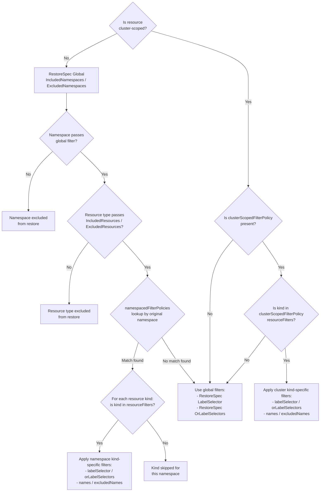

# Fine Grained Restore Filters via Resource Policies

This is a continuation of the work done for backup filters enhancement introduced by [PR 9783](https://github.com/velero-io/velero/pull/9783), referred to as Phase 1 throughout this design.

## Glossary & Abbreviation

**Restore Filter**: The mechanism in Velero that determines which resources from a backup archive are restored into the target cluster. Restore filters currently operate on four dimensions: namespace, resource type, label, and cluster scope.  
**Global Filter**: A filter that applies uniformly across all namespaces in a restore. All existing Velero restore filters are global filters.  
**Namespace-Scoped Filter**: A filter that applies only within specific namespaces, overriding the global filter for those namespaces. This is the capability introduced by this design.  
**ClusterScopedFilterPolicy**: A global filter for cluster-scoped resources that allows per-kind label selectors and name patterns, functioning similarly to `NamespacedFilterPolicy` but applied to cluster-scoped resources globally. Mirrors the backup-side concept of the same name.  
**Resource Filter**: A filter rule that pairs one or more resource kinds with their own label selector and/or name patterns. Multiple resource filters within a namespace-scoped policy allow different filtering criteria for different resource types.  
**Resource Name Filter**: A filter that matches individual resource instances by their metadata.name, using glob patterns. This filter dimension was introduced in Phase 1 (backup-side) and is extended to restore in this design.  
**Resource Policy**: An existing Velero mechanism where backup behavior rules are defined in a ConfigMap and referenced from `BackupSpec.ResourcePolicy`. Phase 1 extended this with `namespacedFilterPolicies` and `clusterScopedFilterPolicy` for backup. This design adds an analogous `RestoreSpec.ResourcePolicy` for restore, reusing the same ConfigMap format.  

## Background

### Why Restore-Side Filters?

Phase 1 enables selective backup — for example, backing up only Deployments and ConfigMaps from `ns-a` while backing up everything from `ns-b`. However, backup-time filtering alone is insufficient for several real-world restore scenarios:

**Scenario 1 — Selective restore from a full backup.** An organization performs full-cluster backups (all namespaces, all resource types) for disaster recovery. When a specific application needs recovery, the administrator wants to restore only the application's resources (specific resource types, specific names) from a single namespace — without restoring monitoring, logging, or infrastructure resources that exist in the same namespace. Today, `RestoreSpec.IncludedResources` applies globally, so filtering out ConfigMaps means filtering them out of *every* namespace being restored.

**Scenario 2 — Cross-environment migration with selective resources.** When migrating workloads between clusters, different namespaces may need different resource types restored. A database namespace needs StatefulSets and PVCs but not Deployments; a frontend namespace needs Deployments and Services but not PVCs. The current global filter cannot express this.

**Scenario 3 — Restore with name-based selection.** A backup contains many ConfigMaps and Secrets in a namespace (e.g., `app-config`, `app-secret`, `monitoring-config`, `monitoring-secret`). The user wants to restore only the `app-*` resources. Without name-based filtering at restore time, this requires either pre-filtering at backup time (which may not have been done) or post-restore manual cleanup.

**Scenario 4 — Restore-time override of backup-time filters.** A backup was produced with `namespacedFilterPolicies` that included specific resources per namespace. At restore time, the operator may want to apply *different* per-namespace filters — for example, restoring only a subset of what was backed up, or applying different label selectors to handle environment differences.

### Existing Restore Filter Mechanisms

The restore pipeline currently supports:

| Filter | Scope | Where Applied |
|---|---|---|
| `RestoreSpec.IncludedNamespaces` / `ExcludedNamespaces` | Global | `getOrderedResourceCollection()` |
| `RestoreSpec.IncludedResources` / `ExcludedResources` | Global | `getOrderedResourceCollection()`, `restoreItem()` |
| `RestoreSpec.LabelSelector` / `OrLabelSelectors` | Global | `getSelectedRestoreableItems()` |
| `RestoreSpec.IncludeClusterResources` | Global | `getOrderedResourceCollection()` |
| `RestoreSpec.NamespaceMapping` | Per-namespace | `getSelectedRestoreableItems()` |

All resource-type, label, and name filters are global. There is no per-namespace override capability.

### Design Approach: New `RestoreSpec.ResourcePolicy` Field

Phase 1 avoided CRD changes for backup by reusing the existing `BackupSpec.ResourcePolicy` ConfigMap reference. For restore, no equivalent field exists — `RestoreSpec` has no `ResourcePolicy` field today.

Two approaches were evaluated:

**Option A — Reuse the backup's ResourcePolicy ConfigMap.** The restore pipeline could read the `namespacedFilterPolicies` from the backup's ConfigMap. This is rejected because:
- Restore should be able to apply *different* filters than backup
- The backup's ConfigMap may no longer exist at restore time
- The backup's ConfigMap is semantically about backup behavior, not restore
- The ConfigMap may have been updated since the backup was taken
- The ConfigMap may not exist on the target cluster, because it's maybe on a different velero instance.

**Option B — Add `RestoreSpec.ResourcePolicy` (minimal CRD change).** Add a single `TypedLocalObjectReference` field to `RestoreSpec`, mirroring the existing `BackupSpec.ResourcePolicy` and `RestoreSpec.ResourceModifier` patterns. This is a small, focused CRD change that follows an established pattern in the codebase.

This design uses **Option B**. The rationale:

| Consideration | Assessment |
|---|---|
| CRD change size | **Minimal** — one `TypedLocalObjectReference` field, identical pattern to `ResourceModifier` |
| Precedent | `RestoreSpec.ResourceModifier` already uses the exact same pattern (ConfigMap ref loaded in `validateAndComplete()`) |
| Independence from backup | Restore filters are decoupled from backup filters — different ConfigMap, different lifecycle |
| Reuse | The `NamespacedFilterPolicy` and `ClusterScopedFilterPolicy` types from Phase 1 (`internal/resourcepolicies/`) are reused unchanged |

### Why Not Just Reuse `BackupSpec.ResourcePolicy` Semantics?

The backup-side `ResourcePolicy` ConfigMap contains multiple policy types (`volumePolicies`, `includeExcludePolicy`, `namespacedFilterPolicies`, `clusterScopedFilterPolicy`). Rather than forcing users to create a ConfigMap with backup-specific sections just to specify restore filters, this design introduces a restore-specific ConfigMap format that contains only `namespacedFilterPolicies` and `clusterScopedFilterPolicy` (and potentially other restore-specific policies in the future).

The restore-side ConfigMap uses the **same YAML structure** for both sections. The `NamespacedFilterPolicy` and `ClusterScopedFilterPolicy` types are reused without modification. This means:
- Users who already understand the backup-side format can immediately use the restore-side one
- The `internal/resourcepolicies/` validation code is reused
- A single ConfigMap can be used for both backup and restore if the user wants (by specifying it in both `BackupSpec.ResourcePolicy` and `RestoreSpec.ResourcePolicy`)

## Goals

- Add a `ResourcePolicy` field to `RestoreSpec` pointing to a ConfigMap with `namespacedFilterPolicies` and/or `clusterScopedFilterPolicy`
- Reuse the `NamespacedFilterPolicy`, `ClusterScopedFilterPolicy`, and `ResourceFilter` types from Phase 1 unchanged
- Apply per-namespace resource type filters, label selectors, and resource name patterns during restore
- Apply per-kind label selectors and name patterns for cluster-scoped resources during restore
- Maintain full backward compatibility — existing restores without `ResourcePolicy` behave exactly as they do today
- Define clear precedence rules for how per-namespace filters interact with global restore filters
- Add corresponding validation in the restore controller
- Update `velero restore describe` output to display per-namespace and cluster-scoped filter information when present
- Ensure restore-side filters work correctly with both filtered and unfiltered backups

## Non-Goals

- Modifying the existing `NamespacedFilterPolicy`, `ClusterScopedFilterPolicy`, or `ResourceFilter` types or the `internal/resourcepolicies/` package structure (reused as-is from Phase 1)
- Adding volume policies or include/exclude policies to the restore-side ResourcePolicy ConfigMap
- Supporting regex patterns for resource names (glob patterns only, consistent with Phase 1)
- Modifying the restore plugin `ResourceSelector` system (`AppliesTo()` / `resolvedAction.ShouldUse()`)
- CLI flags for inline specification of namespace-scoped restore filters (configuration is in ConfigMap YAML)

## Architecture of Restore-Side Filters

### Configuration Model

The restore-side filters are defined in a ConfigMap referenced by a new `RestoreSpec.ResourcePolicy` field. The ConfigMap YAML format reuses the `namespacedFilterPolicies` and `clusterScopedFilterPolicy` sections from Phase 1, with the same `resourceFilters` model:

```yaml
version: v1
clusterScopedFilterPolicy:
  # NEW: global overrides for cluster-scoped resources during restore
  resourceFilters:
    - kinds: [ClusterRole, ClusterRoleBinding]
      names: ["my-app-*"]
    - kinds: [CustomResourceDefinition]
      labelSelector:
        app: my-app
namespacedFilterPolicies:
  - namespaces:
      - ns-a
    resourceFilters:
      - kinds: [ConfigMap, Secret, Deployment]
        labelSelector:
          app: my-app
  - namespaces:
      - ns-b
    resourceFilters:
      - kinds: [Deployment]
        names: [app-1, app-2]
      - kinds: [ConfigMap]
        labelSelector:
          app: my-service
```

The restore-side ConfigMap does **not** require `volumePolicies` or `includeExcludePolicy` sections. Those are backup-specific. The YAML parser will ignore unknown fields gracefully, so a user can technically point to the same ConfigMap used for backup — the restore pipeline will only read `namespacedFilterPolicies` and `clusterScopedFilterPolicy`.

### The `resourceFilters` Model

Each `namespacedFilterPolicies` entry targets one or more namespaces and contains a `resourceFilters` array. Each entry in `resourceFilters` pairs one or more resource kinds with their own label selector and name patterns:

```yaml
namespacedFilterPolicies:
  - namespaces: [ns-a]
    resourceFilters:
      - kinds: [ConfigMap, Secret]        # these kinds share a selector
        labelSelector: {app: my-app}
        names: ["app-*"]
      - kinds: [Deployment]               # this kind has its own selector
        names: [workload-1, workload-2]
      - kinds: [StatefulSet]              # this kind has no extra filtering
```

Only resource kinds listed in `resourceFilters` entries are restored for the matched namespaces; unlisted kinds are implicitly excluded (globally excluded kinds cannot be re-included — see precedence model).

#### Catch-All Resource Filter (Empty `kinds` or `["*"]`)

A `ResourceFilter` entry with an empty (or omitted) `kinds` field, or a field explicitly set to `["*"]`, acts as a **catch-all**. Its `labelSelector` or `orLabelSelectors` (if provided) is applied to **all resource types in the namespace that are not already matched by a kind-specific filter entry**. If no selectors are provided, all unlisted resources are included. Using `["*"]` is highly recommended as it makes the catch-all intention explicit and self-documenting.

**Rules for catch-all entries:**
- At most **one** catch-all entry is allowed per `NamespacedFilterPolicy`.
- `names` and `excludedNames` are **not** supported on catch-all entries. Name patterns are kind-specific by nature and cannot be applied across arbitrary kinds; use kind-specific entries for name-based filtering.
- The catch-all applies to kinds that are **not listed in any other `resourceFilters` entry** in the same policy. Kind-specific entries take precedence over the catch-all.
- A catch-all entry **does not inherit or fall back to `RestoreSpec.LabelSelector`**. If a catch-all entry has no `labelSelector`/`orLabelSelectors`, all unlisted resource kinds in the namespace are included with **no label filtering** — the global label selector is not applied.
- **Catch-all is a `namespacedFilterPolicies`-only feature**. `clusterScopedFilterPolicy` does **not** support catch-all entries (empty or `["*"]` kinds). This is because `clusterScopedFilterPolicy` is a refinement overlay — unlisted cluster-scoped kinds already fall back to global filters by default. A catch-all would conflict with that fallback semantics. Validation rejects catch-all entries in `clusterScopedFilterPolicy`.

**Evaluation order within a namespace filter policy:**
1. For each resource kind encountered during restore, the system first checks whether a kind-specific `resourceFilters` entry exists for that kind.
2. If a kind-specific entry exists, it is used exclusively (label selectors, name patterns from that entry).
3. If no kind-specific entry exists but a catch-all entry is present, the catch-all's `labelSelector`/`orLabelSelectors` is applied to that kind.
4. If neither a kind-specific entry nor a catch-all entry exists, the kind is excluded from the restore for that namespace.

### Filter Precedence Model

The restore-side namespace-scoped filter system layers on top of the existing global restore filter system. The evaluation order is:

1. **Global namespace filter** (`RestoreSpec.IncludedNamespaces`/`ExcludedNamespaces`) is checked first. A namespace must pass this filter to be considered at all. `namespacedFilterPolicies` cannot override namespace exclusion — if a namespace is excluded globally, no filter policy entry can bring it back.

2. **Global resource type filter** (`RestoreSpec.IncludedResources`/`ExcludedResources`) is checked next. A resource type must pass the global filter to be considered. Per-namespace filters can further narrow the set of resource types within a namespace, but cannot include a resource type that is globally excluded.

3. **Per-namespace filter lookup.** For each namespace that passes the global filters, the system checks whether any `namespacedFilterPolicies` entry matches (by namespace name or glob pattern). If a match is found, the `resourceFilters` array determines what gets restored for that namespace:
   - Only resource kinds listed in `resourceFilters[].kinds` are restored (globally excluded kinds cannot be re-included by a per-namespace policy)
   - Each kind uses its own `labelSelector`/`orLabelSelectors` from its `ResourceFilter` entry, **replacing** the global label selector for that kind
   - Each kind uses its own `names`/`excludedNames` patterns from its `ResourceFilter` entry

4. **Namespaces without a matching filter policy** continue to use the global filters (`RestoreSpec.IncludedResources`, `RestoreSpec.LabelSelector`, etc.) exactly as they do today.

5. **If multiple filter policy entries could match the same namespace** (e.g., `team-*` and `team-frontend-*` both matching `team-frontend-prod`), the **first matching policy in the list** is used. **Important: Place more specific patterns before broader patterns** to achieve the intended filtering behavior.

6. **Namespace mapping** is applied after filter lookup. If `RestoreSpec.NamespaceMapping` maps `ns-a` to `ns-a-restored`, the filter policy lookup uses the *original* namespace name (`ns-a`), since the ConfigMap was authored against the backup's namespace structure.

**For Cluster-Scoped Resources:**

1. If `clusterScopedFilterPolicy` is present, it acts as a **refinement overlay** over the existing global filters for cluster-scoped resources. It is NOT an exclusive allowlist.
   - If a cluster-scoped kind is listed in its `resourceFilters`, its specific `labelSelector`/`orLabelSelectors` and `names`/`excludedNames` patterns are applied.
   - If a cluster-scoped kind is **not listed**, it falls back to the standard global filters (`RestoreSpec.LabelSelector`, etc.).

2. If `clusterScopedFilterPolicy` is absent, Velero falls back to the existing global filters (`IncludedResources`, `LabelSelector`, etc.) for cluster-scoped resources.

3. **The `velero.io/exclude-from-backup=true` label** always takes precedence over all filters. Although named for backup, this label is set on resources at backup time and remains present on items in the archive. The restore pipeline honors it: any item carrying this label is skipped regardless of whether it matches global or per-namespace restore filters.



### Key Difference from Backup-Side Precedence

Both sides enforce the same fundamental rule: **a per-namespace filter policy cannot re-include a resource kind that has been globally excluded**. The difference lies in which global gate enforces this constraint and how unlisted kinds are handled for namespaces *without* a matching filter policy:

- **Backup side**: The global exclusion gate is `includeExcludePolicy` (in the ResourcePolicy ConfigMap). It runs first at the resource-type level before any per-namespace lookup occurs. For a namespace that *has* a matching `namespacedFilterPolicies` entry, the per-namespace kind list acts as an exclusive allowlist — only listed kinds are collected, and no fallback to `BackupSpec.IncludedResources` occurs. However, any kind that `includeExcludePolicy` globally excludes remains excluded even if it appears in the per-namespace `resourceFilters`. For a namespace *without* a matching entry, the standard global filters (`BackupSpec.IncludedResources`, `BackupSpec.LabelSelector`, `includeExcludePolicy`) apply as before. See point 6 in the backup design's Filter Precedence Model (`fine-grained-backup-filters-design.md`) for the full treatment, including the warning log emitted when a per-namespace entry lists a globally excluded kind.
- **Restore side**: The global exclusion gate is `RestoreSpec.IncludedResources`/`ExcludedResources` directly on the RestoreSpec. It runs first, globally. For a namespace that *has* a matching `namespacedFilterPolicies` entry, the per-namespace kind list acts as an exclusive allowlist within what the global gate permits — a kind must pass the global filter and be listed in `resourceFilters` to be restored. No fallback to `RestoreSpec.IncludedResources` for additional kinds occurs. For a namespace *without* a matching entry, the standard global filters apply as before. See the "Interaction with Global `IncludedResources`/`ExcludedResources`" entry in the Edge Cases section below for a detailed example.

In both cases, per-namespace policies are an **allowlist that operates within globally established bounds** — the label selector for a matched kind is fully replaced by the per-namespace one on both sides.

For label selectors, **replacement** semantics are used on both sides, because label selectors are typically workload-specific and a per-namespace selector is a complete override of the filtering intent for that namespace.

| | Backup | Restore |
|---|---|---|
| **Data source** | Live cluster — items are listed from Kubernetes API | Backup archive — items are read from tarball |
| **Operator intent** | "What should go into the archive for this namespace?" | "Of what's in the archive, what should I restore for this namespace?" |
| **Global exclusion gate** | `includeExcludePolicy` in ResourcePolicy ConfigMap | `RestoreSpec.IncludedResources` / `ExcludedResources` |
| **Per-namespace kind list** | Exclusive allowlist — only listed kinds collected; globally excluded kinds cannot be re-included | Exclusive allowlist intersected with global filter — only listed kinds that also pass global filter are restored |
| **Namespaces without a matching policy** | Fall back to `BackupSpec.IncludedResources` + `includeExcludePolicy` | Fall back to `RestoreSpec.IncludedResources` / `ExcludedResources` |
| **Per-namespace label selector** | Replaces global label selector for that kind | Replaces global label selector for that kind |
| **clusterScopedFilterPolicy behavior** | Refinement overlay (unlisted kinds fall back to global) | Refinement overlay (unlisted kinds fall back to global) |

### Data Flow in the Restore Pipeline

The restore pipeline has two phases: resource selection and item restore. Namespace-scoped filters are applied in both:

**Phase A — Resource Selection (`getOrderedResourceCollection()` + `getSelectedRestoreableItems()`)**

Resources are enumerated from the backup archive (not from the live cluster — this is a key difference from backup).

- **Resource type check** in `getOrderedResourceCollection()`: The global resource type check still applies. Within the namespace iteration, a per-namespace resource type check is added. If a filter policy matches the current namespace, only kinds listed in `resourceFilters[].kinds` (or matched by a catch-all) are restored — unlisted kinds are skipped for that namespace. Globally excluded kinds cannot be re-included by a per-namespace policy.
- **Label selector** in `getSelectedRestoreableItems()`: The function looks up the filter policy for the current namespace and retrieves the `ResourceFilter` entry for the current resource kind. If found, it uses that entry's `labelSelector`/`orLabelSelectors` instead of the global ones. If not found, the global selectors are used as before.
- **Name pattern check** in `getSelectedRestoreableItems()`: After the label selector check, the item's name is checked against the `ResourceFilter` entry's `names`/`excludedNames` glob patterns for the current kind.

**Phase B — Item Restore (`restoreItem()`)**

The `restoreItem()` function is called for each selected item and also for "additional items" requested by restore plugins.

**Important:** Like the backup-side Stage 2 which is permissive for unlisted kinds requested by plugins, the restore-side Phase B is permissive for AdditionalItems requested by plugins regarding kind, name, and label selectors. This means if a plugin requests an AdditionalItem, it bypasses the fine-grained `namespacedFilterPolicies` and `clusterScopedFilterPolicy` checks, though it must still pass global resource/namespace exclusions. This is intentional to ensure that semantic dependencies (like a PV needed by a PVC) are successfully restored even if their specific resource kind or name pattern wasn't explicitly allowed in the user's namespace-scoped filter policy.

### Interaction with NamespaceMapping

When `RestoreSpec.NamespaceMapping` remaps namespaces (e.g., `ns-a` -> `ns-a-staging`), the filter policy lookup uses the **original** (backup-side) namespace name. This is because:

- The filter ConfigMap is authored against the backup's namespace structure
- The archive directory structure uses the original namespace names
- The `getSelectedRestoreableItems()` function receives `originalNamespace` and applies mapping afterward

The `getNamespaceFilter()` method on `restoreContext` takes the original namespace name as input.

### Interaction with Existing Restore Features

| Feature | Interaction |
|---|---|
| `RestoreSpec.RestorePVs` | Orthogonal — controls PV snapshot restoration, not resource inclusion |
| `RestoreSpec.ExistingResourcePolicy` | Orthogonal — controls overwrite behavior for resources that pass all filters |
| `RestoreSpec.RestoreStatus` | Orthogonal — controls status field restoration for resources that pass all filters |
| `RestoreSpec.Hooks` | Applied to resources that pass all filters. Hooks run regardless of how the item was selected |
| `RestoreSpec.ResourceModifier` | Applied to resources that pass all filters. Modifiers run on resources after filter selection |
| `RestoreSpec.PreserveNodePorts` | Orthogonal — applies to Services that pass all filters |
| Restore Item Actions (plugins) | Plugins may request "additional items." These go through `restoreItem()` which permits them, bypassing the fine-grained filter checks (similar to backup side Stage 2). |

### Edge Cases and Behavior Documentation

**Plugin Additional Items (Restore-Side):**
Like the backup side — which is permissive at Stage 2 to allow CSI plugin-injected resources through — the restore side is permissive for AdditionalItems in `restoreItem()`. If a restore plugin requests an additional item, it is allowed to bypass the fine-grained `namespacedFilterPolicies` and `clusterScopedFilterPolicy` kind, name, and label selector checks. This allows plugins to successfully restore dependencies (like a PV needed by a PVC, or a specific Secret) without the user having to explicitly authorize every single dependent resource type in their configuration. Note that these additional items must still pass global resource/namespace exclusions.

**Multiple Glob Patterns Matching Same Namespace (Incorrect Order):**
```yaml
namespacedFilterPolicies:
  - namespaces: ["team-*"]           # Broader pattern listed first
    resourceFilters:
      - kinds: [Deployment, Service]
  - namespaces: ["team-frontend-*"]  # More specific pattern listed second
    resourceFilters:
      - kinds: [ConfigMap, Secret, Deployment, Service]
```
**Behavior:** For namespace `team-frontend-prod`, the broader `team-*` pattern matches first, so only `Deployment` and `Service` are restored. The more specific `team-frontend-*` rule is never reached.

**Multiple Glob Patterns Matching Same Namespace (Correct Order):**
```yaml
namespacedFilterPolicies:
  - namespaces: ["team-frontend-*"]  # More specific pattern listed first
    resourceFilters:
      - kinds: [ConfigMap, Secret, Deployment, Service]
  - namespaces: ["team-*"]           # Broader pattern listed second
    resourceFilters:
      - kinds: [Deployment, Service]
```
**Behavior:** For namespace `team-frontend-prod`, the specific `team-frontend-*` pattern matches first, restoring all specified resources. For `team-backend-dev`, the broader `team-*` pattern matches, restoring only `Deployment` and `Service`. This achieves the intended behavior.

**Namespace Included Globally But No Matching Filter Policy:**
```yaml
# RestoreSpec includes "production" namespace
# ResourcePolicy has no namespacedFilterPolicies entry for "production"
```
**Behavior:** The namespace uses global filters exactly as it does today. This is the backward compatibility behavior.

**Empty ResourceFilters Array:**
```yaml
namespacedFilterPolicies:
  - namespaces: ["test-namespace"]
    resourceFilters: []  # empty array
```
**Behavior:** Validation error during restore creation:
```
namespacedFilterPolicies[0]: at least one resourceFilter must be specified
```

**Namespace Pattern with No Matches:**
```yaml
namespacedFilterPolicies:
  - namespaces: ["nonexistent-*"]
    resourceFilters: [...]
```
**Behavior:** No error. The filter policy is loaded but never applied since no namespaces match the pattern.

**Resource Kind Not Present in Target Namespaces:**
```yaml
resourceFilters:
  - kinds: ["StatefulSet"]  # namespace has no StatefulSets in the backup archive
    names: ["workload-1"]
```
**Behavior:** No error. The filter is applied but finds no matching resources. Empty result set is valid.

**Conflicting Name Patterns:**
```yaml
resourceFilters:
  - kinds: ["ConfigMap"]
    names: ["app-*"]
    excludedNames: ["app-config"]  # conflicts with names pattern
```
**Behavior:** The `excludedNames` takes precedence. Resources matching `app-*` are included, then `app-config` is excluded. Net result: includes `app-secret`, `app-data`, etc., but excludes `app-config`.

**Invalid Label Selector Syntax:**
```yaml
resourceFilters:
  - kinds: ["Deployment"]
    labelSelector:
      "invalid label key!": "value"  # invalid key syntax
```
**Behavior:** Validation error during restore creation when `labels.ValidatedSelectorFromSet()` fails:
```
namespacedFilterPolicies[0].resourceFilters[0]: invalid label selector: "invalid label key!" is not a valid label key
```

**Out-of-Scope Kinds in Filter Entries:**
A user may accidentally list a cluster-scoped kind (e.g., `ClusterRole`) inside a `namespacedFilterPolicies` entry, or a namespace-scoped kind (e.g., `ConfigMap`) inside `clusterScopedFilterPolicy`. The system silently ignores such entries at the archive traversal level: namespace-scoped items are never in the cluster-scope portion of the archive, and vice versa. A warning is logged at restore start so the user can detect the misconfiguration:

```
WARN  kind "ClusterRole" in namespacedFilterPolicies[0].resourceFilters[1] is a cluster-scoped resource; it will never match in a namespace-scoped filter — did you mean clusterScopedFilterPolicy?
```

**Discovery Helper Unavailable:**
If the discovery helper is unavailable during restore initialization, the restore fails with:
```
failed to resolve namespace filter policies: discovery client unavailable
```

**Interaction with Global `IncludedResources`/`ExcludedResources`:**

`namespacedFilterPolicies` operates within the bounds already established by the global resource type filter — it is a refinement, not a replacement. `RestoreSpec.IncludedResources`/`ExcludedResources` is applied first at the resource-type level, before any per-namespace filter policy is consulted. A namespace-scoped filter policy cannot re-include a resource kind that has been globally excluded.

Two separate gates are applied in order:
1. **`RestoreSpec.IncludedResources`/`ExcludedResources` runs first**, globally, across all namespaces. It decides which resource types are eligible at all.
2. **`namespacedFilterPolicies` runs second**, within the bounds established by step 1. It can only further restrict kinds that survived the global gate — it cannot widen it.

```yaml
# RestoreSpec
excludedResources: [secrets]          # global — Secrets excluded from all namespaces

# ResourcePolicy ConfigMap
namespacedFilterPolicies:
  - namespaces: [ns-a]
    resourceFilters:
      - kinds: [ConfigMap, Secret]    # Secret listed here is ineffective — globally excluded
        labelSelector:
          app: my-app
      - kinds: [Deployment]
```

**What gets restored from `ns-a`:**
- `ConfigMap` with label `app=my-app` — restored (listed in per-namespace policy, not globally excluded)
- `Secret` with label `app=my-app` — **not restored** (globally excluded by `ExcludedResources`, even though listed in the per-namespace policy)
- `Deployment` — restored (listed in per-namespace policy, not globally excluded)

The "no fallback to `RestoreSpec.IncludedResources`" rule means that for a namespace *with* a matching policy, only the kinds listed in `resourceFilters` are candidates for restore — `RestoreSpec.IncludedResources` is not consulted to add additional kinds. The global `ExcludedResources` exclusions, however, still apply because they are enforced at an earlier, separate stage.

To restore `Secret` in specific namespaces, users must remove `secrets` from `ExcludedResources` globally, or restructure their policy.

A warning is logged at restore start when a `namespacedFilterPolicies` entry lists a kind that is globally excluded:
```
level=warn msg="namespacedFilterPolicies entry lists a kind that is globally excluded by RestoreSpec.ExcludedResources; the per-namespace filter entry has no effect" kind="secrets" namespacePattern="ns-a"
```

> **See also:** The backup-side design's "Interaction with `includeExcludePolicy`" (point 6 in the Filter Precedence Model of `fine-grained-backup-filters-design.md`) documents the structurally identical behavior for backup. The only difference is the global gate: on the backup side it is `includeExcludePolicy` (in the ResourcePolicy ConfigMap); on the restore side it is `RestoreSpec.IncludedResources`/`ExcludedResources` (on the RestoreSpec directly).

# Detailed Design

## Workflow

### Restore Workflow

The restore workflow is preserved with the following additions. The modules in the existing restore path remain unchanged when `ResourcePolicy` is absent from `RestoreSpec`.

**Step 1 — Load and parse policies (in `restore_controller.go`, `validateAndComplete()`)**

The restore controller loads the ConfigMap, similar to how `ResourceModifier` is loaded today:

The loaded policies are passed through to `runValidatedRestore()` and stored on the `restore.Request`.

**Step 2 — Resolve namespace and cluster-scoped filter maps (in `restore.go`, `RestoreWithResolvers()`)**

After existing filter setup, the filter policies are resolved into the runtime maps:

The `resolveRestoreNamespacedFilterPolicies` function:
- For each `NamespacedFilterPolicy`, iterates its `ResourceFilters` entries
- Resolves kind names to fully-qualified group-resource strings using the discovery helper
- Converts `labelSelector` maps into `labels.Selector` objects using `labels.ValidatedSelectorFromSet()`
- Converts `orLabelSelectors` maps into `[]labels.Selector`
- Creates `IncludesExcludes` instances for `names`/`excludedNames` patterns
- Identifies catch-all entries (empty or `["*"]` kinds) and stores them in `catchAllFilter`
- Builds a `resourceFilterMap` keyed by the resolved group-resource string
- Returns both the map and an ordered `namespacedFilterPatterns` slice for first-match traversal

**Step 3 — Per-namespace resource type check (in `restore.go`, `getOrderedResourceCollection()`)**

Inside the namespace iteration, after the global namespace check and global resource type check, and before calling `getSelectedRestoreableItems()`:

**Step 4 — Label selector and name filter (in `restore.go`, `getSelectedRestoreableItems()`)**

Before the items loop, resolve the effective `ResourceFilter` (hoisted for performance). The function handles three cases in order:

1. **Namespace-scoped item with a matching `namespacedFilterPolicies` entry** — resolve the effective `ResourceFilter` by checking the kind-specific entry first, then falling back to the catch-all
2. **Cluster-scoped item with the kind listed in `clusterScopedFilterPolicy`** — apply that kind's label/name filters (refinement overlay; unlisted cluster-scoped kinds fall through to global)
3. **All other cases** — fall back to the existing global label selector logic

**Note on cluster-scoped resources:** There is no separate kind-level skip step in `getOrderedResourceCollection()` for cluster-scoped resources analogous to Step 3. `clusterScopedFilterPolicy` is a refinement overlay — unlisted cluster-scoped kinds are not skipped; they fall through to existing global filter handling. Behavior changes only when the kind is explicitly listed in `clusterScopedFilterMap`, and only in `getSelectedRestoreableItems()` (above).

### Backup Workflow

No changes. The backup pipeline is unaffected by this design.

### Delete Workflow

No changes. Restore deletion removes the restore metadata. The backup archive is unaffected.

## Validation

The following validation is added in `restore_controller.go`'s `validateAndComplete()`:

1. **ConfigMap existence and format**: Handled by `GetResourcePoliciesFromRestore()`, which returns validation errors if the ConfigMap is missing, malformed, or fails `Policies.Validate()`.

2. **`ResourcePolicy.Kind` must be `"configmap"`** (case-insensitive): Consistent with `BackupSpec.ResourcePolicy` and `RestoreSpec.ResourceModifier`.

3. **Namespace filter policy validation** (delegated to `Policies.Validate()`):
   - Each filter policy must specify at least one namespace
   - Each filter policy must specify at least one resource filter
   - Each resource filter without kinds can only be defined once (at most one catch-all), and cannot specify `names`/`excludedNames`
   - No duplicate kinds across resource filter entries within the same namespace filter
   - `labelSelector` and `orLabelSelectors` cannot co-exist within each resource filter
   - No duplicate exact namespace patterns across filter policies (overlapping glob patterns are allowed — first-match semantics handle them at runtime)
   - Name/excludedNames patterns must be valid globs

4. **`clusterScopedFilterPolicy` validation** (delegated to `Policies.Validate()`):
   - At least one resourceFilter must be specified
   - Each resource filter must specify at least one kind — **catch-all (empty `kinds` or `["*"]`) is NOT permitted in `clusterScopedFilterPolicy`** since it is a refinement overlay rather than an allowlist
   - No duplicate kinds across resource filters
   - `labelSelector` and `orLabelSelectors` mutual exclusion
   - Resource name patterns must be valid globs

5. **Mutual exclusion with global `OrLabelSelectors`/`LabelSelector`**: If `namespacedFilterPolicies` are present and the `RestoreSpec` also has both `LabelSelector` and `OrLabelSelectors`, the existing validation catches this. No additional validation needed for the interaction — per-namespace selectors simply override the global ones for matching namespaces.

## ConfigMap Examples

### Restore-Specific ResourcePolicy ConfigMap

Restore only Deployments and ConfigMaps (labeled `app=my-app`) from `ns-a`, but everything from `ns-b`:

```yaml
apiVersion: v1
kind: ConfigMap
metadata:
  name: restore-filter-policy
  namespace: velero
data:
  policy: |
    version: v1
    namespacedFilterPolicies:
      - namespaces:
          - ns-a
        resourceFilters:
          - kinds: [Deployment, ConfigMap]
            labelSelector:
              app: my-app
      # ns-b has no filter policy entry, so global filters apply (restore everything)
```

Restore CR:

```yaml
apiVersion: velero.io/v1
kind: Restore
metadata:
  name: selective-restore
  namespace: velero
spec:
  backupName: full-backup
  includedNamespaces:
    - ns-a
    - ns-b
  resourcePolicy:
    kind: configmap
    name: restore-filter-policy
```

### Restore with Name Pattern Filtering

Restore only `app-*` ConfigMaps and Secrets from `production`:

```yaml
apiVersion: v1
kind: ConfigMap
metadata:
  name: app-restore-filter
  namespace: velero
data:
  policy: |
    version: v1
    namespacedFilterPolicies:
      - namespaces:
          - production
        resourceFilters:
          - kinds: [ConfigMap, Secret]
            names: ["app-*"]
            excludedNames: ["*-tmp", "*-debug"]
```

### Catch-All with No Label Selector (Override-Only)

A user may want to use the global configuration for 99% of resources in a namespace, but only apply a specific name filter to a single kind. A catch-all filter without a label selector achieves this:

```yaml
apiVersion: v1
kind: ConfigMap
metadata:
  name: override-only-restore-policy
  namespace: velero
data:
  policy: |
    version: v1
    namespacedFilterPolicies:
      - namespaces:
          - ns-a
        resourceFilters:
          - kinds: [Secret]
            names: [my-secret]     # Specific override for Secrets
          - kinds: ["*"]           # Catch-all: NO label selector
            # Restores all other kinds unconditionally
```

**Result:**
- `Secret` resources: only `my-secret` is restored.
- All other resource types: restored unconditionally (acting like a global fallback).

### Catch-All with Per-Kind Name Overrides

Use exact names for specific kinds, and fall back to a label selector for all remaining kinds:

```yaml
apiVersion: v1
kind: ConfigMap
metadata:
  name: mixed-restore-filter-policy
  namespace: velero
data:
  policy: |
    version: v1
    namespacedFilterPolicies:
      - namespaces:
          - production
        resourceFilters:
          - kinds: [Deployment]
            names: [api-server, worker]        # these exact Deployments by name
          - kinds: [Secret]
            names: [db-credentials, tls-cert]  # these exact Secrets by name
          - kinds: ["*"]                        # catch-all for all other kinds
            labelSelector:
              backup: "true"                   # restore by label
```

**Result:**
- `Deployment` resources: only `api-server` and `worker` are restored.
- `Secret` resources: only `db-credentials` and `tls-cert` are restored.
- All other resource types: restored only if they carry `backup=true`.

### Cluster-Scoped Filter Policy

Restore only specific ClusterRoles and CRDs matching a label:

```yaml
apiVersion: v1
kind: ConfigMap
metadata:
  name: cluster-restore-filter
  namespace: velero
data:
  policy: |
    version: v1
    clusterScopedFilterPolicy:
      resourceFilters:
        - kinds: [ClusterRole, ClusterRoleBinding]
          names: ["my-app-*"]
        - kinds: [CustomResourceDefinition]
          labelSelector:
            app: my-app
    namespacedFilterPolicies:
      - namespaces:
          - production
        resourceFilters:
          - kinds: [Deployment, ConfigMap, Secret, StatefulSet, PersistentVolumeClaim]
```

### Restore with Glob Namespace Patterns

Apply the same filter to all namespaces matching a pattern. **Critical: Order patterns from most specific to least specific:**

```yaml
apiVersion: v1
kind: ConfigMap
metadata:
  name: team-restore-filter
  namespace: velero
data:
  policy: |
    version: v1
    namespacedFilterPolicies:
      # More specific patterns first
      - namespaces:
          - "team-frontend-prod"      # Most specific (exact match)
        resourceFilters:
          - kinds: [Deployment, Service, ConfigMap, Secret, PersistentVolumeClaim]
      - namespaces:
          - "team-frontend-*"         # Less specific (pattern match)
        resourceFilters:
          - kinds: [Deployment, Service, ConfigMap]
      - namespaces:
          - "team-*"                  # Least specific (broad pattern)
        resourceFilters:
          - kinds: [Deployment, Service]
```

**Pattern Matching Results:**
- `team-frontend-prod` → Uses exact match policy (restores 5 resource types)
- `team-frontend-dev` → Uses `team-frontend-*` policy (restores 3 resource types)
- `team-backend-test` → Uses `team-*` policy (restores 2 resource types)
- `app-namespace` → No match, uses global filters

### Same ConfigMap for Backup and Restore

A single ConfigMap can be referenced by both `BackupSpec.ResourcePolicy` and `RestoreSpec.ResourcePolicy`. The backup pipeline uses `volumePolicies`, `includeExcludePolicy`, `namespacedFilterPolicies`, and `clusterScopedFilterPolicy`. The restore pipeline uses only `namespacedFilterPolicies` and `clusterScopedFilterPolicy`:

```yaml
apiVersion: v1
kind: ConfigMap
metadata:
  name: shared-policy
  namespace: velero
data:
  policy: |
    version: v1
    volumePolicies:
      - conditions:
          capacity: "0,10Gi"
        action:
          type: fs-backup
    clusterScopedFilterPolicy:
      resourceFilters:
        - kinds: [ClusterRole, ClusterRoleBinding]
          names: ["my-app-*"]
    namespacedFilterPolicies:
      - namespaces:
          - production
        resourceFilters:
          - kinds: [Deployment, ConfigMap, Secret, StatefulSet, PersistentVolumeClaim]
```

### Restore CR — No ResourcePolicy (backward compatible)

Existing restores continue to work exactly as before:

```yaml
apiVersion: velero.io/v1
kind: Restore
metadata:
  name: full-restore
  namespace: velero
spec:
  backupName: my-backup
  includedNamespaces:
    - "*"
```

## CLI

### `velero restore describe`

The output is extended to display namespace-scoped and cluster-scoped filter policies when present:

```
Name:         selective-restore
Namespace:    velero
Labels:       <none>
Annotations:  <none>

Phase:  Completed

Errors:    0
Warnings:  0

Backup:  full-backup

Namespaces:
  Included:  ns-a, ns-b
  Excluded:  <none>

Resources:
  Included:        *
  Excluded:        <none>
  Cluster-scoped:  auto

Namespace Mapping:  <none>

Label Selector:  <none>

Resource Policy:  restore-filter-policy

Namespace-Scoped Filter Policies:
  ns-a:
    Resource Filters:
      Deployment, ConfigMap:
        Label selector:     app=my-app
        Included names:     <none>
        Excluded names:     <none>

Cluster-Scoped Filter Policy:
  Resource Filters:
    ClusterRole, ClusterRoleBinding:
      Label selector:     <none>
      Included names:     [my-app-*]
      Excluded names:     <none>
    CustomResourceDefinition:
      Label selector:     app=my-app
      Included names:     <none>
      Excluded names:     <none>

Restore PVs:  auto

...
```

### `velero restore create`

A new `--resource-policies-configmap` flag is added to `velero restore create`, mirroring the existing backup-side flag:

```bash
velero restore create selective-restore \
  --from-backup full-backup \
  --include-namespaces ns-a,ns-b \
  --resource-policies-configmap restore-filter-policy
```

The `--help` output for `velero restore create` is updated to clarify the interaction between global and namespace-scoped filters:

```
Restore Filtering Options:
  --include-namespaces stringArray                    namespaces to include in the restore (use '*' for all namespaces)
  --exclude-namespaces stringArray                    namespaces to exclude from the restore
  --include-resources stringArray                     resources to include in the restore, formatted as resource.group
  --exclude-resources stringArray                     resources to exclude from the restore, formatted as resource.group
  --include-cluster-resources optionalBool[=true]     include cluster-scoped resources
  --selector labelSelector                            only restore resources matching this label selector
  --or-selector labelSelector                         restore resources matching any of the label selectors (can be repeated)
  --resource-policies-configmap string                reference to a configmap containing resource policies for namespace-scoped and cluster-scoped filtering

Notes:
- Global filters (--include-resources, --selector, etc.) apply to all included namespaces
- Namespace-scoped filters defined in --resource-policies-configmap refine global filters for matching namespaces (globally excluded kinds cannot be re-included)
- Fine-grained global filter policies defined in --resource-policies-configmap refine global filters for cluster-scoped resources
- Use 'velero restore describe' to view resolved filter policies after restore creation
```

## User Perspective

- **For users not using restore-side filter policies**: Zero changes. All existing restores work identically.
- **For users adopting restore-side filter policies**: Create a ConfigMap with the `namespacedFilterPolicies` and/or `clusterScopedFilterPolicy` sections and reference it via `RestoreSpec.ResourcePolicy` (or `--resource-policies-configmap` CLI flag). The restore will selectively include/exclude resources per namespace.
- **For users already using backup-side filter policies**: Restore-side policies are independent. A backup-side ConfigMap can be reused for restore (both `BackupSpec.ResourcePolicy` and `RestoreSpec.ResourcePolicy` can point to the same ConfigMap), or a different ConfigMap can be used.
- **Interaction with NamespaceMapping**: Filter policies use the original (backup-side) namespace names. If `NamespaceMapping` remaps `ns-a` to `ns-b`, the filter ConfigMap should reference `ns-a`.
- **`velero restore describe`**: Shows per-namespace and cluster-scoped filter details when `ResourcePolicy` is present.
- **Validation errors**: Reported at restore start when the ConfigMap is invalid.

## Alternatives Considered

1. **Reuse Backup's ResourcePolicy ConfigMap**: Automatically apply the backup's `namespacedFilterPolicies` during restore without requiring restore-side configuration. Rejected because restore should be independently configurable from backup, and the backup's ConfigMap may not exist at restore time or may have been modified.

2. **No CRD Change — Annotation-Based Reference**: Use a Velero annotation on the Restore CR to point to the ConfigMap instead of a CRD field. Rejected because annotations are not validated, not documented via `kubectl explain`, and are inconsistent with how the backup side works.

3. **Embed Filter Policies in RestoreSpec (Full CRD Approach)**: Add `NamespacedFilters []NamespaceFilter` directly to `RestoreSpec`. Rejected because it requires complex nested CRD types, doesn't reuse the Phase 1 ConfigMap infrastructure, and is a drift from backup side design.

4. **CLI-Only (No CRD Change)**: Express restore filters entirely via CLI flags that get stored as annotations. Rejected because it doesn't support the declarative Restore CR workflow and is not auditable.
