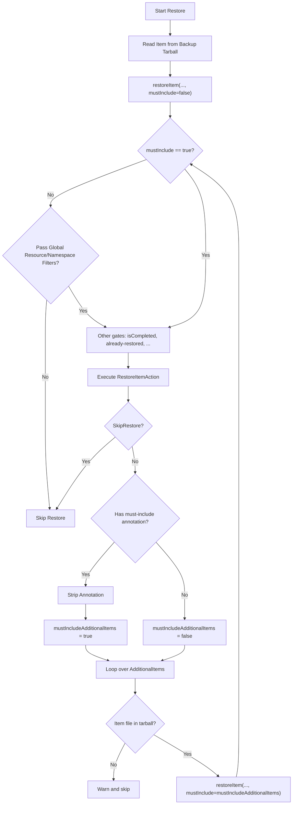

# RestoreItemAction Must-Include Additional Items

## Abstract

Backup Item Actions (BIAs) can already mark additional items as must-include via `backup.velero.io/must-include-additional-items`, so Velero bypasses resource and namespace exclusion filters when backing those dependencies up.
This proposal adds the same plugin-controlled escape hatch on restore: `restore.velero.io/must-include-additional-items`, so Restore Item Actions (RIAs) can force-restore declared `AdditionalItems` even when they would otherwise be dropped by global restore filters.

## Glossary & Abbreviation

**Additional Item**: A resource identifier returned by a Backup/Restore Item Action's `Execute()` result that Velero should process as a dependency of the current item.  
**BIA**: Backup Item Action plugin.  
**RIA**: Restore Item Action plugin.  
**Must-Include**: A plugin-set annotation on the action's `UpdatedItem` that tells Velero to bypass global include/exclude filters for that action's `AdditionalItems`.  
**Global Restore Filter**: `RestoreSpec` filters applied uniformly — `IncludedNamespaces`/`ExcludedNamespaces`, `IncludedResources`/`ExcludedResources`, `IncludeClusterResources`, and label selectors.  
**Fine-Grained Restore Filter**: Per-namespace / cluster-scoped policies from `RestoreSpec.ResourcePolicy` (`namespacedFilterPolicies`, `clusterScopedFilterPolicy`), as described in [Fine Grained Restore Filters via Resource Policies](https://github.com/velero-io/velero/blob/main/design/restore-filter-enhancement/fine-grained-restore-filters-design.md).  
**`resourceMustHave`**: A small hardcoded server-side set of resource types that bypass resource and namespace I/E checks inside `restoreItem()` today (but not `IncludeClusterResources=false`).  

## Background

### Backup-side precedent

On backup, a BIA may set `backup.velero.io/must-include-additional-items: "true"` on the returned `UpdatedItem`.
Velero strips that annotation (it is an internal signal, not intended to land on the live object) and passes `mustInclude=true` into recursive `backupItem` calls for that action's `AdditionalItems`.
When `mustInclude` is true, `itemInclusionChecks` skips namespace/resource exclusion checks (and related exclusion labels / fine-grained name filters) so plugin-declared dependencies are not dropped by the user's backup filters.
In-tree CSI BIAs already rely on this for VolumeSnapshot / VolumeSnapshotContent / VolumeSnapshotClass style dependency chains.

### Restore-side gap

On restore, RIAs can return `AdditionalItems`, and Velero recursively calls `restoreItem()` for each of them.
That path already bypasses fine-grained restore filters and global label selectors, because those are evaluated earlier in `getOrderedResourceCollection` / `getSelectedRestoreableItems`.
However, `restoreItem()` still enforces global resource includes/excludes, namespace includes/excludes, and `IncludeClusterResources=false`.

The fine-grained restore filters design explicitly documents this remaining floor:

> Note that these additional items must still pass global resource/namespace exclusions.

There is no restore-side equivalent of the BIA must-include annotation.
Plugins that need a hard dependency restored despite a selective restore configuration have no opt-in way to express that, short of relying on the server-side `resourceMustHave` list (which is global, not plugin-scoped, and does not bypass `IncludeClusterResources=false`).

### Motivating scenario

Consider a selective restore that includes only application namespaces and excludes storage/snapshot resource types, while a plugin knows that restoring a PVC correctly requires a related cluster-scoped or cross-namespace dependency that exists in the backup archive.
Today the RIA can request that dependency as an `AdditionalItem`, but Velero will skip it at the global exclusion checks inside `restoreItem()`.
With a restore must-include annotation, the plugin can declare the dependency as required and Velero will restore it (provided the object is present in the backup tarball).

## Goals

- Add `restore.velero.io/must-include-additional-items` with the same parent-annotation contract as the backup-side must-include annotation.
- When an RIA sets the annotation on `UpdatedItem`, bypass global resource I/E, namespace I/E, and `IncludeClusterResources=false` for that RIA's `AdditionalItems`.
- Keep the change opt-in and backward compatible: restores and plugins that do not set the annotation behave exactly as today.
- Document the trust model, precedence rules, and interaction with existing restore gates for plugin authors and operators.

## Non-Goals

- Changing the plugin protobuf / `RestoreItemAction` interface shape (no new RPC fields).
- Changing CRDs or adding CLI flags.
- Changing the `resourceMustHave` list (including any narrowing related to VolumeSnapshotContent).
- Updating in-tree RIAs (CSI or otherwise) to set the new annotation as part of this change.
- Per-additional-item granularity (the annotation applies blanket to all `AdditionalItems` from that RIA invocation, matching BIA).
- Materializing items that were never backed up.

## High-Level Design

Mirror the backup workflow:

1. Introduce annotation constant `restore.velero.io/must-include-additional-items`.
2. After each RIA `Execute()`, if `UpdatedItem` carries the annotation with value `"true"`, strip it and set `mustIncludeAdditionalItems=true`.
3. Pass that boolean into recursive `restoreItem(..., mustInclude)` calls for the action's `AdditionalItems`.
4. When `mustInclude` is true, skip the global resource/namespace/`IncludeClusterResources` exclusion checks inside `restoreItem()`.
5. Keep all non-filter gates unchanged (tarball presence, already-restored, completed Jobs, API errors, wait-for-additional-items, etc.).

Top-level items from the archive continue to be restored with `mustInclude=false`, so user filters still apply to the primary restore set.



> The edge `recursiveRestoreItem --> checkMustInclude` is a recursive call (new `restoreItem` stack frame), not a same-frame loop.

## Detailed Design

### Annotation constant

In `pkg/apis/velero/v1/labels_annotations.go`, next to the existing backup constant:

```go
// Velero checks this annotation to determine whether to skip resource excluding check.
MustIncludeAdditionalItemAnnotation = "backup.velero.io/must-include-additional-items"

// MustIncludeAdditionalItemRestoreAnnotation is set by RestoreItemActions on the UpdatedItem
// to tell Velero to bypass global resource/namespace exclusion checks (and IncludeClusterResources=false)
// for that action's AdditionalItems. Value must be "true". The annotation is stripped before
// the item is applied to the cluster.
//
// Notice: SkipRestore on the Execute output takes precedence. If SkipRestore is true, the
// annotation is never inspected and AdditionalItems are not processed.
MustIncludeAdditionalItemRestoreAnnotation = "restore.velero.io/must-include-additional-items"
```

Only the string value `"true"` enables the bypass (same as backup).

### `restoreItem` signature

```go
func (ctx *restoreContext) restoreItem(
	obj *unstructured.Unstructured,
	groupResource schema.GroupResource,
	namespace string,
	mustInclude bool,
) (results.Result, results.Result, bool)
```

Call sites:

| Site | `mustInclude` value |
|---|---|
| Top-level restore loop | `false` |
| Recursive additional-item restore after an RIA | derived from that RIA's `UpdatedItem` annotation |

### Bypass exclusion checks; keep namespace creation

Today, namespace exclusion and `EnsureNamespaceExistsAndIsReady` share one `if namespace != ""` block in `restoreItem()`.
If must-include only skipped the exclusion check without refactoring, an additional item targeting an excluded namespace would fail because its target namespace was never ensured.

Required structure:

```go
if mustInclude {
	restoreLogger.Info("Skipping the resource/namespace exclusion checks because the item is marked as must-include")
} else {
	if !ctx.resourceIncludesExcludes.ShouldInclude(groupResource.String()) && !ctx.resourceMustHave.Has(groupResource.String()) {
		restoreLogger.Info("Not restoring item because resource is excluded")
		return warnings, errs, itemExists
	}

	if namespace != "" {
		if !ctx.namespaceIncludesExcludes.ShouldInclude(obj.GetNamespace()) && !ctx.resourceMustHave.Has(groupResource.String()) {
			restoreLogger.Info("Not restoring item because namespace is excluded")
			return warnings, errs, itemExists
		}
	} else {
		if boolptr.IsSetToFalse(ctx.restore.Spec.IncludeClusterResources) {
			restoreLogger.Info("Not restoring item because it's cluster-scoped")
			return warnings, errs, itemExists
		}
	}
}

// Namespace creation runs regardless of mustInclude.
if namespace != "" {
	nsToEnsure := getNamespace(restoreLogger, archive.GetItemFilePath(ctx.restoreDir, "namespaces", "", obj.GetNamespace()), namespace)
	_, nsCreated, err := kube.EnsureNamespaceExistsAndIsReady(nsToEnsure, ctx.namespaceClient, ctx.resourceTerminatingTimeout, ctx.resourceDeletionStatusTracker)
	// ... existing error handling and restoredItems bookkeeping ...
}
```

Namespace remapping is unchanged: exclusion checks use the original namespace (`obj.GetNamespace()`); namespace creation uses the remapped target `namespace` parameter.

### Process the annotation after each RIA

Inside the applicable-actions loop in `restoreItem()`, after `SkipRestore` handling and type-asserting `UpdatedItem`:

```go
obj = unstructuredObj

mustIncludeAdditionalItems := false
if annotations := obj.GetAnnotations(); annotations != nil &&
	annotations[velerov1api.MustIncludeAdditionalItemRestoreAnnotation] == "true" {
	mustIncludeAdditionalItems = true
	restoreLogger.Info("RestoreItemAction marked additional items as must-include; bypassing resource/namespace exclusion checks for them")
	delete(annotations, velerov1api.MustIncludeAdditionalItemRestoreAnnotation)
	obj.SetAnnotations(annotations)
}

for _, additionalItem := range executeOutput.AdditionalItems {
	// existing tarball stat / unmarshal / namespace mapping ...
	w, e, additionalItemExists := ctx.restoreItem(
		additionalObj,
		additionalItem.GroupResource,
		additionalItemNamespace,
		mustIncludeAdditionalItems,
	)
	// existing merge / filteredAdditionalItems bookkeeping ...
}
```

### Filter bypass matrix

| Gate | Plain AdditionalItem | `resourceMustHave` | RIA `mustInclude=true` | BIA `mustInclude=true` (parity target) |
|---|---|---|---|---|
| Fine-grained policies (kind/name/label) | Bypass (never enter selection Phase B filters) | N/A in `restoreItem` | Bypass (same) | Bypass |
| Global label selectors | Bypass (never re-enter selection) | N/A in `restoreItem` | Bypass (same) | Bypass |
| Global resource I/E | Honored | Bypass | Bypass | Bypass |
| Global namespace I/E | Honored | Bypass | Bypass | Bypass |
| `IncludeClusterResources=false` | Honored | Honored (not bypassed) | Bypass | Bypass |
| Item must exist in backup tarball | Required | Required | Required | N/A (fetched from cluster) |
| `isCompleted` / already-restored / API errors | Still apply | Still apply | Still apply | `DeletionTimestamp` still applies on backup |

RIA must-include is intentionally a **stronger** override than `resourceMustHave` because it also bypasses `IncludeClusterResources=false`.
That matches BIA must-include semantics (plugin-trusted hard dependencies), rather than widening the hardcoded server list.

### Interaction with fine-grained restore filters

Per [Fine Grained Restore Filters via Resource Policies](../restore-filter-enhancement/fine-grained-restore-filters-design.md), plugin additional items already bypass `namespacedFilterPolicies` / `clusterScopedFilterPolicy` kind, name, and label checks.
Those filters live in the selection phases; additional items enter `restoreItem()` directly.

This proposal only changes the remaining global gates inside `restoreItem()`.
With must-include set, an additional item effectively bypasses **all** restore filters (fine-grained and global).
Without the annotation, behavior is unchanged: fine-grained filters are still bypassed, global exclusions still apply.

### Interaction with existing restore gates

#### `SkipRestore` precedence

If `Execute()` returns `SkipRestore: true`, `restoreItem()` returns before inspecting the annotation, and no `AdditionalItems` are processed.
This mirrors backup-side precedence where `velero.io/skip-from-backup` outranks must-include.

#### Multi-RIA semantics

Annotation handling is per RIA invocation inside the actions loop:

1. RIA N executes → inspect/strip annotation on that `UpdatedItem` → restore that RIA's `AdditionalItems` with the derived flag.
2. RIA N+1 sees the already-stripped object unless it sets the annotation again.

A later RIA does not inherit an earlier RIA's must-include decision.

#### Transitive propagation

The parent's `mustInclude` flag admits the child additional item through filters.
It does **not** automatically force-include grandchildren.
Each RIA level that needs the escape hatch must set the annotation on its own `UpdatedItem`, matching BIA behavior.

#### Non-filter gates that still apply

Even when `mustInclude=true`:

- Missing archive file → warn and skip (existing behavior).
- `isCompleted` resources (e.g. completed Jobs) → skip.
- Already present in `ctx.restoredItems` → skip.
- Create/update API failures → errors as today.
- `WaitForAdditionalItems` / `AreAdditionalItemsReady` polling after the additional-item loop → unchanged.

### Relationship to `resourceMustHave`

| Mechanism | Who decides | Bypasses resource/ns I/E | Bypasses `IncludeClusterResources=false` |
|---|---|---|---|
| `resourceMustHave` | Velero server (hardcoded) | Yes | No |
| RIA must-include | Plugin author (annotation) | Yes | Yes |

The two mechanisms coexist.
This proposal does not migrate in-tree CSI (or other) RIAs onto the annotation.
Doing so would be a separate behavior change: it could force-restore types users explicitly excluded, and would newly restore cluster-scoped dependencies even when `IncludeClusterResources=false`.

### Plugin usage sketch

```go
func (p *myRestoreAction) Execute(input *velero.RestoreItemActionExecuteInput) (*velero.RestoreItemActionExecuteOutput, error) {
	item := input.Item.(*unstructured.Unstructured)
	annotations := item.GetAnnotations()
	if annotations == nil {
		annotations = map[string]string{}
	}
	annotations[velerov1api.MustIncludeAdditionalItemRestoreAnnotation] = "true"
	item.SetAnnotations(annotations)

	return &velero.RestoreItemActionExecuteOutput{
		UpdatedItem: item,
		AdditionalItems: []velero.ResourceIdentifier{
			{GroupResource: schema.GroupResource{Group: "example.io", Resource: "dependencies"}, Namespace: "dep-ns", Name: "dep-1"},
		},
	}, nil
}
```

Plugin authors must ensure the additional item was actually captured in the backup (typically via the corresponding BIA also using `backup.velero.io/must-include-additional-items`).

### Tests

Extend restore coverage (existing `TestRestoreActionAdditionalItems` patterns / focused cases) for:

1. Resource exclusion bypass with annotation; still skipped without annotation.
2. Namespace exclusion bypass **and** target namespace creation.
3. `IncludeClusterResources=false` bypass for cluster-scoped additional items.
4. Annotation stripped from the object applied to the cluster.
5. `SkipRestore: true` prevents additional-item processing even if the annotation is set.
6. Missing tarball entry still warns and skips.
7. Transitive case: child RIA must re-set the annotation for grandchildren.
8. Top-level restore path still passes `mustInclude=false` and honors filters.

### Documentation

- Constant doc comment (including `SkipRestore` precedence).
- Plugin-author docs for Restore Item Actions: annotation key/value, blanket scope, filter-bypass matrix, namespace-creation side effect, tarball requirement.

## Security Considerations

Installing an RIA that sets this annotation grants that plugin authority to restore dependencies outside the operator's restore filters, including:

- resources in namespaces the restore excluded (and creation of those target namespaces if needed);
- resource types the restore excluded;
- cluster-scoped resources even when `IncludeClusterResources=false`.

This matches the existing BIA trust model: item-action plugins are already privileged components of the Velero deployment.
Operators should treat RIA installation as a trust decision.
The annotation is stripped before apply so it does not persist as attacker-controlled cluster state from the backup archive alone; a matching RIA must run and return `AdditionalItems` for the bypass to take effect.

## Compatibility

- No CRD or plugin interface changes.
- Existing restores unchanged when no RIA sets the annotation.
- Existing tests that assert additional items are dropped under namespace filters / `IncludeClusterResources=false` remain valid for the no-annotation path.
- Compatible with fine-grained restore filters: additional items already bypass those filters; this proposal only addresses the documented global-exclusion floor.

## Alternatives Considered

### Per-item must-include on each `ResourceIdentifier`

Pros: selective control within one `AdditionalItems` list.
Cons: requires API changes to `ResourceIdentifier` or a parallel structure; diverges from BIA; plugins that need selectivity can already split across actions or omit non-required items.

Rejected for this proposal; may be revisited later if plugin authors demonstrate a concrete need.

### Widen `resourceMustHave` instead of a plugin annotation

Pros: no plugin contract change.
Cons: server-forced, global, not scoped to a plugin call; does not give third-party plugins a general tool; does not match BIA; conflicts with efforts to keep hardcoded force-include lists narrow.

Rejected — wrong trust model for a general plugin escape hatch.
