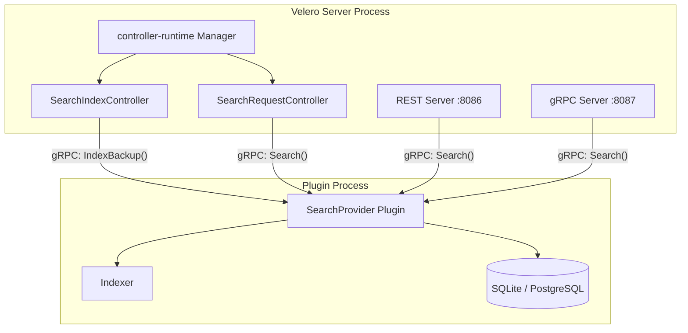
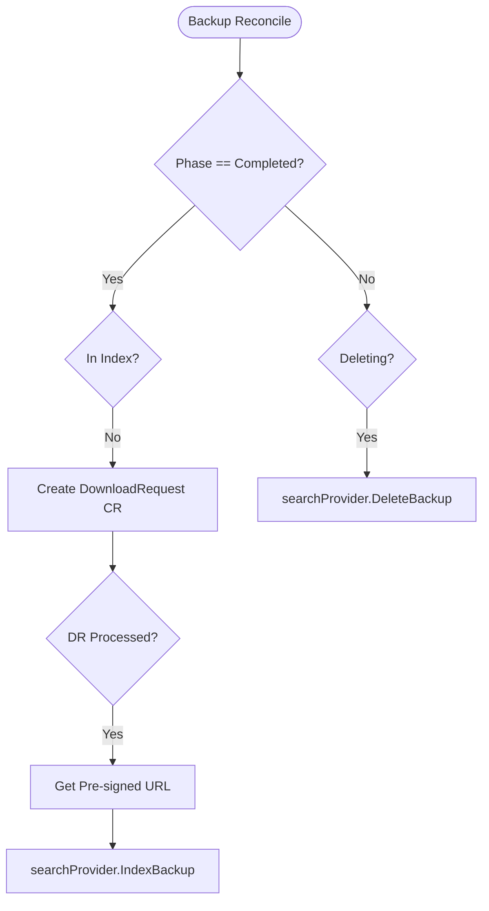
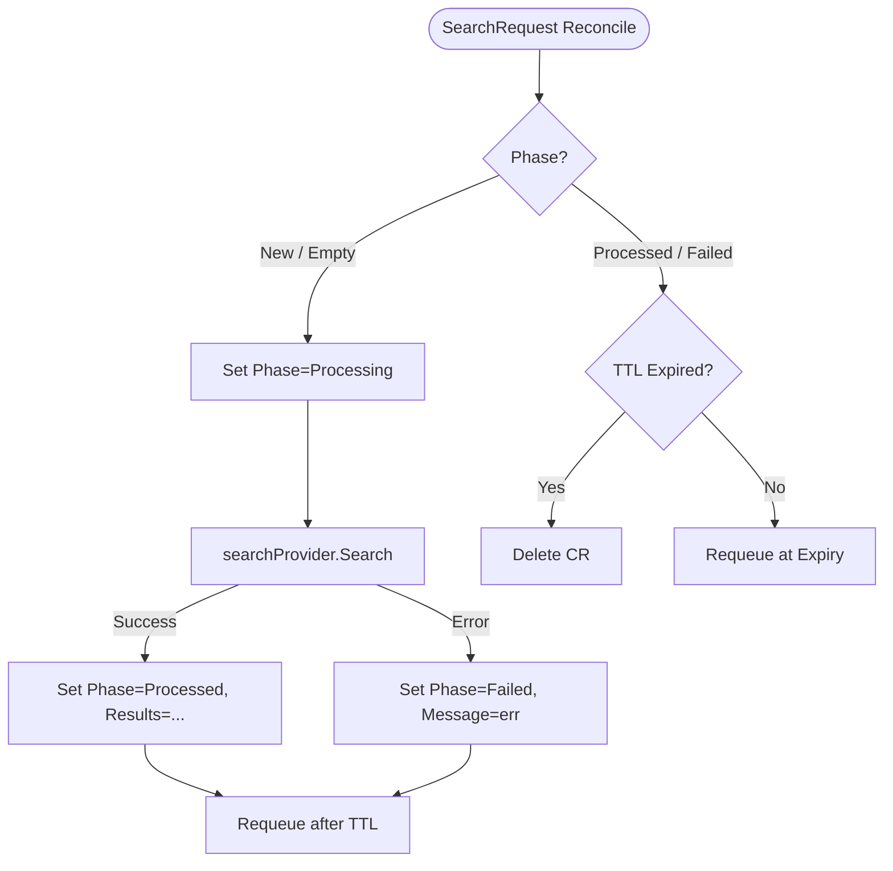
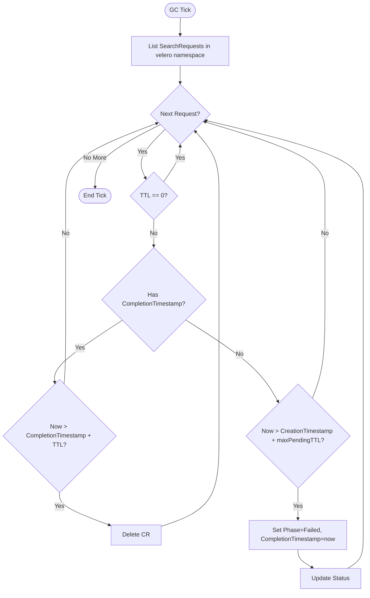

# Velero Resource Search

## 1. Overview

This document proposes adding a **resource search capability** to Velero. The feature allows
operators and users to answer the question: _"Which backup contains this Kubernetes resource?"_

Today, finding a resource in a backup requires either restoring the entire backup and inspecting
the cluster, or manually downloading and grepping the backup tarball. Neither approach scales to
large clusters with hundreds of backups.

The search feature introduces:

- A **background indexer** that parses backup tarballs and records resource metadata (name,
  namespace, kind, API version, labels) into a local index.
- A **`SearchRequest` CRD** as the primary Kubernetes-native API for running searches.
- An optional **REST API** and **gRPC API** for latency-sensitive consumers such as CLIs and
  dashboards.
- A **`SearchProvider` plugin interface** so the storage backend (SQLite, PostgreSQL,
  Elasticsearch, etc.) is swappable without modifying Velero itself.

The feature is entirely **opt-in**, gated by `--features=Search`, and has no impact on existing
Velero functionality when disabled.

---

## 2. Goals and Non-Goals

### Goals

- Let users find which backup(s) contain a given Kubernetes resource by name, namespace, kind, API
  version, and/or labels — across all completed backups.
- Provide a Kubernetes-native CRD API consistent with Velero's existing request/result pattern
  (`DownloadRequest`, `ServerStatusRequest`).
- Keep the Velero server process isolated from indexer failures through the plugin architecture.
- Ship a built-in SQLite backend so the feature works out of the box with zero external
  dependencies.
- Support pluggable backends for operators who want PostgreSQL, Elasticsearch, or other stores.
- Expose opt-in REST and gRPC APIs for tooling that requires lower latency than the CRD
  reconcile cycle.

### Non-Goals

- Full-text or content-level search (only resource metadata is indexed, not `spec`/`status`).
- Multi-cluster search aggregation.
- Modifying the existing `DownloadRequest` CRD mechanism.
- Indexing in-progress or failed backups (only `Completed` backups are indexed).

---

## 3. Architecture Overview

The search feature is structured in two layers:



The Velero server **drives the indexing lifecycle** — it decides when to index a backup (on
`Completed`) and when to remove it (on deletion). All storage and query logic lives inside the
`SearchProvider` plugin, keeping the server process isolated from indexer failures.

---

## 4. Plugin Architecture — SearchProvider

### 4.1 Why Plugins

The indexer must download and stream multi-gigabyte backup tarballs, which can consume significant
memory and CPU. Running this inside the Velero server process risks starving or crashing the
controllers that manage live backup and restore operations. The plugin model, already used for
`ObjectStore`, `VolumeSnapshotter`, and item actions, provides the right isolation boundary.

| Dimension             | Direct Embed                            | Plugin (chosen)                     |
|:----------------------|:----------------------------------------|:------------------------------------|
| Blast radius          | Indexer OOM crashes Velero server       | Plugin process crashes in isolation |
| Release cadence       | Tied to Velero releases                 | Can ship independently              |
| Storage state         | Velero server owns SQLite file          | Plugin owns all storage             |
| Operator opt-out      | Requires config flag                    | Omit plugin binary                  |
| Backend extensibility | Single implementation                   | Any backend via the interface       |

### 4.2 SearchProvider Interface

```go
// pkg/plugin/velero/search_provider.go

// SearchProvider is a Velero plugin interface for indexing and querying
// Kubernetes resource metadata extracted from Velero backup tarballs.
type SearchProvider interface {
    // Init initialises the backend with driver-specific configuration.
    // Called once after the plugin process starts.
    Init(config map[string]string) error

    // IndexBackup downloads the backup tarball at tarballURL, parses resource
    // metadata, and stores records keyed by backupName.
    // tarballURL is a pre-signed object-storage URL produced by a DownloadRequest;
    // the plugin fetches the tarball directly to keep gRPC messages small.
    IndexBackup(ctx context.Context, backupName string, tarballURL string) error

    // DeleteBackup removes all indexed records for backupName.
    DeleteBackup(ctx context.Context, backupName string) error

    // Search queries indexed records matching params and returns a page of results.
    Search(ctx context.Context, params SearchParams) (SearchResult, error)

    // Ready reports whether the initial index load has completed.
    Ready(ctx context.Context) (bool, error)
}

// SearchParams defines the query filters.
type SearchParams struct {
    Name       string            // glob: * matches any sequence, ? matches one character
    Namespace  string            // exact match; empty matches all namespaces
    Kind       string            // exact match (e.g. "Deployment")
    APIVersion string            // exact match (e.g. "apps/v1")
    Labels     map[string]string // all entries AND-ed
    BackupName string            // restrict to one backup; empty searches all
    Limit      int               // default 100, max 500
}

// SearchResult is a page of matching resource records.
type SearchResult struct {
    Records    []ResourceRecord
    TotalCount int // total matches before limit/offset
}

// ResourceRecord is a single indexed resource entry.
type ResourceRecord struct {
    BackupName   string
    ResourceName string
    APIVersion   string
    Kind         string
    Namespace    string
    Labels       map[string]string
}
```

### 4.3 gRPC Transport (Internal Plugin Protocol)

Velero's plugin system uses HashiCorp `go-plugin` with gRPC as the transport. The
`SearchProvider` kind is wired up following the same pattern as `ObjectStore`:

| File | Purpose |
|:-----|:--------|
| `pkg/plugin/proto/searchprovider/v1/search_provider.proto` | Protobuf definitions |
| `pkg/plugin/generated/searchprovider/v1/` | Generated gRPC stubs |
| `pkg/plugin/framework/search_provider.go` | `go-plugin` Plugin implementation |
| `pkg/plugin/framework/search_provider_client.go` | gRPC → Go interface adapter (client side) |
| `pkg/plugin/framework/search_provider_server.go` | Go interface → gRPC adapter (server side) |
| `pkg/plugin/clientmgmt/manager.go` | `GetSearchProvider(name)` added to Manager |

`IndexBackup` passes only the pre-signed tarball URL, not the bytes, so gRPC messages stay small
regardless of backup size. The plugin fetches the tarball directly from object storage.

### 4.4 Built-in Default Plugin

A built-in `SearchProvider` plugin is registered inside the Velero binary itself under the name
`velero.io/search-provider`. It implements the indexer (tarball download and parse) and storage
(SQLite by default, PostgreSQL optionally) described in §6. Operators who need an alternative
backend (e.g., Elasticsearch) implement the `SearchProvider` interface in an external plugin
binary, exactly as they do for a custom `ObjectStore`.

---

## 5. Indexing Lifecycle — SearchIndexController

### 5.1 Controller Registration

`SearchIndexController` is registered with the controller-runtime manager in `server.go` when the
`Search` feature flag is active, alongside the existing controllers.

### 5.2 Reconcile Logic



**DownloadRequest Creation Strategy:**
The controller must obtain a pre-signed URL for the backup tarball. There are two options for this:
1. **Direct CR Creation (Chosen):** The `SearchIndexController` directly creates a `DownloadRequest` CR, watches it until it reaches the `Processed` phase, extracts the URL, and then deletes the CR.
   * *Pros:* Simple, decoupled from other controllers, easy to track lifecycle and clean up.
   * *Cons:* Requires the controller to manage the watch/wait loop.
2. **Enqueueing on Downloader Controller:** The controller could pass a request to an internal Go channel managed by the existing `downloadRequest` controller.
   * *Pros:* Reuses existing internal memory structures.
   * *Cons:* Tighter coupling between controllers, harder to handle retries if the indexer fails.

The chosen approach is **Direct CR Creation**. The `DownloadRequest` lifecycle (create → watch until Processed → read URL → delete) is handled inside the controller, reusing the existing `downloader` helper already in Velero. The controller labels every `DownloadRequest` it creates with `created-by: velero-search` for orphan cleanup on restart.

The existing `BackupDeletionController` (`backup_deletion_controller.go`) is extended to call
`searchProvider.DeleteBackup` as part of its cleanup path, providing coverage for TTL-based
garbage collection.

### 5.3 Periodic Resync

On a configurable ticker (flag `--search-resync-interval`, default `1h`) the controller performs
a full reconcile:

1. List all `Completed` `Backup` CRs.
2. Query the index for already-indexed backup names.
3. Enqueue any missing backups for indexing.
4. Call `DeleteBackup` for any names present in the index but absent from the cluster (orphans
   from a missed delete event while the controller was down).

### 5.4 Feature Gate

```
--features=Search
```

When the flag is absent, no search controllers are registered, no plugin is loaded, and no
`SearchRequest` CRs are reconciled. All other Velero functionality is unaffected.

---

## 6. Built-in Storage Backend

The built-in plugin ships two storage backends selected by `--search-db-driver`:

### 6.1 SQLite (default)

- Pure-Go driver (`modernc.org/sqlite`) — no CGO, no external process.
- WAL mode enabled at startup for concurrent reads alongside writes.
- All writes serialised through a dedicated writer goroutine to avoid lock contention.
- Database file path configurable via `--search-db-dsn` (default `/var/lib/velero/search.db`).
- **Persistence:** It is expected that environments wanting the search feature will provision a `PersistentVolume` (PVC) for Velero to store the SQLite file. It can run without a PVC, but the consequence is that the entire index must be rebuilt from scratch after every pod restart.

### 6.2 PostgreSQL (optional)

- `jackc/pgx/v5` driver.
- `JSONB` column with a `GIN` index for efficient label queries.
- Suitable for HA deployments, and for use cases where there are large numbers of backups and the query pattern is dominantly label based(because PostgreSQL can handle the label based queries more efficiently through `GIN` index).

### 6.3 Schema

```sql
-- One row per indexed Kubernetes resource
CREATE TABLE resources (
    id            SERIAL PRIMARY KEY,
    backup_name   TEXT    NOT NULL,
    resource_name TEXT    NOT NULL,
    api_version   TEXT    NOT NULL,
    kind          TEXT    NOT NULL,
    namespace     TEXT    NOT NULL DEFAULT '',
    labels        JSONB   NOT NULL DEFAULT '{}'   -- TEXT on SQLite
);

CREATE UNIQUE INDEX idx_resources_unique
    ON resources (backup_name, resource_name, api_version, kind, namespace);
CREATE INDEX idx_resource_name ON resources (resource_name);
CREATE INDEX idx_kind_ns       ON resources (kind, namespace);
-- PostgreSQL only:
CREATE INDEX idx_labels ON resources USING GIN (labels);

-- Tracks which backups have been fully indexed
CREATE TABLE processed_backups (
    backup_name TEXT PRIMARY KEY,
    indexed_at  TEXT NOT NULL   -- RFC3339
);
```

---

## 7. Primary API — SearchRequest CRD

The `SearchRequest` CRD is the primary user-facing API. It follows the identical request/result
pattern as `DownloadRequest` and `ServerStatusRequest`: a user creates the CR, the Velero server
reconciles it, writes results into `.status`, and the CR is eventually cleaned up automatically.

### 7.1 Type Definition

**Group/Version/Kind:** `velero.io/v2alpha1 SearchRequest`

```go
// pkg/apis/velero/v2alpha1/search_request_types.go

type SearchRequestSpec struct {
    // Query defines the search filters.
    Query SearchQuery `json:"query"`

    // Limit is the maximum number of results returned. Hard capped at 500.
    // +optional
    // +kubebuilder:default=100
    Limit int `json:"limit,omitempty"`

    // TTL specifies how long this SearchRequest is retained after completion.
    // Defaults to 10 minutes. Set to 0 to disable automatic deletion.
    // +optional
    TTL metav1.Duration `json:"ttl,omitempty"`
}

type SearchQuery struct {
    // Name is a glob pattern matched against resource names.
    // Wildcards: * matches any sequence of characters, ? matches one character.
    // +optional
    Name string `json:"name,omitempty"`

    // Namespace filters by exact Kubernetes namespace.
    // Omit to search all namespaces and cluster-scoped resources.
    // +optional
    Namespace string `json:"namespace,omitempty"`

    // Kind filters by exact resource kind (e.g. "Deployment", "Pod").
    // +optional
    Kind string `json:"kind,omitempty"`

    // APIVersion filters by exact API version (e.g. "apps/v1").
    // +optional
    APIVersion string `json:"apiVersion,omitempty"`

    // Labels filters resources where ALL specified key/value pairs match.
    // Multiple entries are AND-ed together.
    // +optional
    Labels map[string]string `json:"labels,omitempty"`

    // BackupName restricts the search to a single named backup.
    // Omit to search across all indexed backups.
    // +optional
    BackupName string `json:"backupName,omitempty"`
}

type SearchRequestStatus struct {
    // Phase is the current lifecycle state of this SearchRequest.
    // +optional
    Phase SearchRequestPhase `json:"phase,omitempty"`

    // Results holds the matching resource records for the current page.
    // +optional
    Results []SearchResourceMatch `json:"results,omitempty"`

    // TotalCount is the total number of matching resources before limit/offset.
    // +optional
    TotalCount int `json:"totalCount,omitempty"`

    // Message provides human-readable details when Phase is Failed.
    // +optional
    Message string `json:"message,omitempty"`

    // StartTimestamp is when the Velero server began processing this request.
    // +optional
    StartTimestamp *metav1.Time `json:"startTimestamp,omitempty"`

    // CompletionTimestamp is when processing finished (Processed or Failed).
    // +optional
    CompletionTimestamp *metav1.Time `json:"completionTimestamp,omitempty"`
}

// SearchRequestPhase is the lifecycle state of a SearchRequest.
// +kubebuilder:validation:Enum=New;Processing;Processed;Failed
type SearchRequestPhase string

const (
    SearchRequestPhaseNew        SearchRequestPhase = "New"
    SearchRequestPhaseProcessing SearchRequestPhase = "Processing"
    SearchRequestPhaseProcessed  SearchRequestPhase = "Processed"
    SearchRequestPhaseFailed     SearchRequestPhase = "Failed"
)

type SearchResourceMatch struct {
    BackupName   string            `json:"backupName"`
    ResourceName string            `json:"resourceName"`
    APIVersion   string            `json:"apiVersion"`
    Kind         string            `json:"kind"`
    // Namespace is empty for cluster-scoped resources.
    Namespace    string            `json:"namespace,omitempty"`
    Labels       map[string]string `json:"labels,omitempty"`
}
```

### 7.2 Usage Example

**Create a search:**
```yaml
apiVersion: velero.io/v2alpha1
kind: SearchRequest
metadata:
  name: find-nginx-pods
  namespace: velero
spec:
  query:
    name: "*nginx*"
    kind: Pod
    namespace: production
    labels:
      app: nginx
  limit: 50
  ttl: 10m
```

**Watch for completion:**
```bash
kubectl get searchrequest find-nginx-pods -n velero -w
# NAME               PHASE       TOTALCOUNT   AGE
# find-nginx-pods    New                      0s
# find-nginx-pods    Processing               1s
# find-nginx-pods    Processed   12           2s
```

**Inspect results:**
```bash
kubectl get searchrequest find-nginx-pods -n velero \
  -o jsonpath='{.status.results}' | jq .
```

**Delete explicitly (if TTL was set to 0):**
```bash
kubectl delete searchrequest find-nginx-pods -n velero
```

### 7.3 SearchRequestController — Reconcile Logic



### 7.4 SearchRequest Cleanup

`SearchRequest` objects accumulate in etcd if not cleaned up. Three mechanisms handle this:

#### a) TTL-based automatic deletion (primary)

Every `SearchRequest` has a `spec.ttl` field (default `10m`). When the controller finishes
processing (transitions to `Processed` or `Failed`), it sets `status.completionTimestamp` and
requeues itself for `spec.ttl` duration. On the next reconcile it compares
`completionTimestamp + ttl` against the current time and deletes the CR.

- `spec.ttl: 0` disables automatic deletion — the user must delete the CR explicitly.
- `spec.ttl` defaults are configurable cluster-wide via the server flag
  `--search-request-default-ttl` (default `10m`).

#### b) Server-side GC controller (safety net)

A lightweight `SearchRequestGCController` (analogous to the existing `gc_controller.go` for
`Backup` TTLs) runs on a ticker (every `--search-gc-interval`, default `30m`). It lists all
`SearchRequest` CRs **in the Velero namespace** and deletes any that are past their TTL, regardless of the
per-CR requeue. This catches requests that were never processed (e.g., the search index was not
ready) or whose requeue was lost due to a controller restart.



`--search-max-pending-ttl` (default `5m`) bounds how long a `SearchRequest` can remain in
`New` or `Processing` before the GC controller marks it `Failed` (e.g., if the search index was
not ready when the request arrived).

#### c) Explicit user deletion

Users and operators may always `kubectl delete searchrequest <name> -n velero` at any time,
regardless of phase or TTL setting.

#### Cleanup summary

| Trigger | Condition | Action |
|:--------|:----------|:-------|
| Per-CR requeue | `completionTimestamp + ttl <= now()` | Controller deletes the CR |
| GC controller tick | `completionTimestamp + ttl <= now()` | GC controller deletes the CR |
| GC controller tick | `New`/`Processing` for > `maxPendingTTL` | Mark `Failed`, then TTL applies |
| User | Any phase | `kubectl delete` |

### 7.5 RBAC

Standard Kubernetes RBAC governs `SearchRequest` access. Grant search permissions by binding the
`searchrequests` resource:

```yaml
apiVersion: rbac.authorization.k8s.io/v1
kind: ClusterRole
metadata:
  name: velero-search-user
rules:
- apiGroups: ["velero.io"]
  resources: ["searchrequests"]
  verbs: ["create", "get", "list", "watch", "delete"]
- apiGroups: ["velero.io"]
  resources: ["searchrequests/status"]
  verbs: ["get"]
```

The Velero server's own `ServiceAccount` needs `create`/`delete` on `searchrequests` (for TTL
cleanup) and `update` on `searchrequests/status`.

### 7.6 Known Limitations

- **Result size:** etcd enforces a ~3 MB per-object limit. With `limit` hard-capped at 500 and each
  `SearchResourceMatch` approximately 200 bytes, a full result set is ~100 KB — well within the limit.
  500 results is sufficient for resource discovery; returning more results is generally meaningless for human operators.
- **Latency:** A `SearchRequest` round-trips through the kube-apiserver and a reconcile cycle.
  Expected end-to-end latency is 200–500 ms. This is acceptable for administrative use; the REST
  API (§8) is available for interactive tooling.

---

## 8. Advanced Options — REST and gRPC APIs

The REST and gRPC APIs are opt-in, for latency-sensitive consumers such as CLIs, dashboards, or
automation pipelines where the CRD reconcile round-trip is too slow.

### 8.1 REST API

An HTTP server runs inside the Velero pod on port `:8086` and is registered with the kube-apiserver
as an **aggregated API** (`APIService`). All requests proxy through the kube-apiserver, so
Kubernetes RBAC, audit logging, and authentication apply transparently — no separate auth
configuration is needed.

**Note on Certificates:** The Velero server must serve valid TLS certificates for the aggregated API from day 1.

Enable with `--features=Search,SearchRESTAPI`.

**Endpoints:**

| Method | Path | Description |
|:-------|:-----|:------------|
| `GET` | `/apis/search.velero.io/v2alpha1/resources` | Search across all backups |
| `GET` | `/apis/search.velero.io/v2alpha1/backups/{name}/resources` | Search within one backup |
| `GET` | `/healthz` | Liveness |
| `GET` | `/readyz` | Readiness (index ready) |

Query parameters: `name` (glob), `namespace`, `kind`, `apiVersion`, `label` (repeatable,
`key=value`), `limit`.

**Response:**
```json
{
  "items": [
    {
      "backupName": "daily-2026-05-08",
      "resourceName": "nginx-6d4cf56db6-abc12",
      "apiVersion": "v1",
      "kind": "Pod",
      "namespace": "production",
      "labels": {"app": "nginx"}
    }
  ],
  "totalCount": 1
}
```

**APIService manifest** (applied when the feature is enabled):
```yaml
apiVersion: apiregistration.k8s.io/v1
kind: APIService
metadata:
  name: v2alpha1.search.velero.io
spec:
  group: search.velero.io
  version: v2alpha1
  service:
    namespace: velero
    name: velero
    port: 8086
  groupPriorityMinimum: 100
  versionPriority: 100
  # Valid certificates are required.
```

### 8.2 gRPC API

A `SearchService` gRPC server runs on port `:8087`. This is for programmatic consumers that
benefit from strongly-typed clients and server-side streaming for large result sets.

Enable with `--features=Search,SearchGRPCAPI`.

**Proto definition** (`pkg/search/proto/search_service.proto`):
```protobuf
syntax = "proto3";
package velero.search.v1;

service SearchService {
  // Search returns a single page of matching records.
  rpc Search(SearchRequest) returns (SearchResponse);

  // SearchStream streams results one record at a time for large result sets.
  rpc SearchStream(SearchRequest) returns (stream ResourceRecord);

  // Ready reports whether the search index is ready.
  rpc Ready(google.protobuf.Empty) returns (ReadyResponse);
}

message SearchRequest {
  string name                  = 1;
  string namespace             = 2;
  string kind                  = 3;
  string api_version           = 4;
  map<string, string> labels   = 5;
  string backup_name           = 6;
  int32  limit                 = 7;
}

message ResourceRecord {
  string backup_name           = 1;
  string resource_name         = 2;
  string api_version           = 3;
  string kind                  = 4;
  string namespace             = 5;
  map<string, string> labels   = 6;
}

message SearchResponse {
  repeated ResourceRecord items = 1;
  int32 total_count             = 2;
}

message ReadyResponse {
  bool ready = 1;
}
```

Authentication uses Kubernetes token review via a gRPC interceptor, or mTLS for in-cluster
service-to-service calls.

---

## 9. Feature Flags

| Flag combination | What is enabled |
|:-----------------|:----------------|
| `Search` | `SearchProvider` plugin loaded; `SearchIndexController` and `SearchRequestController` registered; `SearchRequest` CRD reconciled |
| `Search,SearchRESTAPI` | Above, plus REST API server on `:8086` and `APIService` registration |
| `Search,SearchGRPCAPI` | Above, plus gRPC server on `:8087` |

`Search` must be present for either advanced option to have effect. All three may be combined.

---

## 10. Configuration Reference

| Flag | Env var | Default | Description |
|:-----|:--------|:--------|:------------|
| `--search-db-driver` | `SEARCH_DB_DRIVER` | `sqlite` | Storage backend: `sqlite` or `postgres` |
| `--search-db-dsn` | `SEARCH_DB_DSN` | `/var/lib/velero/search.db` | SQLite file path or PostgreSQL DSN |
| `--search-max-workers` | `SEARCH_MAX_WORKERS` | `10` | Max concurrent backup indexing goroutines |
| `--search-resync-interval` | `SEARCH_RESYNC_INTERVAL` | `1h` | Full index reconcile interval |
| `--search-request-default-ttl` | `SEARCH_REQUEST_DEFAULT_TTL` | `10m` | Default TTL for SearchRequest CRs |
| `--search-max-pending-ttl` | `SEARCH_MAX_PENDING_TTL` | `5m` | Max time a SearchRequest may stay in New/Processing before being marked Failed |
| `--search-gc-interval` | `SEARCH_GC_INTERVAL` | `30m` | Interval for the SearchRequest GC sweep |
| `--search-rest-port` | `SEARCH_REST_PORT` | `8086` | Port for the REST API server |
| `--search-grpc-port` | `SEARCH_GRPC_PORT` | `8087` | Port for the gRPC API server |

---

## 11. Summary

| Concern | Decision |
|:--------|:---------|
| Integration model | Plugin architecture (`SearchProvider` interface via `go-plugin` gRPC) |
| Default backend | Built-in SQLite (zero external dependencies); PostgreSQL optional |
| Primary user API | `SearchRequest` CRD (`velero.io/v2alpha1`) |
| SearchRequest cleanup | TTL field + per-CR requeue + GC controller sweep + explicit delete |
| Advanced APIs | REST (kube-apiserver aggregation) and gRPC — opt-in feature flags |
| Feature gating | `--features=Search[,SearchRESTAPI][,SearchGRPCAPI]` |
| RBAC | Standard Kubernetes RBAC on `searchrequests` resource |
