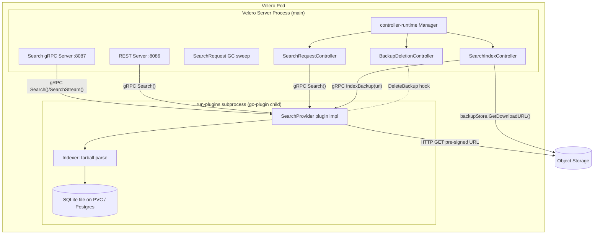
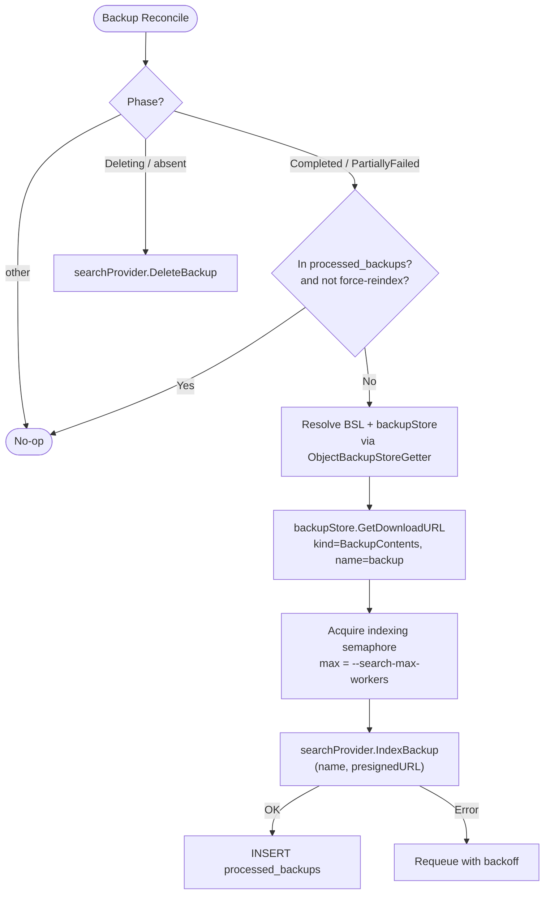
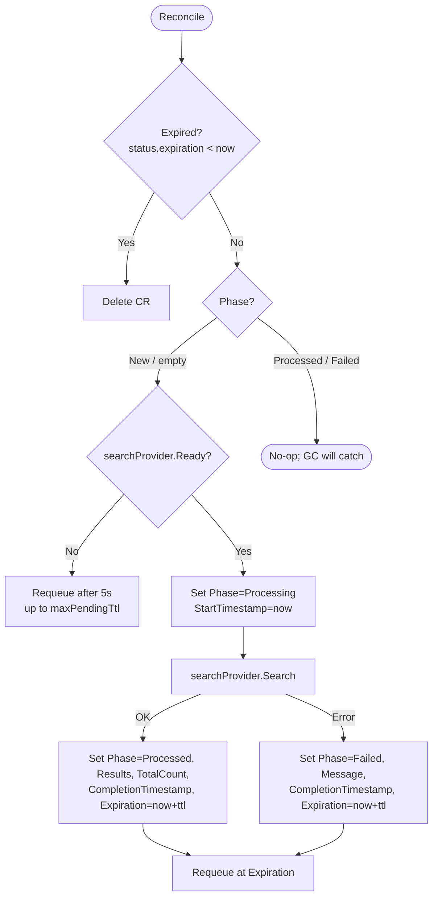

# Velero Resource Search — Design Proposal

## 1. Overview

This document proposes adding a **resource search capability** to Velero. The feature answers: *"Which backup contains this Kubernetes resource?"*

Today, finding a resource in a backup requires either restoring the entire backup and inspecting the cluster, or manually downloading and grepping the backup tarball. Neither scales to large clusters with hundreds of backups.

The search feature introduces:

- A **background indexer** (`SearchIndexController`) that, on backup completion, obtains a pre-signed tarball URL and asks a `SearchProvider` plugin to parse and store resource metadata (name, namespace, kind, API version, labels).
- A **`SearchRequest` CRD** as the primary Kubernetes-native API for running searches, consistent with Velero's existing request/result pattern (`DownloadRequest`, `ServerStatusRequest`).
- Optional **REST** and **gRPC** APIs for latency-sensitive consumers (CLIs, dashboards, automation).
- A **`SearchProvider` plugin interface** so the storage backend (SQLite, PostgreSQL, Elasticsearch, …) is swappable without modifying Velero.

The feature is entirely **opt-in**, gated by `--features=EnableSearch`, and has no impact on existing Velero functionality when disabled.

---

## 2. Goals and Non-Goals

### Goals

- Find which backup(s) contain a given Kubernetes resource by name (glob), namespace, kind, API version, and/or labels — across all completed and partially-failed backups.
- Provide a Kubernetes-native CRD API consistent with Velero's request/result pattern.
- Keep the Velero server process isolated from indexer failures through the plugin architecture (separate subprocess, restartable).
- Ship a built-in SQLite backend so the feature works out of the box with zero external dependencies.
- Support pluggable backends for operators who want PostgreSQL, Elasticsearch, or other stores.
- Expose opt-in REST and gRPC APIs for tooling that requires lower latency than the CRD reconcile cycle.
- Be safe to enable on existing clusters: idempotent indexing; graceful cold start backfill.

### Non-Goals

- Full-text or content-level search (only resource metadata is indexed, not `spec`/`status`).
- Multi-cluster search aggregation.
- Indexing in-progress or failed backups (only `Completed` and `PartiallyFailed` are indexed).
- Indexing resource annotations (labels only, to bound row size).
- Searching across restore results.

---

## 3. Architecture Overview



Key invariants:

- The **Velero server** owns the indexing lifecycle (when to index, when to de-index). It obtains the pre-signed tarball URL **in-process** via the existing `persistence.ObjectBackupStoreGetter`.
- The **plugin** owns storage and query logic. It receives only the pre-signed URL over gRPC and fetches the tarball directly from object storage, keeping gRPC messages small regardless of backup size.
- The plugin runs as a **go-plugin child subprocess** inside the Velero pod (built-in plugins via `velero run-plugins`; external plugins via the `/plugins` volume). A PVC mounted into the Velero pod is therefore accessible to the plugin for SQLite persistence.

---

## 4. Plugin Architecture — SearchProvider

### 4.1 Why Plugins

The indexer must download and stream multi-gigabyte backup tarballs, which can consume significant memory and CPU. Running this inside the main Velero server process risks starving or crashing the controllers that manage live backup and restore operations. The plugin model provides the right isolation boundary (restartable subprocess, panic isolation, independent release cadence).

| Dimension | Direct Embed | Plugin (chosen) |
|:---|:---|:---|
| Blast radius | Indexer OOM crashes Velero server | Plugin subprocess crashes in isolation |
| Release cadence | Tied to Velero releases | Can ship independently |
| Storage state | Velero server owns SQLite file | Plugin owns all storage |
| Operator opt-out | Requires config flag | Omit plugin binary / disable feature |
| Backend extensibility | Single implementation | Any backend via the interface |

### 4.2 SearchProvider Interface

```go
// pkg/plugin/velero/search_provider.go
package velero

import "context"

// SearchProvider is a Velero plugin interface for indexing and querying
// Kubernetes resource metadata extracted from Velero backup tarballs.
type SearchProvider interface {
	// Init initialises the backend with driver-specific configuration.
	// Called once after the plugin process starts, and again after any
	// subprocess restart (with the originally supplied config).
	Init(config map[string]string) error

	// IndexBackup downloads the backup tarball at tarballURL, parses resource
	// metadata, and stores records keyed by backupName. Implementations MUST
	// be idempotent: re-indexing the same backup replaces (or is a no-op for)
	// existing rows for that backup. Implementations SHOULD stream records to
	// storage rather than accumulating them in memory.
	IndexBackup(ctx context.Context, backupName, tarballURL string) error

	// DeleteBackup removes all indexed records for backupName, including the
	// processed_backups marker. MUST be idempotent (no error if absent).
	DeleteBackup(ctx context.Context, backupName string) error

	// Search queries indexed records matching params and returns a page of
	// results.
	Search(ctx context.Context, params SearchParams) (SearchResult, error)

	// Ready reports whether the initial index load (cold-start backfill) has
	// completed and the backend can serve queries.
	Ready(ctx context.Context) (bool, error)
}

// SearchParams defines the query filters.
type SearchParams struct {
	Name       string            // glob: * any sequence, ? one char; empty = match all
	Namespace  string            // exact match; empty matches all namespaces (incl. cluster-scoped)
	Kind       string            // exact match (e.g. "Deployment")
	APIVersion string            // exact match (e.g. "apps/v1")
	Labels     map[string]string // all entries AND-ed
	BackupName string            // restrict to one backup; empty searches all
	Limit      int               // default 100, max 500
	Offset     int               // pagination offset for REST/gRPC; 0 for CRD
}

// SearchResult is a page of matching resource records.
type SearchResult struct {
	Records    []ResourceRecord
	TotalCount int // total matches before limit/offset
}

// ResourceRecord is a single indexed resource entry.
type ResourceRecord struct {
	BackupName   string
	ResourceName string
	APIVersion   string
	Kind         string
	Namespace    string            // empty for cluster-scoped
	Labels       map[string]string
}
```

### 4.3 gRPC Transport (Internal Plugin Protocol)

Velero's plugin system uses HashiCorp `go-plugin` with gRPC as the transport. The `SearchProvider` kind is wired up following the standard plugin pattern. Every proto **request** message carries a `string plugin = 1;` field used by `ServerMux.GetHandler` to dispatch to the named implementation. `IndexBackup` passes only the pre-signed tarball URL, keeping gRPC messages small. Plugin names must follow the `<DNS subdomain>/<name>` convention (e.g., `velero.io/search-provider`).

### 4.4 Built-in Default Plugin

A built-in `SearchProvider` is registered in `pkg/cmd/server/plugin/plugin.go` (the `velero run-plugins` subprocess) under the name `velero.io/search-provider`. The built-in plugin implements the indexer (tarball download + parse) and storage (SQLite by default, PostgreSQL optional). Operators who need an alternative backend implement the `SearchProvider` interface in an external plugin binary. The registration is gated by the `EnableSearch` feature flag.

### 4.5 Restartable Process

The `SearchProvider` is wrapped with a restartable process manager:
- `Init(config)` stores the config; on subprocess restart, `Reinitialize` re-calls `Init` with the stored config, which reopens the SQLite/Postgres connection.
- Every method call checks if the subprocess is alive and relaunches it if it died.
- The SQLite file path / Postgres DSN is part of `config`, making re-init self-contained.

### 4.6 Single Active Provider

The search index is a **single global** store. Only one `SearchProvider` is active. The active provider name is configured via `--search-provider-name` (default `velero.io/search-provider`). The instance is shared by controllers, REST/gRPC servers, and the deletion hook.

---

## 5. Indexing Lifecycle — SearchIndexController

### 5.1 What Gets Indexed

A `Backup` is a candidate for indexing when its **phase transitions into** `Completed` **or** `PartiallyFailed`. `PartiallyFailed` backups still contain successfully backed-up resources and are valuable for search. `Failed`, `InProgress`, and other non-terminal phases are ignored. On `Deleting`/deletion, the index entry is removed.

### 5.2 Reconcile Logic



**Tarball URL strategy:** The controller resolves the Backup's `BackupStorageLocation`, obtains an `ObjectBackupStore`, and calls `GetDownloadURL`. This returns a pre-signed URL with `DownloadURLTTL` (10 min) validity, which is passed to the plugin over gRPC. The plugin HTTP-GETs the tarball directly from object storage.

### 5.3 Periodic Resync

On a configurable ticker (`--search-resync-interval`, default `1h`) the controller performs a full reconcile:
1. List all `Completed` and `PartiallyFailed` `Backup` CRs.
2. Query the index for the set of indexed backup names.
3. Enqueue any missing backups for indexing.
4. Call `DeleteBackup` for any names present in the index but absent from the cluster (orphans).

### 5.4 Idempotency and Re-index

The controller maintains a **local cache** of indexed backup names (`processed_backups` in the backend) to avoid re-downloading tarballs on every `Modified` event.

A user can force a re-index by annotating the `Backup`:

```yaml
metadata:
  annotations:
    search.velero.io/reindex: "true"
```

The controller strips the annotation and re-fetches. `IndexBackup` is required to be idempotent (upsert-by-replace).

### 5.5 Backup Deletion Hook

`BackupDeletionController` is extended with a hook inside its deletion flow, immediately **after** `backupStore.DeleteBackup(backup.Name)` succeeds:

```go
// existing code at line 364:
if backupStore != nil && len(errs) == 0 {
    log.Info("Removing backup from backup storage")
    if err := backupStore.DeleteBackup(backup.Name); err != nil {
        errs = append(errs, err.Error())
    } else if r.searchProvider != nil { // nil when EnableSearch is off
        log.Info("Removing backup from search index")
        if err := r.searchProvider.DeleteBackup(ctx, backup.Name); err != nil {
            errs = append(errs, err.Error())
        }
    }
}
```

This ordering ensures the index is cleaned up only after the object-storage deletion succeeds. If object-storage deletion fails, a future retry will handle both.

### 5.6 Cold Start and Readiness

On first enable (or after the index DB is wiped):
1. `SearchIndexController` starts. `searchProvider.Ready()` returns `false` until the initial backfill completes.
2. The controller immediately begins the resync path to backfill all `Completed`/`PartiallyFailed` backups, bounded by `--search-max-workers`.
3. `SearchRequestController` checks `Ready()` before serving a `SearchRequest`. While not ready, it leaves the request in `Processing` and requeues with backoff. If `Ready` does not become true within `--search-max-pending-ttl` (default `5m`), the request is marked `Failed` to avoid returning empty results.

### 5.7 Feature Gate

The feature is gated by `--features=EnableSearch`. When the flag is absent, no search controllers are registered, no plugin is loaded, `SearchRequest` CRs are not reconciled, and the deletion hook is a no-op.

---

## 6. Built-in Storage Backend

The built-in plugin ships two storage backends selected by `--search-db-driver`.

### 6.1 SQLite (default)

- Pure-Go driver `modernc.org/sqlite` — no CGO, no external process.
- WAL mode enabled at startup (`PRAGMA journal_mode=WAL; PRAGMA synchronous=NORMAL`) for concurrent reads alongside writes.
- All writes serialized through a dedicated writer goroutine fed by a buffered channel (prevents `SQLITE_BUSY`).
- Database file path configurable via `--search-db-dsn` (default `/var/lib/velero/search.db`). Expected to be on a PVC.

### 6.2 PostgreSQL (optional)

- `jackc/pgx/v5` driver.
- `JSONB` column with a `GIN` index for efficient label containment queries.
- Suitable for HA deployments and large backup counts.
- Connection pool sized to `--search-max-workers` for writes; reads share the pool.

### 6.3 Schema

**Logical model**:
```
resources(backup_name, resource_name, api_version, kind, namespace, labels)
  unique on (backup_name, resource_name, api_version, kind, namespace)
  index on resource_name
  index on (kind, namespace)
  index on labels (driver-specific)
processed_backups(backup_name PK, indexed_at, resource_count)
```

### 6.4 Indexing Pipeline (inside the plugin)

The plugin's `IndexBackup` uses a single-pass stream to avoid accumulating records in memory:

```
HTTP GET url → gzip.Reader → tar.Reader → for each entry:
  skip if not under resources/ or not *.json or in metadata/ or velero-backup.json
  json.Decode only {apiVersion, kind, metadata.{name,namespace,labels}}
  emit record → batched insert (every N records or on tar EOF)
on success: upsert processed_backups(backup_name, now, count) in same txn
on any error: rollback txn, return error (controller will requeue)
```

The parser uses only the JSON `metadata` fields for `name`/`namespace`/`labels`. The path is used only as a fast skip filter.

---

## 7. Primary API — SearchRequest CRD

### 7.1 Type Definition

**Group/Version/Kind:** `velero.io/v2alpha1 SearchRequest`

```go
// pkg/apis/velero/v2alpha1/search_request_types.go

type SearchRequestSpec struct {
	// Query defines the search filters.
	Query SearchQuery `json:"query"`

	// Limit is the maximum number of results returned. Hard capped at 500.
	// +optional
	// +kubebuilder:default=100
	// +kubebuilder:validation:Maximum=500
	// +kubebuilder:validation:Minimum=1
	Limit int `json:"limit,omitempty"`

	// TTL specifies how long this SearchRequest is retained after completion.
	// Defaults to the server's --search-request-default-ttl (10m).
	// Set to 0 to disable automatic deletion.
	// +optional
	TTL metav1.Duration `json:"ttl,omitempty"`
}

type SearchQuery struct {
	// Name is a glob pattern matched against resource names.
	// Wildcards: * matches any sequence, ? matches one character.
	// +optional
	Name string `json:"name,omitempty"`

	// Namespace filters by exact Kubernetes namespace.
	// Omit to search all namespaces and cluster-scoped resources.
	// +optional
	Namespace string `json:"namespace,omitempty"`

	// Kind filters by exact resource kind (e.g. "Deployment", "Pod").
	// +optional
	Kind string `json:"kind,omitempty"`

	// APIVersion filters by exact API version (e.g. "apps/v1").
	// +optional
	APIVersion string `json:"apiVersion,omitempty"`

	// Labels filters resources where ALL specified key/value pairs match.
	// Multiple entries are AND-ed together.
	// +optional
	Labels map[string]string `json:"labels,omitempty"`

	// BackupName restricts the search to a single named backup.
	// Omit to search across all indexed backups.
	// +optional
	BackupName string `json:"backupName,omitempty"`
}

type SearchRequestStatus struct {
	// Phase is the current lifecycle state.
	// +optional
	Phase SearchRequestPhase `json:"phase,omitempty"`

	// Results holds the matching resource records (capped by spec.limit).
	// +optional
	// +kubebuilder:pruning:PreserveUnknownFields
	Results []SearchResourceMatch `json:"results,omitempty"`

	// TotalCount is the total number of matching resources before limit.
	// +optional
	TotalCount int `json:"totalCount,omitempty"`

	// Message provides human-readable details when Phase is Failed.
	// +optional
	Message string `json:"message,omitempty"`

	// StartTimestamp is when the Velero server began processing this request.
	// +optional
	StartTimestamp *metav1.Time `json:"startTimestamp,omitempty"`

	// CompletionTimestamp is when processing finished (Processed or Failed).
	// +optional
	CompletionTimestamp *metav1.Time `json:"completionTimestamp,omitempty"`

	// Expiration is when this SearchRequest will be garbage-collected.
	// +optional
	Expiration *metav1.Time `json:"expiration,omitempty"`
}

// +kubebuilder:validation:Enum=New;Processing;Processed;Failed
type SearchRequestPhase string

const (
	SearchRequestPhaseNew        SearchRequestPhase = "New"
	SearchRequestPhaseProcessing SearchRequestPhase = "Processing"
	SearchRequestPhaseProcessed  SearchRequestPhase = "Processed"
	SearchRequestPhaseFailed     SearchRequestPhase = "Failed"
)

type SearchResourceMatch struct {
	BackupName   string            `json:"backupName"`
	ResourceName string            `json:"resourceName"`
	APIVersion   string            `json:"apiVersion"`
	Kind         string            `json:"kind"`
	Namespace    string            `json:"namespace,omitempty"`
	Labels       map[string]string `json:"labels,omitempty"`
}
```

### 7.2 Usage Example

**Create:**
```yaml
apiVersion: velero.io/v2alpha1
kind: SearchRequest
metadata:
  name: find-nginx-pods
  namespace: velero
spec:
  query:
    name: "*nginx*"
    kind: Pod
    namespace: production
    labels:
      app: nginx
  limit: 50
  ttl: 10m
```

**Watch:**
```bash
kubectl get searchrequest find-nginx-pods -n velero -w
```

### 7.3 SearchRequestController — Reconcile Logic



### 7.4 SearchRequest Cleanup

Three mechanisms exist for cleaning up `SearchRequest` CRs:
1. **Per-CR requeue:** The controller requeues the CR at its expiration time and deletes it.
2. **GC sweep:** A periodic sweep (every `--search-gc-interval`) re-enqueues all CRs, catching any requests lost due to controller restarts.
3. **Pending-too-long:** Requests stuck in `New`/`Processing` past `--search-max-pending-ttl` are marked `Failed`.

Users can also manually delete CRs via `kubectl delete`.

### 7.5 RBAC

A `ClusterRole` (e.g., `velero-search-user`) provides `create`, `get`, `list`, `watch`, `delete` access to `searchrequests` for users. The Velero server ServiceAccount requires `get`, `list`, `watch`, `create`, `update`, `patch`, `delete` permissions.

### 7.6 Known Limitations

- **etcd object size:** Default `--max-request-bytes` is 1.5 MiB. With `limit` capped at 500, a typical result set is ~100 KiB. However, large label payloads could exceed the limit. The controller serializes the result envelope before writing status; if it exceeds a budget (e.g., 1 MiB), it truncates `Results` and sets a warning message. `TotalCount` remains accurate.
- **Latency:** `SearchRequest` goes through a reconcile cycle (200–500 ms). REST/gRPC APIs are available for interactive tooling.

---

## 8. Advanced Options — REST and gRPC APIs

Opt-in APIs for latency-sensitive consumers (CLIs, dashboards, automation).

### 8.1 REST API

**Mode A — Simple in-pod HTTP (default when `EnableSearchRESTAPI`):**
An HTTP server runs in the Velero pod on `:8086`. Exposed via a `Service`. Authentication uses Kubernetes bearer tokens validated with `TokenReview`. Authorization uses standard RBAC on the `searchrequests` resources.

**Mode B — Aggregated APIService (optional, `EnableSearchRESTAPIAggregated`):**
Registers an `APIService` for `search.velero.io/v2alpha1` pointing at the Velero Service on `:8086` over TLS. Proxies through kube-apiserver for native RBAC/audit/auth. Requires serving valid TLS certificates.

**Endpoints:**
- `GET /apis/search.velero.io/v2alpha1/resources`
- `GET /apis/search.velero.io/v2alpha1/backups/{name}/resources`
- `GET /healthz`, `/readyz`, `/metrics`

Query parameters: `name`, `namespace`, `kind`, `apiVersion`, `label`, `limit`, `offset`.

### 8.2 gRPC API

A `SearchService` gRPC server runs on `:8087` for strongly-typed clients and server-side streaming. Enabled with `--features=EnableSearch,EnableSearchGRPCAPI`. Auth uses Kubernetes `TokenReview` or mTLS.

---

## 9. Feature Flags

| Flag combination | What is enabled |
|:---|:---|
| `EnableSearch` | `SearchProvider` plugin loaded; `SearchIndexController` and `SearchRequestController` registered; `SearchRequest` CRD reconciled; deletion hook active |
| `EnableSearch,EnableSearchRESTAPI` | Above, plus REST API server on `:8086` (Mode A) |
| `EnableSearch,EnableSearchRESTAPI,EnableSearchRESTAPIAggregated` | Above, plus APIService registration (Mode B) |
| `EnableSearch,EnableSearchGRPCAPI` | Above, plus gRPC server on `:8087` |

---

## 10. Configuration Reference

| Flag | Default | Description |
|:---|:---|:---|
| `--search-provider-name` | `velero.io/search-provider` | Active SearchProvider plugin name |
| `--search-db-driver` | `sqlite` | Built-in backend: `sqlite` or `postgres` |
| `--search-db-dsn` | `/var/lib/velero/search.db` | SQLite path or PostgreSQL DSN |
| `--search-max-workers` | `10` | Max concurrent `IndexBackup` calls |
| `--search-resync-interval` | `1h` | Full index reconcile interval |
| `--search-request-default-ttl` | `10m` | Default TTL for SearchRequest CRs |
| `--search-max-pending-ttl` | `5m` | Max time a SearchRequest may stay `New`/`Processing` |
| `--search-gc-interval` | `30m` | Interval for the SearchRequest GC sweep |
| `--search-rest-port` | `8086` | REST API server port |
| `--search-grpc-port` | `8087` | gRPC API server port |
| `--search-result-size-budget` | `1MiB` | Max serialized status size before truncation |

---

## 11. Metrics

Exported on the existing Velero metrics endpoint:
- `velero_search_indexed_backups`
- `velero_search_indexed_resources`
- `velero_search_index_attempts_total`
- `velero_search_index_duration_seconds`
- `velero_search_delete_attempts_total`
- `velero_search_request_total`
- `velero_search_request_duration_seconds`
- `velero_search_query_duration_seconds`
- `velero_search_ready`

---

## 12. CLI

A new `velero search` subcommand (in `pkg/cmd/cli/search/`) creates a `SearchRequest`, polls `status.phase`, prints results as a table or JSON, and relies on TTL for cleanup:

```bash
velero search --name '*nginx*' --kind Pod --namespace production \
  --label app=nginx --backup-name daily-2026-05-08 --limit 50
```

---

## 13. Deployment Considerations

- **PVC for SQLite:** Operators enabling the default SQLite backend should provision a `PersistentVolumeClaim` mounted at `/var/lib/velero` in the Velero pod. Without a PVC, the index rebuilds from scratch on every pod restart.
- **Single replica:** SQLite implies a single Velero replica for indexing. HA deployments should use PostgreSQL.
- **Ports:** Ensure `:8086` and `:8087` do not collide with user-defined ports.
- **CRD installation:** `SearchRequest` CRD is applied by `velero install` when `EnableSearch` is requested.

---

## 14. Rollout and Graduation

1. **v2alpha1 landing:** Ship behind `EnableSearch` (off by default). SQLite backend, CRD API, CLI. REST/gRPC behind their own flags.
2. **Stabilisation:** One–two release cycles. Collect feedback on query semantics, result-size behaviour, and operator deployment experience.
3. **Graduation to v1:** Promote `SearchRequest` to `velero.io/v1` with a conversion webhook if any field changes; mark v2alpha1 deprecated.
4. **Default-on evaluation:** After v1 stabilisation, consider enabling by default.

---

## 15. Summary

| Concern | Decision |
|:---|:---|
| Integration model | Plugin (`SearchProvider` via go-plugin gRPC), built-in registered in `velero run-plugins` |
| Default backend | Built-in SQLite (zero external deps); PostgreSQL optional |
| Tarball URL | In-process `backupStore.GetDownloadURL` |
| Indexed phases | `Completed` **and** `PartiallyFailed` |
| Primary user API | `SearchRequest` CRD (`velero.io/v2alpha1`, graduation path to v1) |
| SearchRequest cleanup | TTL + per-CR requeue + periodic GC sweep + pending-too-long fail + explicit delete |
| Advanced APIs | REST (in-pod default; aggregated optional) and gRPC — opt-in flags |
| Feature gating | `EnableSearch[,EnableSearchRESTAPI][,EnableSearchRESTAPIAggregated][,EnableSearchGRPCAPI]` |
| Deletion hook | `BackupDeletionController`, after `backupStore.DeleteBackup` succeeds, no-op when disabled |
| RBAC | Standard Kubernetes RBAC on `searchrequests`; server SA via kubebuilder markers |
| Observability | Prometheus metrics on the existing endpoint |
| CLI | `velero search` subcommand over the CRD |