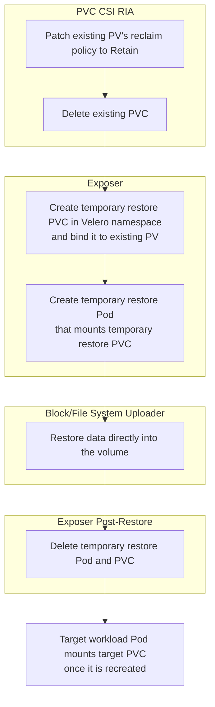
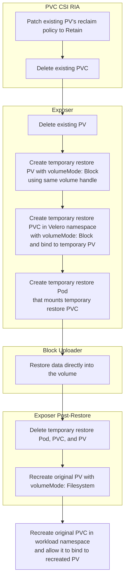

# Volume Data In-place Full/Incremental Restore

## Table of Contents

- [Background](#background)
- [Goals](#goals)
- [Non-Goals](#non-goals)
- [Overview](#overview)
- [Detailed Design](#detailed-design)
  - [CRD Changes](#crd-changes)
  - [CLI](#cli)
  - [Workload Management](#workload-management)
  - [Handling Cross-Zone Scheduling (WaitForFirstConsumer)](#handling-cross-zone-scheduling-waitforfirstconsumer)
  - [Pre-flight Checks](#pre-flight-checks)
    - [1. PVC is Not Actively Used by a Running Pod](#1-pvc-is-not-actively-used-by-a-running-pod)
    - [2. PVC is Bound to the Original PV](#2-pvc-is-bound-to-the-original-pv)
    - [3. Volume Size Validation](#3-volume-size-validation)
  - [Restore Workflow Update](#restore-workflow-update)
    - [In-place Incremental Restore for CSI Snapshot with Block Data Move for Block Volumes](#in-place-incremental-restore-for-csi-snapshot-with-block-data-move-for-block-volumes)
    - [In-place Full Restore for CSI Snapshot with Block Data Move for Block Volumes](#in-place-full-restore-for-csi-snapshot-with-block-data-move-for-block-volumes)
    - [In-place Incremental Restore for CSI Snapshot with File System Data Move for File System Volumes](#in-place-incremental-restore-for-csi-snapshot-with-file-system-data-move-for-file-system-volumes)
    - [In-place Full Restore for CSI Snapshot with File System Data Move for File System Volumes](#in-place-full-restore-for-csi-snapshot-with-file-system-data-move-for-file-system-volumes)
    - [In-place Incremental Restore for CSI Snapshot with Block Data Move for File System Volumes](#in-place-incremental-restore-for-csi-snapshot-with-block-data-move-for-file-system-volumes)
    - [In-place Full Restore for CSI Snapshot with Block Data Move for File System Volumes](#in-place-full-restore-for-csi-snapshot-with-block-data-move-for-file-system-volumes)
    - [In-place Incremental Restore for File System Backup for File System Volumes](#in-place-incremental-restore-for-file-system-backup-for-file-system-volumes)
    - [In-place Full Restore for File System Backup for File System Volumes](#in-place-full-restore-for-file-system-backup-for-file-system-volumes)
- [Installation](#installation)
- [Upgrade](#upgrade)

## Background

Currently, Velero only supports restoring volume data to a newly provisioned PVC. If the target PVC already exists in the cluster, Velero skips the data restoration entirely and leaves the existing volume untouched.

This design introduces the "in-place restore" capability, allowing Velero to restore volume data directly into an existing, bound PVC. When performing an in-place restore, users can choose to either overwrite the volume entirely (in-place full restore) or only restore the modified data to optimize performance (in-place incremental restore).

To ensure data consistency and allow Velero to safely recreate the PVC during the process, users must manually delete any pods consuming the target volume before initiating an in-place restore.

## Goals

- Enable Velero to restore volume data directly into an existing, bound PVC without requiring the user to manually delete the PVC and PV.
- Support both Full (overwrite all) and Incremental (overwrite only changed data) in-place restores.
- Support in-place restores for Windows workloads.
- Ensure data consistency and correct Kubernetes scheduling constraints (e.g., handling `WaitForFirstConsumer` and zonal topologies) are respected during and after the restore.

## Non-Goals

- Automating the deletion of workloads before the restore. It remains the user's responsibility to ensure the volume is not actively consumed and the Pods are completely removed before triggering the restore to prevent data corruption and allow PVC recreation.
- In-place restore for CSI snapshot without data move.
- In-place restore for Native Snapshots (cloud provider snapshots without CSI).
- Fine-grained, per-volume control over in-place restores. The newly introduced in-place restore policies apply globally to all volumes within a single restore operation. Allowing users to specify different restore strategies for individual volumes is deferred to a future enhancement.

## Overview

This design focuses exclusively on volume data restoration. To support this, we are introducing a new field, `ExistingVolumeDataPolicy`, to the `Restore` spec. This feature operates independently of Kubernetes resource restoration, which remains controlled by the existing `ExistingResourcePolicy` field.

Depending on how unchanged data is handled during the restoration process, in-place volume data restores are categorized into two types:

- **In-place full restore**: Overwrites the volume with the backup data, regardless of whether the existing data has changed.
- **In-place incremental restore**: Optimizes the process by restoring only the data that has changed since the backup, leaving unmodified data intact. This is achieved by leveraging Changed Block Tracking (CBT) for block data and file metadata comparisons for file system data.

Support for in-place full and incremental restores varies depending on the underlying backup method, as detailed in the following table: 

| Backup Method                           | In-place Full Restore | In-place Incremental Restore |
| --------------------------------------- | --------------------- | ---------------------------- |
| CSI Snapshot with Block Data Move       | Yes                   | Yes                          |
| CSI Snapshot with File System Data Move | Yes                   | Yes                          |
| CSI Snapshot without Data Move          | No                    | No                           |
| File System Backup                      | Yes                   | Yes                          |
| Native Snapshot                         | No                    | No                           |

Additionally, a new boolean field `DeleteExtraFiles` is added to the `UploaderConfig` within the `Restore` spec. When performing a file system restore (either via PodVolumeBackup or CSI File System Data Move), this flag controls whether files present in the target volume but absent in the backup should be deleted. Setting this to `true` ensures the target volume's file system exactly mirrors the backup state. Note that this setting is ignored for block data mover restores, as block-level operations inherently overwrite the entire file system structure.

Because Velero must create a temporary restore Pod in the Velero namespace to mount the volume and restore the data, it cannot directly use the existing PVC, which resides in the workload namespace. Velero must delete the existing PVC, recreate a temporary restore PVC in the Velero namespace, and bind it to the existing PV. The core strategy for implementing an in-place restore involves the following sequence:



When restoring a file system volume using the block data mover, the PV must temporarily have its `volumeMode` set to `Block` so the restore Pod can mount it as a raw block device. Because the `volumeMode` field in a PV spec is immutable, reusing the existing PV directly is not possible. Instead, Velero must delete the existing PV and create a temporary one. The sequence for this scenario is as follows:




## Detailed Design

### CRD Changes

To support the new in-place restore policies and incremental data transfer, several Custom Resource Definitions (CRDs) will be updated.

**Restore CRD**  
A new field `existingVolumeDataPolicy` is added to the `Restore` spec to allow users to define how existing volume data should be handled. Additionally, a new field `deleteExtraFiles` is added to the `uploaderConfig` to control file deletion during file system restores.

```yaml
spec:
  existingVolumeDataPolicy: "" # Valid values: "", none, full, incremental
  uploaderConfig:
    deleteExtraFiles: false
```

- `existingVolumeDataPolicy`: 
  - `""` (default) or `none`: Do not restore volume data if the target PVC already exists.
  - `full`: Perform an in-place full restore, overwriting all existing data on the volume.
  - `incremental`: Perform an in-place incremental restore, only overwriting data that has changed since the backup.
- `uploaderConfig.deleteExtraFiles`: A boolean flag that controls whether files present in the target volume but absent from the backup should be deleted. **Note:** This setting is *only* applicable to File System restores (PodVolumeBackup or CSI File System Data Move) and has no effect on Block Data Move restores. Furthermore, it is ignored for non-in-place restores (where `existingVolumeDataPolicy` is not set to `full` or `incremental`).

If `existingVolumeDataPolicy` is set to `full` or `incremental` but the target PVC does not exist, Velero will log an error and skip the volume restore. Similarly, if these policies are applied but the underlying backup method does not support in-place restores, Velero will log an error and skip the operation.
 
**DataDownload CRD**  
To support incremental restores, the `DataDownload` spec is extended with a new `restoreType` string flag (valid values are `full` and `incremental`) to instruct the data mover to perform an incremental restore. It also introduces a new `csiSnapshot` field, which captures the metadata of a snapshot taken from the existing PVC, acting as the baseline for Changed Block Tracking (CBT) delta calculations during an in-place incremental block restore. Additionally, the `deleteExtraFiles` configuration is passed to the underlying data mover via the existing `dataMoverConfig` map.

```yaml
spec:
  restoreType: "incremental"
  csiSnapshot:
    volumeSnapshot: ""
    storageClass: ""
    snapshotClass: ""
    driver: ""
```

- `restoreType`: A string flag indicating whether the data mover should perform a `full` or `incremental` restore.
- `csiSnapshot`:
  - `volumeSnapshot`: the name of the volume snapshot
  - `storageClass`: the name of the storage class of the PVC that the volume snapshot is created from
  - `snapshotClass`: the name of the snapshot class that the volume snapshot is created with
  - `driver`: the driver used by the VolumeSnapshotContent

**PodVolumeRestore CRD**  
A new `restoreType` string flag (valid values are `full` and `incremental`) is added to the `PodVolumeRestore` spec to instruct the file system data mover (e.g., Kopia) to perform an incremental restore. Additionally, the `deleteExtraFiles` configuration is passed to the underlying uploader via the existing `uploaderSettings` map.

```yaml
spec:
  restoreType: "incremental"
```

- `restoreType`: A string flag indicating whether the data mover should perform a `full` or `incremental` restore.

### CLI

New flags will be added to the `velero restore create` command to support the new policy:

- `--existing-volume-data-policy`: Accepts the values `none`, `full`, or `incremental`, mapping to `existingVolumeDataPolicy`.
- `--delete-extra-files`: A boolean flag mapping to `uploaderConfig.deleteExtraFiles`.

### Workload Management

To ensure data consistency and allow for necessary configuration changes, users must delete any Pods actively using the target volume before initiating an in-place restore. This is required for three primary reasons:

1. **Preventing Data Corruption:** It is critical to prevent the active workload Pods and the temporary restore Pods from writing to the volume simultaneously, which would lead to data corruption.
2. **PVC Recreation:** Velero creates a temporary restore Pod in the Velero namespace to mount the volume and restore the data. Since it cannot directly use the existing PVC located in the workload namespace, Velero must delete the existing PVC, create a temporary restore PVC in the Velero namespace, and bind it to the existing PV. However, Kubernetes' `pvc-protection` finalizer prevents the deletion of any PVC actively used by a running Pod. Consequently, simply pausing the workload is insufficient; the Pods must be completely removed to allow the PVC deletion to proceed.
3. **ReadWriteOncePod Access Mode:** If the volume is configured with the `ReadWriteOncePod` access mode, Kubernetes strictly enforces that the volume can only be mounted by a single Pod at a time. The existing workload Pod must be completely deleted to release the volume, allowing Velero's temporary restore Pod to successfully mount it and perform the data transfer.

Users must manage the lifecycle of their workloads before starting the restore. This applies to various workload types:

- **Standard Controllers (Deployments, StatefulSets, Jobs, CronJobs):** The required action depends on the restore method:
  - **For CSI Snapshot Restores:** Users can scale these controllers down to zero replicas to terminate the underlying Pods.
  - **For File System Restores (PodVolumeRestore):** Users must completely delete the controllers. Simply scaling down to zero is insufficient because file system restores rely on an init container injected into the restored target Pod to process the data transfer. If the controller is only scaled down, it will immediately terminate the Pod restored by Velero to maintain its zero-replica count. Although the controller may subsequently spawn a new Pod, that new Pod will lack the required restore init container, causing the restore to fail.
- **DaemonSets:** Since Kubernetes lacks a mechanism to scale DaemonSets to zero, users must either delete the DaemonSet entirely or use node selectors/cordoning to evict the Pods.
- **Operator-Managed Pods:** Custom controllers (like ArgoCD) may have fast reconciliation loops that aggressively recreate Pods. These operators must be paused or suspended, and their managed Pods deleted.
- **Out-of-Cluster Clients:** External consumers accessing the storage directly (e.g., via NFS or storage APIs) are invisible to Kubernetes and must be manually disconnected to ensure no external writes occur during the restore.

**Note:** Automating the deletion of these workloads is explicitly out of scope for this feature. It remains the user's responsibility to ensure the volume is not actively consumed and the Pods are removed before triggering the restore.

### Handling Cross-Zone Scheduling (WaitForFirstConsumer)

When performing an in-place restore, Velero deletes the existing target PVC and recreates it. For StorageClasses using the `WaitForFirstConsumer` volume binding mode, this recreation resets the scheduling lifecycle. Even though Velero adds a selector to the PVC spec to ensure it binds exclusively to the original PV, a scheduling issue can still occur. If the target PVC loses its node affinity, the Kubernetes Scheduler might schedule the recreated business Pod to a different availability zone. Because the original PV is physically constrained to its original zone, the Pod will fail to mount the volume and remain stuck in the `ContainerCreating` state with an attachment error.

**Solution**:
During the PVC Restore Item Action (RIA), Velero must extract the `volume.kubernetes.io/selected-node` annotation from the original PVC. When Velero recreates the target PVC, it must inject this annotation back into the PVC spec. 
By preserving the `selected-node` annotation, the Kubernetes Scheduler is forced to schedule the recreated business Pod to the original node/zone, ensuring it successfully mounts the restored PV.

### Pre-flight Checks

Before initiating an in-place restore for a volume, Velero performs the following pre-flight checks to ensure the operation is safe and valid:

#### 1. PVC is Not Actively Used by a Running Pod
Velero verifies that the target PVC is not currently mounted or consumed by any running Pods in the cluster. If the PVC is in use, Velero will skip the in-place restore for that volume and log an error. This enforces the prerequisite that users must completely delete consuming workloads prior to the restore, which prevents data corruption and avoids deadlocks caused by the Kubernetes `pvc-protection` finalizer during PVC recreation.

#### 2. PVC is Bound to the Original PV
Velero checks whether the existing PVC in the cluster is still bound to the same PersistentVolume (PV) it was bound to at the time of the backup. If the PVC is bound to a different PV, performing an in-place restore (especially an incremental one that relies on Changed Block Tracking) may be unsafe or result in unpredictable behavior. If this check fails, Velero will log an error and skip the in-place restore for that volume.


#### 3. Volume Size Validation

For in-place restores, the target volume must be large enough to accommodate the backed-up data. While the data path performs size checks during the actual restoration (only for block data mover), Velero will fail early to prevent unnecessary operations (such as taking a temporary snapshot). 

Before initiating an in-place restore, Velero compares the existing PV's size (`pv.spec.capacity.storage`) against the backup's data size (retrieved from the backup volume info). If the target PV is smaller than the backup data size, Velero will log an error and skip the volume data restoration.

### Restore Workflow Update

This section outlines the step-by-step control path and data path workflows for in-place restores. The exact sequence of operations depends on the backup method (CSI snapshot vs. file system backup), the chosen data mover (block vs. file system), and the target volume mode (block vs. file system). The following subsections detail the mechanisms for each supported scenario.

#### In-place Incremental Restore for CSI Snapshot with Block Data Move for Block Volumes

**Control Path**  

PVC RIA:
- Preserve the `volume.kubernetes.io/selected-node` annotation to ensure correct scheduling during target PVC recreation.

PVC CSI RIA:
- Create a snapshot of the existing `PVC` to serve as the baseline for CBT delta calculations.
- Patch the existing PV's reclaim policy to `Retain`.
- Delete the existing PVC.
- Create a `DataDownload` resource referencing this snapshot and the existing `PV`, with `restoreType` set to `incremental`.

Restore Exposer:
- Create a temporary restore PVC and bind it to the existing PV.
- Create a temporary restore Pod that mounts the temporary restore PVC.

**Data Path**  

Block Uploader:  
- The block uploader utilizes the Changed Block Tracking (CBT) delta between the current volume state and the backup snapshot. It skips unchanged blocks and only overwrites modified blocks, significantly reducing I/O operations and overall restore time. If the underlying storage does not support CBT, Velero reports an error and skips restoring the volume data rather than falling back to an in-place full restore.

#### In-place Full Restore for CSI Snapshot with Block Data Move for Block Volumes

The workflow is identical to the **In-place Incremental Restore for CSI Snapshot with Block Data Move for Block Volumes**, with the following exceptions:
- No baseline snapshot is taken.
- The uploader does not use CBT to calculate deltas; instead, it overwrites all data on the volume.

#### In-place Incremental Restore for CSI Snapshot with File System Data Move for File System Volumes

**Control Path**  

The control path workflow is identical to the **In-place Incremental Restore for CSI Snapshot with Block Data Move for Block Volumes**, with the following exceptions:
- No baseline snapshot is taken.

**Data Path**  

Kopia Uploader:
- Set the `incremental` flag to `true` when initiating the restore with the Kopia uploader.
- Pass the `deleteExtraFiles` configuration to the Kopia uploader based on the user's settings.
- Kopia evaluates file metadata (e.g., modification times and sizes) to identify changed files. It skips downloading and overwriting files that are identical to the backup, only restoring those that are modified, missing, or corrupted.

#### In-place Full Restore for CSI Snapshot with File System Data Move for File System Volumes

The workflow is identical to the **In-place Incremental Restore for CSI Snapshot with File System Data Move for File System Volumes**, with the following exceptions:
- The `restoreType` flag set to `full`.
- The Kopia uploader does not evaluate file metadata to skip unchanged files; instead, it overwrites all data on the target volume. 

#### In-place Incremental Restore for CSI Snapshot with Block Data Move for File System Volumes

**Control Path**  

PVC RIA:
- Preserve the `volume.kubernetes.io/selected-node` annotation to ensure correct scheduling during target PVC recreation.

PVC CSI RIA:
- Create a snapshot of the existing `PVC` to serve as the baseline for CBT delta calculations.
- Patch the existing `PV` to set its `persistentVolumeReclaimPolicy` to `Retain`.
- Delete the existing `PVC`.
- Create a `DataDownload` resource referencing the snapshot and the existing `PV`, with `restoreType` set to `incremental`.

Restore Exposer:
- Delete the existing `PV`.
- Create a temporary restore `PV` with `volumeMode` set to `Block`, using the same volume handle as the original `PV`.
- Reset the bind information of the temporary restore `PV` to ensure it only binds to the temporary restore `PVC`.
- Create a temporary restore `PVC` with `volumeMode` set to `Block`.
- Create a temporary restore Pod that mounts the temporary restore `PVC`.

**Data Path**  

Block Uploader:  
- The block uploader utilizes the Changed Block Tracking (CBT) delta between the current volume state and the backup snapshot. It skips unchanged blocks and only overwrites modified blocks, significantly reducing I/O operations and overall restore time. If the underlying storage does not support CBT, Velero reports an error and skips restoring the volume data rather than falling back to an in-place full restore.

**Control Path (Post-Restore)**  

Restore Exposer:
- Delete the temporary restore Pod, `PVC`, and `PV`.
- Recreate the original `PV` with its `volumeMode` set back to `Filesystem`.
- Proceed with the standard process to allow the target `PVC` to bind to the recreated `PV`.

#### In-place Full Restore for CSI Snapshot with Block Data Move for File System Volumes

The workflow is identical to the **In-place Incremental Restore for CSI Snapshot with Block Data Move for File System Volumes**, with the following exceptions:
- No baseline snapshot is taken.
- The uploader does not use CBT to calculate deltas; instead, it overwrites all data on the volume. 

#### In-place Incremental Restore for File System Backup for File System Volumes

**Control Path**  

- Create a `PodVolumeRestore` resource with `restoreType` set to `incremental`.

**Data Path**  

Kopia Uploader:
- Set the `incremental` flag to `true` when initiating the restore with the Kopia uploader.
- Pass the `deleteExtraFiles` configuration to the Kopia uploader based on the user's settings.
- Similar to the CSI File System Data Move, Kopia evaluates file metadata to skip unchanged files and only restores those that are modified or missing.

#### In-place Full Restore for File System Backup for File System Volumes

The workflow is identical to the **In-place Incremental Restore for File System Backup for File System Volumes**, with the following exceptions:
- The `restoreType` flag is set to `full`.
- The Kopia uploader does not evaluate file metadata to skip unchanged files; instead, it overwrites all data on the target volume.

## Installation

No change to Installation.  

## Upgrade

No impacts to Upgrade. The new fields in the CRDs are all optional fields and have backwards compatible values.