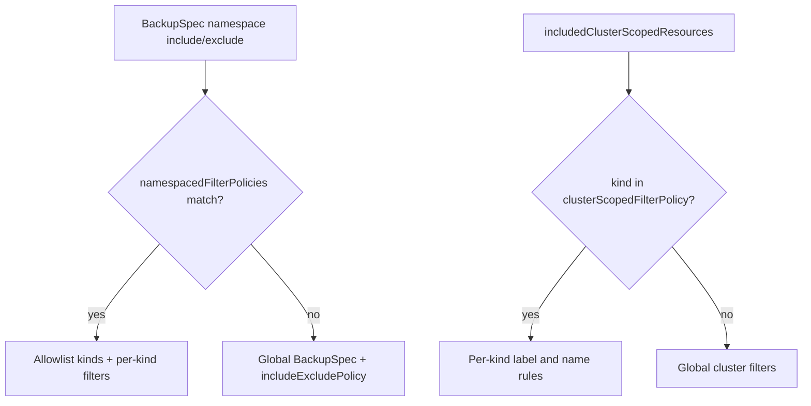

This guide explains how to use Velero's **fine-grained backup filters**: per-namespace, per-kind rules with independent label selectors and resource name patterns. Configuration lives in the same **ResourcePolicy ConfigMap** you may already use for volume policies.

For architecture and pipeline details, see the [design document](https://github.com/velero-io/velero/blob/main/design/backup-filter-enhancement/fine-grained-backup-filters-design.md).

---

## Introduction

Velero's global backup filters apply the same namespace list, resource types, and label selector to every namespace in a backup. That works for many clusters, but common scenarios need more control:

- **Different namespaces, different strategies** — back up everything in a database namespace, but only Deployments and ConfigMaps in a frontend namespace.
- **Filter by resource name** — back up `app-config` and `app-secret` without also capturing `monitoring-config`.
- **Different labels per kind** — Deployments labeled `app=workload-1` and StatefulSets labeled `app=workload-2` in the same namespace.

Fine-grained filters add two optional sections to the ResourcePolicy ConfigMap:

| Section | Scope | Behavior |
|---------|-------|----------|
| `namespacedFilterPolicies` | Namespaces you match (exact name or glob) | **Exclusive allowlist** — only resource kinds listed in `resourceFilters` (or covered by a catch-all) are backed up from those namespaces |
| `clusterScopedFilterPolicy` | Cluster-scoped resources globally | **Refinement overlay** — listed kinds get per-kind label and name rules; unlisted cluster-scoped kinds still use global BackupSpec filters |

**No new BackupSpec CRD fields** are required. Reference the policy from `Backup.spec.resourcePolicy` or `velero backup create --resource-policies-configmap`.

**Backward compatible:** if you omit both new sections, backups behave exactly as they do today.

---

## Prerequisites and wiring

### What you need

- Velero installed with backup filters support (see your Velero release notes).
- A ResourcePolicy ConfigMap in the Velero namespace (`velero` by default).
- Permission to create Backups (or Schedules) that reference the ConfigMap.

### End-to-end pattern

Every example below follows the same three steps:

1. **Create or update** a ConfigMap with `data.policy` containing `version: v1` and your filter rules.
2. **Create a Backup** (or Schedule) that includes the target namespaces and references the ConfigMap.
3. **Verify** with `velero backup describe` and inspect backup contents or logs.

### Minimal skeleton

Use this once; later examples show only the `policy:` body.

**ResourcePolicy ConfigMap:**

```yaml
apiVersion: v1
kind: ConfigMap
metadata:
  name: my-backup-filter-policy
  namespace: velero
data:
  policy: |
    version: v1
    namespacedFilterPolicies:
      - namespaces:
          - my-namespace
        resourceFilters:
          - kinds: [ConfigMap]
            labelSelector:
              app: my-app
```

**Backup:**

```yaml
apiVersion: velero.io/v1
kind: Backup
metadata:
  name: my-backup
  namespace: velero
spec:
  includedNamespaces:
    - my-namespace
  resourcePolicy:
    kind: configmap
    name: my-backup-filter-policy
  storageLocation: default
```

**CLI equivalent:**

```bash
velero backup create my-backup \
  --include-namespaces my-namespace \
  --resource-policies-configmap my-backup-filter-policy
```

**Verify:**

```bash
velero backup describe my-backup
velero backup describe my-backup -o json | jq '.namespacedFilterPolicies'
```

### Important: do not mix old-style BackupSpec resource filters

When `namespacedFilterPolicies` or `clusterScopedFilterPolicy` is present in the ResourcePolicy, **do not** set these on the Backup:

- `spec.includedResources` / `spec.excludedResources`
- `spec.includeClusterResources`

Use `includeExcludePolicy` inside the ResourcePolicy ConfigMap for global resource-type include/exclude instead. Velero rejects backups that combine the new policy sections with old-style fields.

Schedules follow the same rule: configure filters in the ResourcePolicy ConfigMap, not via deprecated resource filter fields on the Schedule template.

---

## Examples

Each example includes: **goal**, **policy YAML**, **backup notes**, **expected outcome**, and **how to verify**.

---

### Example 0 — Baseline (no new filters)

**Goal:** Confirm that namespaces without a `namespacedFilterPolicies` entry still use global BackupSpec filters.

**Policy:** Omit `namespacedFilterPolicies` and `clusterScopedFilterPolicy` entirely (or use a ConfigMap with only `volumePolicies` / `includeExcludePolicy`).

**Backup:**

```yaml
spec:
  includedNamespaces:
    - ns-a
    - ns-b
    - production
  # No resourcePolicy — global filters only
```

**Expected outcome:** All resources in included namespaces follow `includedNamespaces`, `labelSelector`, `includedResources`, and related global fields — same as before this feature.

**Verify:** `velero backup describe` shows no namespace-scoped filter policies section.

---

### Example 1 — Per-namespace kinds and labels

**Goal:** In `ns-a`, back up only ConfigMaps, Secrets, Deployments, and Pods with `app=my-app`. In `ns-b`, use global filters (no policy entry for that namespace).

**Policy:**

```yaml
version: v1
namespacedFilterPolicies:
  - namespaces:
      - ns-a
    resourceFilters:
      - kinds: [ConfigMap, Secret, Deployment, Pod]
        labelSelector:
          app: my-app
```

**Backup:**

```yaml
spec:
  includedNamespaces:
    - ns-a
    - ns-b
  resourcePolicy:
    kind: configmap
    name: per-namespace-resource-filter-policy   # or your ConfigMap name
```

**Expected outcome:**

- **ns-a:** Only listed kinds with label `app=my-app` (e.g. `app-config`, `app-secret`, `app-deployment`). Resources like `monitoring-config` (different labels) are excluded.
- **ns-b:** Everything allowed by global filters (no namespace policy match).

**Verify:** `velero backup describe` lists resolved filters for `ns-a`.

---

### Example 2 — Exact resource names

**Goal:** Back up only two ConfigMaps by exact name, optionally requiring a label.

**Policy:**

```yaml
version: v1
namespacedFilterPolicies:
  - namespaces:
      - target-namespace
    resourceFilters:
      - kinds: [ConfigMap]
        names: [vm-1, vm-2]
        labelSelector:
          resource-type: VirtualMachine
```

**Backup:** `includedNamespaces: [target-namespace]` plus `resourcePolicy` reference.

**Expected outcome:** Only `vm-1` and `vm-2` ConfigMaps with `resource-type=VirtualMachine`. `vm-3` and other ConfigMaps are excluded.

**Verify:** Backup archive contains exactly those two ConfigMaps in `target-namespace`.

---

### Example 3 — Glob name patterns with exclusions

**Goal:** Back up `app-*` ConfigMaps and Secrets in `production`, but exclude temporary and debug names.

**Policy:**

```yaml
version: v1
namespacedFilterPolicies:
  - namespaces:
      - production
    resourceFilters:
      - kinds: [ConfigMap, Secret]
        names: ["app-*"]
        excludedNames: ["*-tmp-*", "*-debug-*", "*-tmp", "*-debug"]
```

**Expected outcome:**

- **Included:** `app-config`, `app-cache-config`, `app-secret`, `app-db-secret`
- **Excluded:** `app-tmp-config`, `app-debug-config` (excluded by `excludedNames`), and `monitoring-tmp-secret` (excluded because it does not match the `names: ["app-*"]` allowlist)

`excludedNames` takes precedence over `names` when both match.

**Verify:** Inspect backup item list.

---

### Example 4 — Per-kind label selectors

**Goal:** Apply different label rules to different resource types in the same namespace.

**Policy:**

```yaml
version: v1
namespacedFilterPolicies:
  - namespaces:
      - target-namespace
    resourceFilters:
      - kinds: [ConfigMap]
        orLabelSelectors:
          - app: production-workload-1
            component: vm-group
          - app: production-workload-2
            component: vm-service
```

**Expected outcome:** ConfigMaps matching either label combination are backed up; other ConfigMaps in the namespace are not (for this kind).

**Note:** Use `orLabelSelectors` when you need OR across label sets. `labelSelector` and `orLabelSelectors` cannot appear in the same `resourceFilters` entry.

---

### Example 5 — OR label selectors across kinds

**Goal:** Back up ConfigMaps, Secrets, or Deployments that match any of several label conditions.

**Policy:**

```yaml
version: v1
namespacedFilterPolicies:
  - namespaces:
      - ns-a
    resourceFilters:
      - kinds: [ConfigMap, Secret]
        orLabelSelectors:
          - app: my-app
          - app: monitoring
      - kinds: [Deployment]
        orLabelSelectors:
          - app: my-app
          - app: monitoring
          - component: backend
```

**Expected outcome:** Resources included if they match **any** map in `orLabelSelectors` for their kind (AND within each map, OR across maps).

---

### Example 6 — Multiple criteria on one kind

**Goal:** Combine exact names with OR label selectors for a single kind.

**Policy:**

```yaml
version: v1
namespacedFilterPolicies:
  - namespaces:
      - target-namespace
    resourceFilters:
      - kinds: [ConfigMap]
        names: [vm-1, vm-2]
        orLabelSelectors:
          - resource-type: VirtualMachine
          - component: vm-group
          - component: vm-service
```

**Expected outcome:** Only `vm-1` and `vm-2` that also satisfy one of the label OR branches.

---

### Example 7 — One policy entry, multiple namespaces

**Goal:** Apply the same rules to `ns-a`, `ns-b`, and `production` in a single policy block.

**Policy:**

```yaml
version: v1
namespacedFilterPolicies:
  - namespaces:
      - ns-a
      - ns-b
      - production
    resourceFilters:
      - kinds: [ConfigMap]
      - kinds: [Deployment]
        labelSelector:
          tier: web
```

**Expected outcome:**

- All ConfigMaps in those namespaces (no label filter on that entry).
- Deployments with `tier=web` only.

---

### Example 8 — Namespace glob patterns and ordering

**Goal:** Different backup breadth for `team-frontend-prod`, `team-frontend-dev`, and `team-backend-test` using glob patterns.

**Policy (correct order — most specific first):**

```yaml
version: v1
namespacedFilterPolicies:
  - namespaces:
      - "team-frontend-*"
    resourceFilters:
      - kinds: [Deployment, Service, ConfigMap]
  - namespaces:
      - "team-*"
    resourceFilters:
      - kinds: [Deployment, Service]
  - namespaces:
      - team-frontend-prod          # exact match
    resourceFilters:
      - kinds: [Deployment, Service, ConfigMap, Secret, PersistentVolumeClaim]
```

**Expected outcome:**

| Namespace | Matched policy | Kinds backed up |
|-----------|----------------|-----------------|
| `team-frontend-prod` | First entry (exact) | 5 kinds |
| `team-frontend-dev` | `team-frontend-*` | 3 kinds |
| `team-backend-test` | `team-*` | 2 kinds |

**Wrong order (avoid):** If `team-*` is listed **before** `team-frontend-*`, then `team-frontend-dev` matches the broader `team-*` rule first and only Deployments and Services are backed up — the more specific `team-frontend-*` rule is never reached.

Velero evaluates namespaces by looking for an **exact match** first, and then evaluates glob patterns in **definition order** (first-match wins). Because `team-frontend-prod` is an exact match in this policy, its evaluation is unaffected by glob ordering. However, for namespaces relying on glob patterns like `team-frontend-dev`, the order of the glob patterns is critical.

**Backup:** Include all relevant namespaces in `includedNamespaces` (they must still pass the global namespace filter).

---

### Example 9 — Catch-all by label

**Goal:** Back up any resource kind that has a given label, without listing every kind. Kind-specific entries override the catch-all.

**Policy (recommended explicit form):**

```yaml
version: v1
namespacedFilterPolicies:
  - namespaces:
      - ns-a
    resourceFilters:
      - kinds: ["*"]                 # catch-all
        labelSelector:
          app: common-app
      - kinds: [ConfigMap, Secret]   # override for these kinds
        labelSelector:
          app: specialized-app
```

**Equivalent:** `kinds: []` (empty) also denotes a catch-all; `kinds: ["*"]` is preferred for readability.

**Rules:**

- At most **one** catch-all per namespace policy entry.
- Catch-all entries **cannot** use `names` or `excludedNames` — use kind-specific entries for name filtering.
- Catch-all does **not** inherit `BackupSpec.labelSelector`; set `labelSelector` or `orLabelSelectors` on the catch-all entry explicitly.

**Expected outcome:** ConfigMaps and Secrets use `app=specialized-app`; all other kinds listed only via catch-all use `app=common-app`.

---

### Example 10 — Catch-all with per-kind name overrides

**Goal:** Pin critical Deployments and Secrets by exact name; back up everything else with a label convention.

**Policy:**

```yaml
version: v1
namespacedFilterPolicies:
  - namespaces:
      - ns-a
    resourceFilters:
      - kinds: [Deployment]
        names: [api-server, worker]
      - kinds: [Secret]
        names: [db-credentials, tls-cert]
      - kinds: ["*"]
        labelSelector:
          backup: "true"
```

**Expected outcome:**

- Deployments: only `api-server` and `worker`
- Secrets: only `db-credentials` and `tls-cert`
- Other kinds (ConfigMap, Service, …): resources with `backup=true` only

**Verify:** `other-deployment` and `no-backup-label-config` should be absent; `backup-labeled-config` and `catch-all-labeled-service` should be present.

---

### Example 11 — Override-only catch-all (no label on catch-all)

**Goal:** Apply a strict name filter to one kind while including all other kinds without listing them or adding labels.

**Policy:**

```yaml
version: v1
namespacedFilterPolicies:
  - namespaces:
      - ns-a
    resourceFilters:
      - kinds: [Secret]
        names: [app-secret]
      - kinds: ["*"]    # no labelSelector — all other kinds included
```

**Expected outcome:**

- Secrets: only `app-secret`
- Other kinds in `ns-a`: all instances included (subject to global filters and allowlist semantics for listed vs unlisted kinds via catch-all)

Use this when you need a narrow exception for one type and broad inclusion for the rest of the namespace.

---

### Example 12 — Cluster-scoped refinement

**Goal:** Refine which cluster-scoped resources are backed up by name and label, without replacing global cluster-scoped inclusion.

**Policy:**

```yaml
version: v1
clusterScopedFilterPolicy:
  resourceFilters:
    - kinds: [StorageClass]
      names: ["my-app-*"]
    - kinds: [ClusterRole, ClusterRoleBinding]
      labelSelector:
        app: my-app
```

**Backup (required):** You must still include cluster-scoped kinds on the Backup:

```yaml
spec:
  includedNamespaces:
    - ns-a
  includedClusterScopedResources:
    - storageclasses
    - clusterroles
    - clusterrolebindings
  resourcePolicy:
    kind: configmap
    name: cluster-scoped-filter-policy
```

**Expected outcome (full overlay):**

- StorageClasses matching `my-app-*` only
- ClusterRoles and ClusterRoleBindings with `app=my-app` only
- Namespace-scoped resources in `ns-a`: global filters (no `namespacedFilterPolicies` in this example)

**Partial overlay:** If `includedClusterScopedResources` lists only `clusterroles` and `clusterrolebindings`, StorageClasses are **not** backed up even if listed in `clusterScopedFilterPolicy` — global inclusion is evaluated first.

**Differences from namespace policies:**

- **Not** an allowlist — unlisted cluster-scoped kinds fall back to global filters.
- **No catch-all** — `kinds: []` or `kinds: ["*"]` is invalid and fails validation.

---

### Example 13 — Global `includeExcludePolicy` and namespace filters

**Goal:** Set a global resource-type baseline, then refine per namespace. Understand that global **exclusions** cannot be overridden per namespace.

**Policy:**

```yaml
version: v1
includeExcludePolicy:
  includedNamespaceScopedResources:
    - configmaps
    - secrets
    - deployments
    - services
namespacedFilterPolicies:
  - namespaces:
      - ns-a
    resourceFilters:
      - kinds: [ConfigMap, Secret]
        labelSelector:
          app: my-app
  - namespaces:
      - production
    resourceFilters:
      - kinds: [ConfigMap]
        names: ["app-*"]
```

**Expected outcome:**

- **ns-a:** ConfigMaps and Secrets with `app=my-app` (within global allowlist)
- **production:** ConfigMaps matching `app-*` pattern
- **Other included namespaces:** Only kinds allowed by `includeExcludePolicy` (no per-namespace override)

**Global exclusion wins (important):**

```yaml
includeExcludePolicy:
  excludedNamespaceScopedResources:
    - secrets
namespacedFilterPolicies:
  - namespaces:
      - ns-a
    resourceFilters:
      - kinds: [ConfigMap, Secret, Deployment]
        labelSelector:
          app: my-app
```

**Result:** No Secrets in the backup — the namespace policy cannot re-include a globally excluded kind. Velero logs a warning at backup start if you list an excluded kind in `namespacedFilterPolicies`.

**Backup tip:** Do not set `includedResources` on the Backup; use `includeExcludePolicy` in the ConfigMap instead.

---

### Example 14 — Volume policies and namespace filters together

**Goal:** Use volume snapshot/fs-backup rules and namespace filters in one ConfigMap.

**Policy:**

```yaml
version: v1
volumePolicies:
  - conditions:
      capacity: "0,10Gi"
      storageClass:
        - standard
    action:
      type: fs-backup
  - conditions:
      capacity: "10Gi,100Gi"
    action:
      type: snapshot
namespacedFilterPolicies:
  - namespaces:
      - production
    resourceFilters:
      - kinds: [ConfigMap]
        names: ["app-*"]
        excludedNames: ["*-tmp", "*-debug"]
      - kinds: [Secret]
        labelSelector:
          workload: application
```

**Expected outcome:** Volume actions apply to PVCs per `volumePolicies`; resource inclusion follows `namespacedFilterPolicies`. The sections are independent.

---

### Example 15 — `velero.io/exclude-from-backup=true` always wins

**Goal:** Ensure explicitly excluded resources never appear in the backup, even when they match namespace filters or catch-all rules.

**Policy:**

```yaml
version: v1
namespacedFilterPolicies:
  - namespaces:
      - ns-a
    resourceFilters:
      - kinds: [ConfigMap, Secret]
        labelSelector:
          app: my-app
      - kinds: ["*"]
        labelSelector:
          app: my-app
```

**On resources to exclude**, set:

```yaml
metadata:
  labels:
    velero.io/exclude-from-backup: "true"
```

**Expected outcome:** Resources with `app=my-app` **and** `velero.io/exclude-from-backup=true` are excluded. Same rule applies to cluster-scoped resources refined by `clusterScopedFilterPolicy`.

---

## Concepts reference

### `resourceFilters` fields

| Field | Description |
|-------|-------------|
| `kinds` | Resource type names (e.g. `ConfigMap`, `deployments`). Empty or `["*"]` = catch-all (namespace policies only). |
| `labelSelector` | Equality labels (`key: value`), AND across keys. No `in`, `exists`, etc. — use `orLabelSelectors` for OR. |
| `orLabelSelectors` | List of label maps; match if **any** map matches (AND within each map). Mutually exclusive with `labelSelector`. |
| `names` | Exact names or glob patterns to include. |
| `excludedNames` | Patterns to exclude; wins over `names` when both match. |

Only kinds listed in `resourceFilters` (or covered by catch-all) are collected from namespaces matched by `namespacedFilterPolicies`.

### Glob pattern syntax

Name and namespace patterns use the same glob style as elsewhere in Velero (`gobwas/glob`):

- Supported: `*`, `?`, `[abc]`, `[a-z]`
- Not supported: `**`, regex, `|`, `()`, `!`, `{}`, `,`

Examples: `app-*`, `team-frontend-*`, `*-tmp`.

### Precedence cheat sheet

**Namespaces**

1. `BackupSpec.excludedNamespaces` — excluded namespaces are never backed up; namespace policies cannot override this.
2. `namespacedFilterPolicies` — first matching pattern (exact match checked before globs in pattern order).
3. No match — use global BackupSpec + `includeExcludePolicy`.

**Namespace-scoped resources (when a namespace policy matches)**

1. Global `includeExcludePolicy` exclusions (e.g. `excludedNamespaceScopedResources`) apply first.
2. Only kinds in `resourceFilters` (or catch-all) are allowlisted for collection.
3. Per-kind `labelSelector` / `orLabelSelectors` for API list calls.
4. Per-kind `names` / `excludedNames` at backup write time.
5. Label `velero.io/exclude-from-backup=true` always excludes.

**Cluster-scoped resources**

1. Must be allowed by `includedClusterScopedResources` / global cluster settings.
2. If `clusterScopedFilterPolicy` lists the kind, apply its label and name rules.
3. If not listed in `clusterScopedFilterPolicy`, use global BackupSpec filters.
4. `velero.io/exclude-from-backup=true` always excludes.



### Catch-all summary

| Rule | Detail |
|------|--------|
| Syntax | `kinds: ["*"]` or `kinds: []` |
| Count | At most one catch-all per `namespacedFilterPolicies` entry |
| Names | `names` / `excludedNames` not allowed on catch-all |
| Override | Kind-specific entries take precedence over catch-all |
| Label inheritance | Does not use `BackupSpec.labelSelector` |
| Cluster-scoped | Catch-all **not** supported in `clusterScopedFilterPolicy` |

---

## Troubleshooting and validation

### Verify a backup

```bash
velero backup describe BACKUP_NAME
velero backup logs BACKUP_NAME
velero backup describe BACKUP_NAME -o json | jq '.namespacedFilterPolicies'
velero backup describe BACKUP_NAME -o json | jq '.clusterScopedFilterPolicy'
```

Catch-all entries appear as `<catch-all> (all other kinds)` in text output, or `"isCatchAll": true` in JSON.

### Common misconfigurations

| Symptom | Likely cause | Fix |
|---------|----------------|-----|
| Fewer resources than expected in `team-frontend-prod` | Broad namespace pattern listed before specific one | Reorder policies: most specific `namespaces` first |
| Namespace policy lists Secrets but none in backup | `includeExcludePolicy` excludes `secrets` globally | Remove global exclusion or accept no Secrets |
| `ClusterRole` in namespace policy has no effect | Cluster-scoped kind in `namespacedFilterPolicies` | Move rule to `clusterScopedFilterPolicy`; check logs for warning |
| Backup fails at creation with filter message | Old-style `includedResources` with new policies | Move resource types to `includeExcludePolicy` in ConfigMap |
| Catch-all does not use backup-wide label | By design | Set `labelSelector` on the catch-all entry |
| Cluster-scoped policy validation error on `kinds: ["*"]` | Catch-all not allowed for cluster policy | List each cluster-scoped kind explicitly |

### Velero logs

```bash
kubectl logs -n velero deployment/velero | grep -i "namespacedFilterPolicies\|clusterScopedFilterPolicy"
kubectl logs -n velero deployment/velero | grep "globally excluded by includeExcludePolicy"
kubectl logs -n velero deployment/velero | grep "cluster-scoped"
```

### Validation errors (policy ConfigMap)

Velero validates the ResourcePolicy when a backup starts. Common errors:

| Error (summary) | Cause |
|-----------------|--------|
| `at least one namespace must be specified` | Empty `namespaces: []` |
| `at least one resourceFilter must be specified` | Empty `resourceFilters: []` |
| `names or excludedNames cannot be specified for catch-all filters` | Name patterns on catch-all entry |
| `only one catch-all resource filter is allowed` | Multiple catch-alls in one policy entry |
| `kind "X" appears in both resourceFilters[...]` | Same kind in two entries |
| `labelSelector and orLabelSelectors cannot co-exist` | Both set in one entry |
| `duplicate namespace pattern` | Same namespace string in two policy entries |
| `invalid glob pattern` | Bad characters in namespace or name pattern |
| `clusterScopedFilterPolicy... kinds must be specified (catch-all is not supported)` | Empty or `["*"]` kinds in cluster policy |
| `include-resources, exclude-resources... cannot be used with namespace-scoped or cluster-scoped global filter policies` | Old-style BackupSpec filters with new policy |

### Silent edge cases (no error)

- Namespace pattern matches no existing namespace — policy loaded but never applied.
- Kind listed but no instances in namespace — empty result, backup still succeeds.
- `excludedNames` narrows `names` — e.g. `names: ["app-*"]` + `excludedNames: ["app-config"]` excludes `app-config` only.

---

## Restore behavior

Restore is unchanged: it restores whatever is in the backup archive. Resources excluded by fine-grained filters are simply absent. Use `Restore.spec.includedNamespaces` (and existing restore filters) to limit what you restore from a partial backup.

Fine-grained resource filtering is also available on the restore path using `namespacedFilterPolicies` and `clusterScopedFilterPolicy`. For details on the restore-side policies, see the [Fine-grained restore filters design](https://github.com/vmware-tanzu/velero/blob/main/design/restore-filter-enhancement/fine-grained-restore-filters-design.md).

---

## Related links

- [Fine-grained backup filters design](https://github.com/velero-io/velero/blob/main/design/backup-filter-enhancement/fine-grained-backup-filters-design.md)
